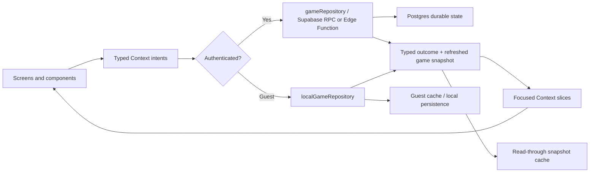

# Loro - Gamified Habits Engineering Architecture

> **Purpose:** Define the stable client, backend, security, persistence, testing, and delivery standards that every feature must follow.
>
> **Product contract:** [`PRODUCT.md`](./PRODUCT.md)  
> **Feature roadmap:** [`PLANS.md`](./PLANS.md)  
> **Agent workflow:** [`../AGENTS.md`](../AGENTS.md)

## Current Architecture Baseline

### Client

- Expo SDK 54
- React 19 and React Native 0.81
- Strict TypeScript
- NativeWind 4 with Tailwind CSS 3
- React Context for UI-facing application state
- React Native Reanimated 4 and Worklets for motion
- `react-native-safe-area-context` for safe areas
- `@expo/vector-icons/Ionicons` for interface icons
- `expo-audio` for UI sound effects
- `expo-haptics` for tactile feedback
- `expo-secure-store`, `expo-sqlite`, and platform-specific cache modules for local persistence
- `react-native-svg` and Lottie for approved visualizations/animation assets

### Backend

- Supabase Auth for authenticated identity
- Supabase Postgres for durable player and game data
- Transactional Postgres RPCs for authoritative game mutations
- RLS, explicit grants/revokes, and ownership checks for client-accessible data
- Supabase Edge Functions for integrations requiring server secrets or orchestration
- pgTAP tests for database security and game invariants
- Generated TypeScript database contracts in `src/types/database.generated.ts`

### Current application capabilities

The application is no longer a local-only prototype. It currently includes:

- Authenticated and guest sessions
- Hosted Supabase-backed game state
- Local guest behavior and platform-specific caches
- Six habits and independent Adventure Paths
- Daily Quests, rewards, streaks, energy, daily check-in, and activity history
- Inventory, randomized equipment loot, equipment sets, and discovery tracking
- Guild quest boards and claims
- Settings, audio, and haptic preferences
- A cached daily Lory AI briefing generated through a Supabase Edge Function

Always inspect the source code and migrations before assuming a roadmap or architecture statement reflects the latest implementation.

## Runtime Data Flow



Screens express player intent. They do not reproduce game rules or patch authoritative balances. Repositories execute the correct authenticated or guest implementation and return a typed outcome plus the latest state.

## Source-of-Truth and Ownership Rules

| Data kind | Owner | Examples |
|-----------|-------|----------|
| Durable authenticated game facts | Postgres | Completions, rewards, coins, XP, streaks, purchases, achievements |
| Durable guest game facts | Local repository and guest persistence | Guest completions, rewards, inventory, settings |
| Derived domain state | Pure utilities/selectors | Active node, effective streak, completion percentage, streak risk |
| UI presentation state | Component/screen or device-local cache | Open modal, selected chart range, seen-item marker, coach-mark step |
| Server integrations and secrets | Edge Functions or verified webhooks | DeepSeek, billing webhooks, export/delete orchestration |
| Read-through state | Existing cache services | Last game snapshot, daily Lory briefing |
| Product scope and status | `docs/PLANS.md` | Priorities, feature contracts, dependencies |

Do not store derived state when it can be recomputed reliably from durable facts. Do not put presentation-only state in the global game snapshot.

## Client Organization

The current source layout follows these responsibilities:

```text
src/
├── assets/        # Images, audio, fonts, and animation files
├── components/    # Reusable cross-screen UI and meaningful UI behavior
├── constants/     # Catalogs, definitions, image/audio registration, theme values
├── contexts/      # Auth, audio, and focused app-state providers/hooks
├── hooks/         # Shared lifecycle or platform hooks
├── navigation/    # Root gate, app navigator, and persistent tab host
├── screens/       # Screen composition and meaningful screen-local helpers
├── services/      # Repositories, Supabase client, auth links, and caches
├── styles/        # Runtime style helpers not expressible through class names
├── types/         # Domain, backend, generated database, and environment contracts
└── utility/       # Pure domain calculations and selectors
```

Rules:

- Keep `App.tsx` thin: global CSS, root providers, and the root navigator only.
- Reusable visual primitives belong in `src/components/`.
- Screen-specific composition remains with the screen.
- Pure calculations belong in `src/utility/`.
- Remote calls, cache access, and response parsing belong in `src/services/`.
- Shared contracts belong in `src/types/`.
- Catalog and authored content definitions belong in `src/constants/`.
- Create a new folder or architectural layer only when real behavior requires it.
- Do not add Redux, a second global state library, or speculative service layers alongside the existing Context/repository architecture.

## Context and State Management

- Context is the UI-facing state layer, not the authority for authenticated economy rules.
- Keep Context slices focused so unrelated consumers do not rerender for every state change.
- Expose intent-based actions such as `startDailyQuest`, `completeDailyQuest`, `claimChapterReward`, or `equipInventoryItem`.
- Screens must not calculate or manually apply coins, XP, loot, energy, streaks, purchases, or inventory changes.
- Store durable facts such as timestamps, completion records, claims, and item instances.
- Derive `active`, `done`, `locked`, effective streaks, progress percentages, and next actions through pure helpers.
- Use functional, immutable state updates.
- Preserve discriminated unions for timed and one-time quest nodes.
- Keep transient Home/path selection and modal visibility out of durable game state unless another screen genuinely needs them.

## Repository Boundary and Guest Parity

Every durable feature must define both paths:

1. **Authenticated:** `gameRepository.ts` calls an authorized Supabase RPC or Edge Function.
2. **Guest:** `localGameRepository.ts` applies equivalent domain rules and persists the result locally.

For every new mutation:

- Add a typed intent to the appropriate Context action contract.
- Add a descriptive mutation ID for in-flight and error state.
- Implement the authenticated transaction.
- Implement equivalent guest behavior.
- Return a typed domain outcome and refreshed state.
- Update cache behavior deliberately.
- Add parity tests for the same input sequence.

If a feature cannot safely operate offline for authenticated users, fail clearly and preserve the last known snapshot. Do not silently queue economy or reward mutations without a designed idempotent synchronization protocol.

## Durable Mutation Standard

A durable mutation must be:

- **Atomic:** all rewards, progress, ledgers, and related state change together.
- **Authorized:** ownership is verified from `auth.uid()`, not a trusted client user ID.
- **Validated:** IDs, ranges, state transitions, and payload shapes are checked server-side.
- **Idempotent:** retries cannot duplicate coins, rewards, claims, inventory, or consumption.
- **Concurrency-safe:** lock the smallest relevant profile, inventory, quest, or entitlement rows.
- **Observable:** return stable error codes and log sanitized failure context.
- **Typed:** update generated database types and client response contracts.

Prefer natural unique constraints for once-only events. Add a client-generated idempotency key when the same valid intent could otherwise be submitted more than once.

Mutation outcomes that can drive UI feedback should expose semantic events, for example:

```ts
type GameMutationOutcome = {
  snapshot: GameSnapshot;
  events: Array<
    | { type: "level-up"; level: number }
    | { type: "chapter-completed"; habitId: HabitId; chapterId: string }
    | { type: "achievement-unlocked"; achievementId: string }
    | { type: "guild-quest-advanced"; questId: string; progress: number; target: number }
    | { type: "streak-protected"; remainingShields: number }
  >;
};
```

The exact union should grow only as implemented behavior requires. Components should not diff arbitrary snapshots to guess which event occurred.

## Supabase Security and Database Rules

- Treat migrations in `supabase/migrations/` as the schema source of truth. Avoid unreproducible dashboard-only schema changes.
- Enable RLS on every exposed user-data table.
- Combine `TO authenticated` with an ownership predicate such as `(select auth.uid()) = user_id`.
- Give update policies both `USING` and `WITH CHECK`; updates also require a usable select policy.
- Prefer `SECURITY INVOKER`.
- If `SECURITY DEFINER` is necessary:
  - Keep the function in `loro_private`.
  - Set an empty or explicit `search_path`.
  - Resolve and verify the caller with `auth.uid()`.
  - Fully qualify referenced tables/functions.
  - Revoke direct execution from `public`, `anon`, and `authenticated`.
  - Expose only a deliberate authorized wrapper.
- Do not grant direct client writes to economy, rewards, progress, achievements, entitlements, or social relationship state.
- Include explicit grants and revokes in every migration; do not assume a new table or function is automatically exposed.
- Index ownership, date, status, and cursor predicates used by RLS or read models.
- Test cross-user denial, anonymous denial, invalid IDs, duplicate retries, and direct-table-write denial.
- Regenerate `src/types/database.generated.ts` after schema changes.

## Read Models and Snapshot Size

The main game snapshot should contain the compact state required to render the core application. It should not become an unbounded transport for every historical record.

Use focused, typed, ownership-checked read models for:

- Statistics by explicit date range
- Paginated activity history
- Guild quest history
- Item discovery/catalog metadata
- Social summaries
- Account export

Use cursor pagination for growing timelines. Keep predicates index-friendly and return only fields rendered by the consumer.

## Cache, Persistence, and Offline Behavior

- Authenticated users may read the last cached game snapshot while offline.
- Guest state is durable in the local guest repository/cache.
- Lory has a separate daily briefing cache because it is derived presentation content.
- Use platform-specific `.native.ts`, `.web.ts`, and shared modules when storage APIs differ.
- Cache keys must include the user or guest identity where data could cross sessions.
- Sign-out and account changes must not display another user's cached state.
- Cache corruption or version mismatch should fail safely to generated/fetched state.
- Permission status, notification schedule IDs, seen-item markers, and other device-specific state remain device-local.
- Do not add a second general-purpose persistence library merely for one setting when the existing cache/settings path is suitable.

## Date, Timezone, and Clock Rules

- Once-per-day behavior uses local date keys in `YYYY-MM-DD` form.
- Durable events use ISO timestamps.
- The configured IANA timezone determines daily keys for authenticated game rules.
- Server clock offset may inform countdown display, but the server transaction remains authoritative.
- Consolidate date-key, next-midnight, week-period, and streak-gap calculations in shared pure utilities.
- Test DST changes, timezone changes, app background/resume, device clock drift, and actions that cross midnight.
- A timed quest should snapshot the effective duration at start; changing settings mid-quest should not move its completion threshold.
- Do not mutate or erase durable history in a generic day-rollover action. New active states should be derived from facts and the current date.

## UI Events, Celebrations, and Navigation

Use one application-level coordinator for transient semantic events such as:

- Quest rewards
- Loot reveals
- Streak protection
- Level-up
- Chapter completion
- Achievement unlock
- Guild progress toasts
- Item details
- Post-completion navigation

The coordinator owns ordering and dismissal. Presentation components emit semantic callbacks and do not import unrelated navigation or mutation logic.

Avoid nested native modals. Before executing a follow-up action, re-evaluate it against the latest snapshot when another mutation may have changed its validity.

The persistent five-tab host remains the primary navigation model. Home/path transitions may remain local to Home.

## AI and External Integrations

- Provider secrets belong in Supabase/EAS secret management, never in `EXPO_PUBLIC_*`.
- The Expo client never calls DeepSeek directly.
- The Lory Edge Function authenticates the user, constructs or validates compact context, enforces cache/lease/refresh rules, validates output, and stores only approved result metadata.
- AI creates text; deterministic code calculates facts, eligibility, actions, statistics, and rewards.
- Do not send email, UUIDs, free-form notes, full activity history, inventory instances, or complete game snapshots to the model.
- External webhook handlers verify provider signatures, remain idempotent, and write entitlements or events transactionally.
- Account export/delete orchestration that requires admin privileges belongs in an authenticated server function with explicit authorization and audit-safe logging.

## Styling and Design System

- Use NativeWind semantic class names for normal styling.
- Keep shared colors, spacing, radii, and effects in `src/constants/themeTokens.js` and expose them through Tailwind.
- Use `src/constants/colors.ts` only when runtime APIs cannot consume class names, including icons, gradients, SVG, Reanimated, and native props.
- Reuse semantic utilities such as `bg-surface-card`, `text-content`, `bg-primary`, `rounded-card`, and `rounded-pill`.
- Avoid scattered duplicate hex values and arbitrary dimensions.
- Use the shared shadow helper for platform-aware card shadows.
- Keep mobile layouts compact, scannable, and touch-friendly.
- Use stable dimensions for timers, resource pills, tab items, avatars, and changing status labels.
- Growing screens use `ScrollView` or `FlatList` with persistent-tab and safe-area clearance.

## Accessibility and Motion

- Every interactive icon has an accessibility role, concise label, disabled state, and at least a 44×44 effective touch target.
- Meaningful images have accessible descriptions; decorative images are hidden from accessibility.
- Status is never communicated with color alone.
- Charts include textual summaries and accessible values.
- Numeric timers/counters use tabular numerals.
- Reanimated effects should prefer `transform` and `opacity` over layout properties.
- Ambient, repeated, entering, and celebration animations respect the system reduced-motion preference.
- Loading, empty, error, offline, permission-denied, and retry states are required feature states.

## Art, Audio, and Assets

- Register reusable image assets in `src/constants/images.tsx`.
- Register reusable sound assets through the shared audio constants/provider.
- Do not repeat `require()` calls across screens.
- Preserve crisp pixel-art edges.
- Prefer transparent PNG only for assets that need transparency; avoid oversized source dimensions.
- Use `resizeMode="contain"` for characters and equipment unless full-bleed cropping is intentional.
- Preload latency-sensitive button sounds and avoid creating/releasing a player for every press.
- Defer non-critical celebration, catalog, and large illustration assets until their surface mounts.
- Asset optimization must preserve the approved visual style and be measured against a recorded bundle baseline.

## TypeScript, Naming, and Comments

- TypeScript remains strict; avoid `any`.
- Shared domain contracts belong in `src/types/`.
- Use `import type` for type-only imports.
- Use PascalCase for React components, camelCase for values/functions, and descriptive union IDs.
- Use `.tsx` only for files containing JSX and `.ts` for TypeScript logic.
- Keep components focused and avoid wrappers that only rename a `View`.
- Extract shared behavior when it is reused or owns a meaningful independent responsibility.
- Prefer small pure helpers and readable names.

Comments are required for non-obvious invariants and platform constraints, including:

- Idempotency and retry assumptions
- Currency/reward row-lock ordering
- Timezone and local-date boundaries
- RLS or `SECURITY DEFINER` assumptions
- Cross-platform cache behavior
- Audio shared-object lifecycle workarounds
- Animation cancellation or reduced-motion behavior

Comments should explain **why the constraint exists** and what would break if it were removed. Do not restate self-explanatory code.

## Expo Dependency Rules

- Keep Expo-managed packages compatible with SDK 54.
- Do not independently upgrade React Native, React, Reanimated, Worklets, or `@types/react` outside the Expo compatibility set.
- Keep `babel-preset-expo` installed because `babel.config.js` references it.
- Retain the Expo Babel preset, `jsxImportSource: "nativewind"`, and NativeWind transform.
- Metro must continue wrapping Expo's default configuration with NativeWind and `global.css`.
- Prefer `npx expo install <package>` for Expo-facing dependencies.
- Do not use `--force` or `--legacy-peer-deps` as a routine peer-dependency fix.
- Re-test with a cleared Metro cache after dependency changes.
- Prefer Expo Go until a required native capability needs a development build; notifications, widgets, native sign-in, billing, and similar capabilities must be verified in development builds.

## Environment and Secret Management

- Local public configuration is read from `.env`; commit only `.env.example`.
- Only publishable/client-safe values may use `EXPO_PUBLIC_*`.
- Store DeepSeek, service-role, database, OAuth-provider, push, billing, and webhook secrets in the appropriate Supabase/EAS/provider secret manager.
- Maintain separate development/staging/production backend configuration before public launch.
- Keep OAuth redirect allow-lists explicit for development, preview, production, and supported web callbacks.
- Deploy backward-compatible server changes before clients that require them.

## Verification Strategy

Use the narrowest relevant verification and expand it with risk:

### Every code change

1. Run `npm run typecheck`.
2. Exercise the affected screen on a mobile-sized viewport or device.
3. Verify loading, error, disabled, and empty states where applicable.
4. Confirm text and controls do not overlap at larger font sizes.
5. Confirm safe areas and the persistent bottom bar remain usable.
6. Confirm images preserve bounds/transparency.
7. Confirm reduced-motion and accessibility behavior for changed interactions.

### Quest or game-state changes

1. New player begins at node one with zero previous progress.
2. Timed quests cannot complete before the authoritative target.
3. One-time habits remain usable at zero energy.
4. A habit cannot complete twice on one local date.
5. The app-wide streak increments only for the first completion of the date.
6. Rewards, XP, history, loot, streaks, Guild progress, and path state update atomically.
7. Node seven unlocks the chapter reward without losing completed path data.
8. Authenticated and guest paths produce equivalent outcomes.
9. Duplicate retries and concurrent requests do not duplicate rewards.

### Schema or Supabase changes

1. Reset/apply migrations locally.
2. Run database lint and pgTAP/RLS tests.
3. Verify cross-user and anonymous denial.
4. Regenerate database types.
5. Run TypeScript verification against the generated contracts.
6. Review grants/revokes, RLS, indexes, idempotency, and migration ordering.

### Dependency or native changes

1. Run `npx expo install --check`.
2. Run `npx expo-doctor`.
3. Clear Metro only after dependency/configuration changes.
4. Verify in the required development build and on the affected platform.

## Definition of Done

A roadmap feature moves to `☑ Complete` only when all applicable conditions are met:

1. Product behavior, edge cases, and interaction copy are documented.
2. Authenticated and guest/local paths produce equivalent domain outcomes.
3. Server mutations are atomic, authorized, validated, concurrency-safe, and retry-safe.
4. Cache and offline behavior are explicit and do not misrepresent unsynchronized progress.
5. Shared behavior is implemented through focused reusable components, utilities, and services.
6. Accessibility, reduced motion, safe areas, large text, and narrow-screen overflow are verified.
7. Pure utilities, repositories/RPCs, critical component states, and the user flow have appropriate tests.
8. TypeScript, Expo compatibility, Supabase tests, and bundle/device checks pass as applicable.
9. Migrations, generated types, configuration/secrets, rollout notes, and `docs/PLANS.md` are updated.

## Documentation Ownership

- This file owns stable engineering architecture, security, persistence, testing, and delivery standards.
- [`PRODUCT.md`](./PRODUCT.md) owns product rules, terminology, tone, and UX boundaries.
- [`PLANS.md`](./PLANS.md) owns feature status, feature-specific implementation contracts, priorities, and dependencies.
- [`history/README.md`](./history/README.md) indexes monthly implementation history, significant decisions, verification, and follow-up records.
- [`../AGENTS.md`](../AGENTS.md) owns mandatory agent workflow and document-routing rules.
- Source code, tests, migrations, and deployed configuration remain the final truth for current implementation behavior.
