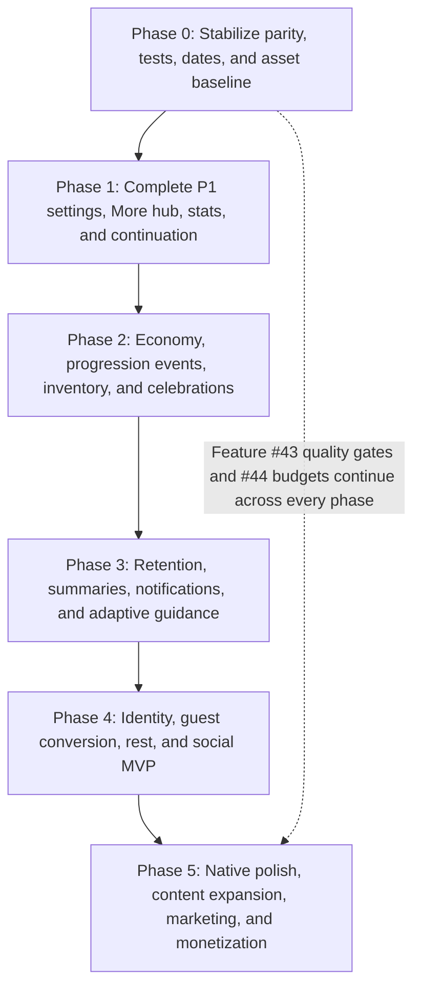

# Loro — Development Plans & Feature Roadmap

> **Last updated:** 2026-07-27
> **Version:** 0.3.1
> **Conversation:** Monthly development-history archive
>
> **Product contract:** [`PRODUCT.md`](./PRODUCT.md)  
> **Engineering architecture:** [`ARCHITECTURE.md`](./ARCHITECTURE.md)  
> **Development history:** [`history/README.md`](./history/README.md)  
> **Agent workflow:** [`../AGENTS.md`](../AGENTS.md)

### Status Legend

- **☑ Complete:** Shipped with authenticated Supabase behavior, guest/local parity, required UI states, and verification.
- **◐ Partial:** A usable foundation exists, but one or more required client, server, parity, security, or UX pieces remain.
- **☐ Planned:** Not started or only represented by non-functional placeholders/constants.

---

## Summary Priority Matrix

| Priority | # | Feature | Effort | Impact | Status |
|----------|---|---------|--------|--------|--------|
| 🔴 P0 | [1](#feature-1) | Today-at-a-glance habit strip | Low | High | ☑ |
| 🔴 P0 | [2](#feature-2) | Energy regeneration countdown timer | Low | High | ☑ |
| 🔴 P0 | [3](#feature-3) | Habit quick-switcher (horizontal pill row) | Medium | High | ☑ |
| 🟡 P1 | [4](#feature-4) | Streak shield earn & consume mechanics | Medium | High | ◐ |
| 🟡 P1 | [5](#feature-5) | Shop tab (shields, potions, charms, cosmetics) | High | High | ☐ |
| 🟡 P1 | [6](#feature-6) | Haptic feedback (quest start/complete, level-up) | Low | Medium | ☑ |
| 🟡 P1 | [7](#feature-7) | Statistics & insights dashboard (More tab) | Medium | Medium | ◐ |
| 🟡 P1 | [8](#feature-8) | Settings UI in More tab (sound, haptics, reminders) | Low | Medium | ◐ |
| 🟡 P1 | [28](#feature-28) | Customize habit settings (duration/count per habit) | Medium | Medium | ◐ |
| 🟡 P1 | [33](#feature-33) | Post-completion flow ("Continue to next trail") | Low | Medium | ☐ |
| 🟡 P1 | [43](#feature-43) | Launch readiness (observability, security, QA, delivery) | High | High | ☐ |
| 🟢 P2 | [10](#feature-10) | Push notifications (reminders, streak at risk, energy) | Medium | High | ☐ |
| 🟢 P2 | [11](#feature-11) | Achievement/badge system | Medium | Medium | ☐ |
| 🟢 P2 | [12](#feature-12) | Level-up celebration modal | Low | Medium | ☐ |
| 🟢 P2 | [13](#feature-13) | Dark mode | High | Medium | ☐ |
| 🟢 P2 | [14](#feature-14) | Onboarding guided tour / tutorial | High | High | ☐ |
| 🟢 P2 | [15](#feature-15) | Path node animation polish (pulse, unlock, chapter burst) | Medium | Medium | ☐ |
| 🟢 P2 | [16](#feature-16) | Streak "at risk" visual warning (amber tint at evening) | Low | Medium | ☐ |
| 🟢 P2 | [17](#feature-17) | Chapter preview / "Coming Soon" teasers | Low | Low | ☐ |
| 🟢 P2 | [35](#feature-35) | Adaptive Lory messages (context-aware briefings) | Medium | Medium | ◐ |
| 🟢 P2 | [36](#feature-36) | Chapter completion celebration (distinct from quest/loot) | Medium | High | ☐ |
| 🟢 P2 | [37](#feature-37) | Equipment comparison on equip (stat diff) | Medium | Medium | ☐ |
| 🟢 P2 | [38](#feature-38) | "New" badge on recently acquired items | Low | Medium | ☐ |
| 🟢 P2 | [39](#feature-39) | Pull-to-refresh + skeleton loading states | Medium | Medium | ☐ |
| 🟢 P2 | [40](#feature-40) | Guild quest progress toasts + quest history | Medium | Medium | ☐ |
| 🟢 P2 | [41](#feature-41) | Tap loot preview in celebration modal for item details | Low | Medium | ☐ |
| 🟢 P2 | [42](#feature-42) | Item catalog (all collected items, even sold/lost) | Medium | Medium | ◐ |
| 🟢 P2 | [44](#feature-44) | Asset optimization and bundle budgets | Medium | Medium | ☐ |
| 🔵 P3 | [18](#feature-18) | Home screen widget (iOS/Android) | High | Medium | ☐ |
| 🔵 P3 | [19](#feature-19) | Habit completion notes (optional one-liner) | Low | Low | ☐ |
| 🔵 P3 | [20](#feature-20) | Expanded sound design (rarity fanfares, ambient music) | Medium | Low | ☐ |
| 🔵 P3 | [21](#feature-21) | Midnight date-roll transition polish | Low | Medium | ◐ |
| 🔵 P3 | [22](#feature-22) | Empty state illustrations (Lory variants) | Medium | Low | ☐ |
| 🔵 P3 | [23](#feature-23) | Daily/weekly summary at check-in | Medium | Medium | ☐ |
| 🔵 P3 | [24](#feature-24) | Calendar heatmap (GitHub-style contribution grid) | Medium | Medium | ☐ |
| 🔵 P3 | [25](#feature-25) | IKEA-effect onboarding (habits first, auth later) | Medium | High | ☐ |
| 🔵 P3 | [26](#feature-26) | Badge indicators on tab bar | Low | Medium | ☐ |
| 🔵 P3 | [27](#feature-27) | Campfire rest days (streak freeze alternative) | Medium | Medium | ☐ |
| 🔵 P3 | [29](#feature-29) | SSO login (Google) | Medium | Medium | ☐ |
| 🔵 P3 | [30](#feature-30) | Friend/social features | High | Medium | ☐ |
| 🔵 P3 | [31](#feature-31) | Landing page / marketing site | High | Medium | ☐ |
| 🔵 P3 | [32](#feature-32) | Business model implementation (payments) | High | High | ☐ |
| 🔵 P3 | [34](#feature-34) | Duplicate gear salvage for coins | Low | Low | ☐ |

Feature numbering preserves the existing roadmap IDs. Feature #9 is currently unallocated; later entries are not renumbered so historical links and conversation-log references remain stable.

### Quick Links

- [Feature Details](#feature-details)
- [Product Guide](./PRODUCT.md)
- [Engineering Architecture and Definition of Done](./ARCHITECTURE.md)
- [Detailed Delivery Blueprints](#detailed-delivery-blueprints)
- [After Adventure Paths](#after-adventure-paths)
- [Loot Pool Management](#loot-pool-management)
- [Review of Existing Planned Features](#review-of-planned)
- [Conflict Analysis](#conflict-analysis)
- [Maintenance Notes](#maintenance-notes)
- [Implementation Order](#implementation-order)
- [Development History](#development-history)

---

## Roadmap Implementation Contract

Feature-specific scope, status, sequencing, and exceptions live in this roadmap. Every implementation must also follow:

- [`PRODUCT.md`](./PRODUCT.md) for game rules, terminology, Lory's voice, interaction boundaries, and the intended player experience.
- [`ARCHITECTURE.md`](./ARCHITECTURE.md) for state/data ownership, client/backend boundaries, security, caching, accessibility, testing, delivery, and the shared Definition of Done.
- [`../AGENTS.md`](../AGENTS.md) for the mandatory agent workflow and roadmap-maintenance procedure.

Source code, tests, migrations, and deployed configuration remain the final truth for current behavior. When implementation and roadmap status differ, audit the code, record the discrepancy, and update this document rather than silently changing historical intent.

---

## Feature Details

### 1. Today-at-a-Glance Habit Strip (P0)

**What:** A compact horizontal strip below the resource bar on Home showing all 6 habits with a check/dot indicator for today's completion status. Tapping a habit switches to it.

**Why:** Currently players must navigate into individual habits to see daily status. This reduces friction and encourages multi-habit days (synergy with guild quests like "Double Step" and "Four Corners").

**Implementation notes (as built):**
- ✅ Implemented directly in the existing `ActiveHabitCard` 2×3 habit grid (no standalone strip component)
- All habit pills share a consistent blue background (`bg-primary-soft`, `border-primary`) for visual clarity
- Active pill uses a slightly stronger border (`border-primary-strong`)
- Status is communicated through the icon only:
  - **Completed today:** green checkmark-circle icon + green label
  - **In progress (timed quest running):** gold play-circle-outline icon + gold label
  - **Active/selected (unstarted):** blueDark habit icon + blue label
  - **Default/unstarted:** muted habit icon + muted label
- ✅ `DailyQuestCard` keeps the active habit icon as its primary icon and overlays the matching completion/in-progress status badge at the lower-right.
- Uses `useGameHabits().habitList`, `useGameSync().todayDateKey`, and `useGameActions().setActiveHabit`
- Future enhancement: add a `3/6 trails cleared` counter summary above the grid with individual habit completion dots
- Future enhancement: show a "Possible loot" rarity teaser (e.g., `?` silhouette matching the node's loot tier) on the `DailyQuestCard` to build anticipation before quest completion

---

### 2. Energy Regeneration Countdown Timer (P0)

**What:** Display "⚡ +1 in 23m" next to the energy pill in `ResourceBar` when energy is below max. Also add a gentle zero-energy fallback so players are never blocked from habits.

**Why:** Classic mobile retention mechanic. The state already tracks `lastRefillAt` — just needs a visible countdown. Energy should feel like a pacing mechanic, not a paywall — especially important for a wellness app.

**Implementation notes (as built):**
- ✅ Client: Added a 30-second interval in `ResourceBar` that calculates remaining time until next energy refill and the effective energy including passive regeneration
- ✅ Client: When `lastRefillAt` is available and energy is below max, displays "+1 in Nm" suffix and updates the displayed value to include passively regenerated points
- ✅ Local repo: `lastRefillAt` now set to `now` on energy deduction in `startLocalDailyQuest` and `completeLocalDailyQuest` (was only set during daily check-in)
- ✅ Server: New migration `20260726000100_energy_passive_refill.sql` that:
  - Updates `start_daily_quest` RPC to set `last_energy_refill_at = action_time` when energy is consumed
  - Updates `complete_daily_quest` RPC to set `last_energy_refill_at = action_time` when energy is consumed for one-time quests
  - Updates `build_game_snapshot` to compute passive refill: `energy_current + floor(elapsed_seconds / 1800)` capped at `energy_max`
- ✅ Cross-device: After logout/login or device switch, the server snapshot includes passively regenerated energy based on real elapsed time
- Refill rate: 1 energy per 30 minutes (configurable in `ENERGY_REFILL_INTERVAL_MS` constant)
- **Future: Zero-energy fallback** — when energy is 0 and user tries a timed quest, offer "Start with reduced rewards" (50% coins, 50% XP, no loot drop) instead of blocking
- **Future: Low-energy warning** — when energy ≤ 1, show a warning before starting a timed quest
- One-time habits (Water, Sleep) remain unaffected and always work at zero energy

---

### 3. Habit Quick-Switcher (P0)

**What:** A horizontal scrollable row of habit icon pills that lets players jump between habits without navigating back to a list.

**Why:** Currently switching habits requires going through `HabitPathScreen` back button. A persistent switcher makes exploration frictionless.

**Implementation notes (as built):**
- ✅ Added reusable `HabitSwitcher` — a horizontal `ScrollView` of `TouchableOpacity` pills rendered below the `HabitPathScreen` header.
- ✅ Each pill retains the habit icon and label, then overlays the same semantic status icons used by Home (`checkmark-circle` for completed today and `play-circle-outline` for a timed quest in progress) at the icon's lower-right corner.
- ✅ The selected habit uses a `bg-primary` highlight and calls `setActiveHabit(habitId)` directly, so the existing path header, chapters, rewards, and node statuses update in place.
- ✅ Selection haptics fire only for a real habit change and respect the user's haptics setting.
- ✅ Home intentionally keeps its existing 2×3 status grid from Feature #1. It gives players a complete at-a-glance daily overview; adding a second switcher there would duplicate the same selection control.
- ✅ **"Resume quest" visibility:** A non-active habit with a timed quest started today shows a gold play badge in the path switcher.

---

### 4. Streak Shield Mechanics (P1)

**What:** Earn streak shields from chapter completions. Auto-consume one when a day is missed to preserve the streak. Visual indicator when a shield is protecting you.

**Why:** Inventory already has `streakShields: 0` and `ActiveBuff` types defined. This is the natural next step to make shields meaningful.

**Implementation notes (partially built):**
- ✅ Added `isStreakReset` helper in `src/utility/adventurePath.ts` to detect when a streak would reset (gap > 1 day or no prior completion).
- ✅ On chapter reward claim (`claimLocalChapterReward` in `src/services/localGameRepository.ts`), increments `inventory.streakShields` by 1.
- ✅ On quest completion (`completeLocalDailyQuest`), checks if either habit streak or daily streak would reset. If `streakShields > 0`, consumes exactly one shield and preserves both streaks (habit.streak + 1, dailyStreak + 1) instead of resetting to 1.
- ✅ Shield display: `src/components/ResourceBar.tsx` shows a blue `shield-checkmark` pill with count next to the flame when `streakShields > 0`.
- ✅ Shield display: `src/screens/profile/index.tsx` shows shield count next to the streak line in the profile header.
- ✅ Shield consumption is atomic — one shield protects all at-risk streaks for a single quest completion.
- ⚠️ **Authenticated parity is incomplete:** the current earn/consume rules are implemented in `localGameRepository.ts`, but the remote chapter/quest RPCs do not yet apply the same shield rules. A later snapshot migration also emits `streakShields: 0` instead of the stored profile value. Feature #4 remains **◐ Partial** until the remote RPCs, snapshot, and pgTAP coverage are corrected.
- Future enhancement: "Streak Protected!" non-blocking toast banner on day-after-miss.

---

### 5. Shop Tab (P1)

**What:** A dedicated shop where players spend coins on items that enhance gameplay.

**Why:** Coins currently have no spend outlet beyond psychological satisfaction. A shop closes the economy loop.

**Shop inventory:**
| Item | Cost | Effect |
|------|------|--------|
| Streak Shield | 50 🪙 | Protects streak for one missed day |
| Energy Elixir | 30 🪙 | Restores 3 energy instantly |
| XP Charm | 40 🪙 | 2× XP for next 3 completions (stacks as `ActiveBuff`) |
| Lory Scarf (Green) | 100 🪙 | Cosmetic — Lory wears a green scarf on Home |
| Lory Hat (Explorer) | 150 🪙 | Cosmetic — Lory wears an explorer hat |

**Implementation notes:**
- Keep the five-tab navigation. Add a `Stash | Shop` segmented mode inside Stash or a Shop destination launched from Stash/More instead of adding a sixth bottom tab.
- Create a `ShopScreen` or screen-local Shop view with catalog, affordability, owned state, and purchase confirmation.
- Shop catalog constant in `src/constants/shop.ts`
- Add a transactional purchase RPC for authenticated users and equivalent local-repository intent for guests; the server must calculate prices/effects and validate sufficient coins.
- Cosmetic items stored in a new `cosmetics` array on `PlayerProfile`

---

### 6. Haptic Feedback (P1)

**What:** Use `expo-haptics` to provide tactile feedback for key interactions.

**Why:** Settings already has `hapticsEnabled`. Wiring it up makes the app feel native and premium with minimal effort.

**Haptic map:**
- `light` — habit switch, tab press, node tap
- `medium` — quest start, quest complete, item equip
- `heavy` — chapter complete, level up, legendary loot drop
- `selection` — scrolling through habit switcher

**Implementation notes:**
- Install `expo-haptics` (compatible with SDK 54)
- Create `src/hooks/useHaptics.ts` that respects `settings.hapticsEnabled`
- Call from `QuestActionButton`, habit switcher, celebration modal, etc.
- ✅ Bottom-tab navigation uses semantic `selectionAsync()` feedback only after `PersistentTabHost` accepts a real tab change. Same-tab taps and taps rejected during an active transition remain silent.
- ✅ Shared haptic calls treat unsupported-device failures as best-effort feedback and safely absorb rejected promises.

---

### 7. Statistics & Insights Dashboard (P1)

**What:** Transform the More tab from a bare sign-out button into a stats hub.

**Why:** `activityLog` and all completion records already exist in state. Players crave visibility into their progress.

**Sections:**
- **Weekly Overview:** 7-day bar chart of completions per day
- **Habit Distribution:** Which habits get the most completions (horizontal bar or donut)
- **Per-Habit Breakdown:** For each habit — total quests, total tracked time (timed), best streak, last completed date, chapter progress
- **Personal Records:** Best streak, longest timed quest, most coins in a day
- **Collection Progress:** "You've found 12 of 16 Verdant Wayfinder pieces"
- **All-Time Stats:** Total quests, total coins earned, total XP
- **Activity Log:** Scrollable timeline of recent completions with timestamps, rewards, and loot (accessible from Profile)

**Implementation notes (partially built):**
- Use `react-native-svg` (already installed) for simple charts
- Compose the dashboard from reusable chart and summary primitives rather than one large component
- Use paged/range-scoped Supabase read models for authenticated all-time data; use the local repository's durable history for guests
- Pure computation in `src/utility/statistics.ts`
- ✅ Profile already contains a small lifetime-statistics summary. The full range-selectable dashboard, accessible charts, server-backed history, and More navigation remain planned.

---

### 8. Settings UI (P1)

**What:** Expose the existing settings state (sound, haptics, reminders, timezone) in the More tab.

**Why:** The current UI exposes the most common toggles, but reminder scheduling, time editing, privacy controls, support, export, reset, and account deletion still need a coherent settings experience.

**Toggles and sections:**
- 🔔 Daily Reminder (on/off + time picker)
- 🔊 Sound Effects (on/off)
- 📳 Haptics (on/off)
- 🌍 Timezone (display-only for now, auto-detected)
- 🌓 Theme toggle (when dark mode is added)
- 🔒 Privacy: link to privacy policy, data usage summary
- 💬 Support & Feedback: email/message link
- 📤 Export Data: download game data as JSON
- 🗑️ Delete Account / Reset Progress: with confirmation flow

**Current status:**
- ✅ More currently exposes sound, haptics, and daily-reminder toggles through `updateSettings`.
- ✅ Habit target controls for Feature #28 are present in the current implementation.
- ☐ Reminder time editing, timezone display, theme, privacy/support links, data export, account deletion/reset, permission state, and notification scheduling remain.

---

### 10. Push Notifications (P2)

**What:** Local scheduled notifications for device-known reminders and state changes, with remote push reserved for events that originate on the server.

**Why:** Settings already scaffolds `dailyReminderEnabled` and `dailyReminderTime`. Notifications are the #1 retention tool for habit apps.

**Notification types:**
- Daily reminder at user's chosen time: "Lory's waiting! Time for your daily quest. 🦜"
- Streak-at-risk at 8 PM: "Your 7-day 🔥 is at risk! Complete a quest before midnight."
- Energy full: "Your energy is fully restored. Ready for adventure?"
- Guild quest expiring: "A guild quest expires tomorrow — claim your reward!"

**Implementation notes:**
- Install the Expo SDK-compatible `expo-notifications` version with `npx expo install` and verify it in a development build
- Put permission/scheduling behavior in a dedicated notification service/coordinator rather than adding more side effects to `AppStateProvider`.
- Respect `dailyReminderEnabled` toggle
- Ask permission when the user enables reminders or during an explicit onboarding step; do not prompt automatically on first launch without context.
- Separate local scheduled reminders from server-triggered push notifications. Device-token storage and remote sends are not required for the first local-reminder slice.

---

### 11. Achievement / Badge System (P2)

**What:** Define milestone-based achievements that unlock badges on the Profile screen. Each badge grants a small coin reward when first earned.

**Why:** `profileBadges` is already defined and imported in Profile. This gives players long-term goals beyond daily streaks.

**Badge definitions (expand on existing 4):**
| Badge | Unlock Condition | Tone |
|-------|-----------------|------|
| 🧭 New Adventurer | Account created | primary |
| ✅ First Quest | Complete 1 quest | success |
| 🔥 Seven Day Spark | 7-day streak | danger |
| 🏆 Chapter Hero | Complete a full chapter | reward |
| 🦜 Lory's Friend | 30 daily check-ins | primary |
| ⚡ Energizer | Complete all habits in one day | reward |
| 💎 Collector | Own 20+ items | reward |
| 🗺️ Trail Master | Complete 3 chapters | reward |
| 🛡️ Iron Will | Use a streak shield | primary |
| ⭐ Legendary Find | Acquire a legendary item | reward |

**Implementation notes:**
- Expand `ProfileBadgeId` union in `constants/profile.ts`
- Add an idempotent `user_achievements` ledger for signed-in users and an equivalent local ledger for guests.
- Evaluate achievement grants inside the same server transaction as the triggering mutation; do not make reducer-only unlocks authoritative for authenticated users.
- Badge unlock shown as a mini celebration (non-blocking toast)
- Profile screen shows greyed-out locked badges

---

### 12. Level-Up Celebration Modal (P2)

**What:** A distinct, simpler modal when the player gains a level, separate from the quest-complete loot drop modal.

**Why:** Currently XP is tracked and levels exist, but the only celebration is quest-complete. Leveling up should feel like an event too.

**Implementation notes:**
- Detect and persist level changes inside the same authenticated transaction as quest completion/chapter reward, with equivalent guest-repository logic
- Emit a typed `levelUp` event in the mutation outcome
- `QuestCelebrationModal` gets a new `"level-up"` variant
- Shows: new level number, stat increase (if applicable), Lory cheering
- Can be a simpler overlay than the full loot drop sequence
- Note: distinct from the [chapter completion celebration](#feature-36) — level-ups can happen mid-chapter; chapter completions are 7-day milestones

---

### 13. Dark Mode (P2)

**What:** A dark variant of the pastel color palette, toggleable in Settings.

**Why:** Major QoL for evening habit logging. NativeWind supports `dark:` variants.

**Implementation notes:**
- Add `darkMode: "class"` to `tailwind.config.js`
- Define dark color tokens in `themeTokens.js`: `dark-canvas`, `dark-surface`, etc.
- Add `theme: "system" | "light" | "dark"` to `AppSettings`
- Toggle in More → Settings
- Persist through the existing settings/snapshot cache rather than adding a second general-purpose storage system solely for theme.
- System theme detection: `useColorScheme()` from React Native

---

### 14. Onboarding Guided Tour (P2)

**What:** First-time user walkthrough introducing Lory, the game loop, streaks, energy, and quest types.

**Why:** New users may not understand timed vs one-time quests, energy costs, or how adventure paths work. A guided tour reduces drop-off.

**Flow:**
1. Lory greets: "Welcome, adventurer! I'm Lory, your trail captain. 🦜"
2. "These are your daily quests — complete them to advance on the adventure path."
3. "Timed quests use energy. Hold the button to start!" (demo on Exercise)
4. "One-time quests like Water don't need energy. Just tap!"
5. "Consistency builds your trail. Missing a day never removes the progress you've earned."
6. "Check in daily for bonus coins and energy."

**Implementation notes:**
- New component `OnboardingTour` with step-by-step overlays
- Tooltip-style highlights pointing at UI elements
- Stored `hasCompletedOnboarding: boolean` in settings or profile
- Skip button always visible
- Can be re-triggered from More → "Replay tutorial"

---

### 15. Path Node Animation Polish (P2)

**What:** Add subtle animations to adventure path nodes beyond static styling.

**Why:** The adventure path is the core visual metaphor. Animations make it feel alive.

**Animations:**
- **Active node:** Soft pulse/glow ring (Reanimated `withRepeat` scale 1→1.05)
- **Node unlock:** Scale-up + fade-in when midnight rolls over
- **Node complete:** Brief burst + checkmark pop (already partially in place via celebration)
- **Chapter complete:** Full-row particle burst (distinct from single-node)
- **Locked nodes:** Subtle "shimmer" on the lock icon to indicate they're not broken, just waiting

**Implementation notes:**
- Animated wrapper around node items in `HabitPathScreen`
- Use `useReducedMotion()` to skip when accessibility setting is on
- Performance: only animate visible nodes (FlatList vs ScrollView consideration)
- **Stretch goal — Visual path map:** Transform the vertically stacked chapter list into a winding trail/board-game aesthetic with connected nodes, Lory standing at the active node, and themed terrain backgrounds per chapter (forest, ridge, springs). This is high-effort but would dramatically reinforce the gamification identity.

---

### 16. Streak "At Risk" Visual Warning (P2)

**What:** If it's past 8 PM in the user's timezone and a habit isn't completed, tint the habit icon amber/orange and show a subtle warning.

**Why:** Proven nudge pattern from Duolingo, Streaks, etc. Creates urgency without being annoying.

**Implementation notes:**
- In `DailyQuestCard` or `HabitSwitcher`, check timezone-aware hour
- If hour >= 20 and `!completedToday`, apply amber border/icon tint
- Optional text: "🔥 Streak at risk — complete before midnight!"
- The `timeZone` field in settings is already available via context

---

### 17. Chapter Preview / Teasers (P2)

**What:** Show the next chapter's name, theme, and description when the current chapter is complete but the next isn't unlocked yet.

**Why:** Builds anticipation. Currently the path just shows locked nodes with no context.

**Implementation notes:**
- After chapter N is complete, show a locked card for chapter N+1
- Card shows: chapter title, description, node count, reward preview
- "Complete Chapter N first to unlock" label
- Data already exists in `habits.ts` chapter blueprints

---

### 18. Home Screen Widget (P3)

**What:** iOS/Android home screen widget showing Lory, today's streak, and completion rings for habits.

**Why:** High engagement value — players see their progress without opening the app.

**Implementation notes:**
- Requires native widget targets/config plugins and therefore a development/production build; this cannot be validated in Expo Go.
- Re-evaluate the supported Expo widget approach against the app's SDK at implementation time rather than committing to an unverified package now.
- Widget shows: Lory icon, streak count, N/6 habits done today
- Write a minimal, non-sensitive widget snapshot through platform shared storage; never share Supabase tokens with the widget.
- Significant effort for cross-platform widget development

---

### 19. Habit Completion Notes (P3)

**What:** Optional single-line text note when completing a habit (e.g., "Read Chapter 4 of Dune").

**Why:** Adds personal context without complicating the interaction model. The "one-tap complete" philosophy is preserved by making notes optional.

**Implementation notes:**
- Keep the Daily Quest action unchanged. Offer "Add a note (optional)" only after the completion transaction succeeds.
- Store as `note?: string` on `NodeCompletionRecord`
- Display in activity log and path node detail
- The note UI is dismissible and must not delay rewards, streaks, loot, or navigation.

---

### 20. Expanded Sound Design (P3)

**What:** Distinct sounds for different loot rarities, streak milestones, and chapter completions.

**Why:** `expo-audio` is already wired for button presses. Expanding the soundscape increases the game-feel dramatically.

**Sound map:**
- Common loot: soft wooden chime
- Uncommon: brighter chime
- Rare: harp arpeggio
- Epic: orchestral sting
- Legendary: full fanfare
- Streak milestone (7, 30, 100): ascending jingle
- Chapter complete: orchestral chord
- Level up: upbeat flourish

**Implementation notes:**
- Add audio files to `src/assets/audio/`
- Register in `src/constants/audio.ts`
- Play via `useAudioPlayer` in `QuestCelebrationModal` and level-up modal
- Respect `settings.soundEnabled`

---

### 21. Midnight Date-Roll Transition (P3)

**What:** When the date changes, auto-refresh the UI: lock yesterday's completed nodes, unlock today's, reset quest status.

**Why:** Currently likely requires a pull-to-refresh or app restart to see new day state.

**Implementation notes:**
- `useEffect` in `AppStateProvider` watching `todayDateKey`
- ✅ `DailyQuestCard` now shows a live `Until next quest: ...` countdown to the next local midnight using the configured timezone and synchronized server clock
- ✅ `AppStateProvider` already polls the configured local date and refreshes the local/remote snapshot when it changes.
- Do not mutate or erase durable completion data in a `DAY_ROLLOVER` reducer action. The refreshed snapshot and pure selectors should derive the new active nodes, effective streaks, energy, and guild period.
- Remaining work: define cross-midnight timed-quest behavior and show a one-time, reduced-motion-aware "New day, new quests!" toast.

---

### 22. Empty State Illustrations (P3)

**What:** Show Lory in different poses for empty states instead of blank space.

**Why:** `PixelParrot` already exists. Empty states are a prime opportunity for personality.

**Lory variants needed:**
- "Thinking" — inventory empty: "No gear yet! Complete quests to find loot."
- "Sleeping" — no active guild quests: "The quest board is quiet. Check back soon!"
- "Celebrating" — all habits done: "Perfect day!"
- "Waving" — welcome back after absence

**Implementation notes:**
- Create alternate parrot PNG assets or use `PixelParrot` with animation variants
- Reusable `EmptyState` component with `PixelParrot`, message, optional CTA

---

### 23. Daily/Weekly Summary at Check-In (P3)

**What:** When the player does their daily check-in, show a quick summary of yesterday's accomplishments.

**Why:** Ties the check-in ritual to recent accomplishments, making it more rewarding.

**Implementation notes:**
- Extend `TrailStampDetails` to include previous-day summary
- "Yesterday you completed 3 quests, earned 85 coins, and found a Rare Cape!"
- Pull data from `activityLog` filtered to yesterday's date key

---

### 24. Calendar Heatmap (P3)

**What:** GitHub-style contribution grid showing completion density over time.

**Why:** Requested by the user. Visually satisfying way to see long-term consistency.

**Implementation notes:**
- New component `CompletionHeatmap` using `react-native-svg`
- Data from `activityLog` — count completions per day
- Show last 3-6 months in a grid (columns = weeks, rows = days)
- Color intensity: 0 = grey, 1-2 = light green, 3-4 = medium, 5+ = dark green
- Place in More → Stats or Profile

---

### 25. IKEA-Effect Onboarding (P3)

**What:** Let users select habits and complete their first quest BEFORE signing up. Auth comes after they've invested effort.

**Why:** User-requested. The IKEA effect (valuing something more when you help build it) increases signup conversion.

**Flow:**
1. Splash → "Pick up to 5 habits to start your adventure"
2. Habit selection grid (checkboxes, max 5)
3. Immediately start first quest (timed or one-time demo)
4. After completion: "Great job! Create your account to save your progress."
5. Signup → "Lory: Your account is ready! Your progress is safe." 🦜
6. Existing users: "I already have an account" → login

**Implementation notes:**
- Existing guest mode, local repository, and platform cache provide the foundation, but the pre-auth habit-selection/first-quest funnel is not built.
- Guest session state must persist through the trial → signup transition
- The current `AuthScreen` would need a pre-auth onboarding phase
- **Guest progress migration:** Never trust an arbitrary client-owned guest snapshot as authoritative currency, loot, or streak data. Import a bounded onboarding result (selected habits plus at most the documented first-quest reward) through an idempotent RPC. Current guest cache key: `loro.game.cache.local-guest` in `gameCache.native.ts`.
- See also: user's existing "IKEA effect on signup" task below

---

### 26. Badge Indicators on Tab Bar (P3)

**What:** Red badge dots on tab bar icons for pending actions.

**Why:** User-requested. Standard mobile pattern for drawing attention.

**Badge rules:**
- **Home:** Unfinished habits count (e.g., "3" if 3 of 6 not done)
- **Profile:** New unlocked badges or completed sets
- **Shop:** New items available (if rotating stock is added)
- **Guild:** Claimable rewards

**Implementation notes:**
- Add `badgeCount` or `hasBadge` to each tab in `PersistentTabHost`
- Red dot (not number) for Profile/Shop, number for Home
- Derived from state in `AppNavigator` or tab host

---

### 27. Campfire Rest Days (P3)

**What:** A "rest day" mechanic — once per week, declare a rest day that preserves your streak without completing a quest.

**Why:** User-requested. Alternative to streak shields. More compassionate: acknowledges that rest is part of a healthy routine, not a failure.

**Implementation notes:**
- Add `restDaysUsedThisWeek: number` and `maxRestDaysPerWeek: 3` to state
- "Campfire" button on Home: "Take a rest day — your streak is safe."
- Visual: Lory sitting by a campfire
- Resets weekly (Sunday or Monday depending on locale)
- Could cost coins instead of being free: 20 coins per rest day
- **"Path progress is safe" messaging:** When the user returns after a missed day, show a reassuring message: "You missed a day, but your path progress is safe. Streaks can be rebuilt!" This reinforces that only streaks reset — never adventure path progress.

---

### 28. Customize Habit Settings (P1)

**What:** Let users adjust the target duration (timed habits) or target count (one-time habits) per habit, without changing quest types. Stock values serve as minimums.

**Why:** User-requested. Six fixed targets won't fit everyone's routine (e.g., "I exercise for 30 minutes, not 15"). This replaces the original #28 (Custom Habit Creation) which was P3 — customizing existing habits is lower effort and higher immediate value. Full custom habit creation may return in a future P3 iteration.

**Constraints:**
- **Type lock:** `timed` habits stay timed; `one-time` habits stay one-time. No converting Water into a timed quest — this would break energy cost assumptions and path structure.
- **Minimum floor:** Timed = 5 minutes, one-time = 1 unit. Stock values are the floor.
- **Per-habit override** stored in `HabitState.settings` (new field), falling back to default chapter blueprints.

**Examples:**
| Habit | Default | User Sets |
|-------|---------|-----------|
| Exercise | 15 min | 30 min |
| Reading | 10 min | 20 min |
| Water | 8 glasses | 6 glasses |

**Implementation notes (partially built):**
- Add `habitSettings: Record<HabitId, { targetOverride?: number }>` to `AppState`
- Add a settings row per habit in the Settings UI (More tab, #8)
- Display: habit icon + label + stepper/slider for the override value
- `getDailyQuestDetails()` reads the override, clamped to the minimum
- No path migration needed — overrides only affect quest completion requirements, not adventure path structure
- This is distinct from the original #28 (custom habit creation) which would create entirely new habits with generated paths
- ✅ The current implementation contains client display/enforcement, local timed-quest enforcement, a Supabase `target_overrides` migration, and More controls.
- ⚠️ One-time quests are still binary actions, so changing a displayed count does not verify that quantity. For the first complete version, either support timed-duration overrides only or add an explicit quantity-tracking interaction as a separate product change.
- ⚠️ Replace per-tap fire-and-forget writes with a validated draft/save or debounced mutation, and validate allowed habit IDs/ranges inside the RPC before marking complete.

---

### 29. SSO Login (Google) (P3)

**What:** Google Sign-In as an alternative to email magic link.

**Why:** User-requested as MUST. Reduces signup friction significantly.

**Implementation notes:**
- Supabase supports Google OAuth out of the box
- Use `@supabase/supabase-js` `signInWithOAuth` with `provider: 'google'`
- Requires Google Cloud Console OAuth client configuration
- Redirect handling via `expo-linking` (already installed)
- Add "Continue with Google" button to auth screen
- Keep existing magic link as fallback

---

### 30. Friend / Social Features (P3)

**What:** Compare streaks, send encouragement, or see friends' adventure progress.

**Why:** User-requested. Social accountability is a powerful habit motivator.

**Considerations:**
- This is a major feature requiring backend work (Supabase friendships table, activity feeds)
- Start minimal: friend codes, see each other's streaks and current chapter
- Avoid competitive leaderboards initially — keep it supportive
- Requires careful privacy design (opt-in sharing)

---

### 31. Landing Page / Marketing Site (P3)

**What:** External web page with app details, screenshots, and a waitlist/signup.

**Why:** User-requested. Needed before public launch.

**Implementation notes:**
- Separate project (not part of the Expo app)
- Could be a simple Next.js or Astro site
- Sections: hero, features, screenshots, "Join the waitlist" form
- Waitlist could feed into a Supabase table or third-party service

---

### 32. Business Model Implementation (P3)

**What:** Monetization strategy — subscription, one-time purchase, or free with IAP.

**Why:** User-requested. Critical for sustainability but needs careful design to not harm the core experience.

**Recommendation:** Free with optional cosmetic IAP + generous free tier.
- Free: 10 energy max, 50 inventory slots, all habits, all quests, streaks
- Loro Supporter ($2.99/mo or $19.99 lifetime): +5 energy max, 200 inventory slots, exclusive Lory cosmetics, supporter badge, priority feature requests
- Never sell: streak protection, energy refills, loot odds — these should stay earnable through gameplay
- Payment via RevenueCat or directly through App Store / Google Play IAP

**Implementation notes:**
- RevenueCat SDK for cross-platform IAP management
- Treat RevenueCat/webhook-backed entitlements as authoritative; client Context only presents the verified entitlement snapshot.
- In-game coin purchases may include earnable shields/elixirs, but real-money products remain cosmetic/supporter benefits and never directly sell streak protection, energy, or loot odds.
- This is a late-stage feature — implement after core loop is solid

---

### 33. Post-Completion Flow in Celebration Modal (P1)

**What:** After the loot drop celebration, offer clear next-action choices instead of just closing the modal.

**Why:** Currently the modal shows rewards then dismisses. Adding "Continue to next trail", "View adventure path", and "Done for today" turns completion into a satisfying transition. Reduces friction for multi-habit days.

**CTA buttons after loot reveal:**
- **"Continue to next trail"** — switches to the next unfinished habit and closes the modal
- **"View adventure path"** — navigates to the adventure path for the completed habit
- **"Done for today"** — closes the modal, stays on current habit

**Implementation notes:**
- Extend `LootDropDetails` with a `nextUnfinishedHabitId` field
- Add action buttons below the streak display in `QuestCelebrationModal`
- "Continue to next trail" only appears when there are unfinished habits remaining

---

### 34. Duplicate Gear Salvage (P3)

**What:** Allow players to convert duplicate inventory items into coins.

**Why:** Inventory already shows item counts and quantities. Duplicates currently have no purpose. A simple salvage action gives them meaning without needing a full shop or crafting system.

**Salvage values by rarity:**
| Rarity | Coins |
|--------|-------|
| Common | 5 |
| Uncommon | 10 |
| Rare | 20 |
| Epic | 40 |
| Legendary | 80 |

**Implementation notes:**
- Add "Salvage" button in `InventoryStackDetailsModal`
- Add an intent-based `salvageInventoryItem` action backed by a transactional authenticated RPC and equivalent guest-repository mutation
- Prevent salvaging equipped items
- Confirmation dialog: "Salvage this [Item Name] for [X] coins?"
- Keep at least one copy of each unique item (anti-frustration)

---

### 35. Adaptive Lory Messages (P2)

**What:** Lory's briefing adapts its tone and content based on player context — completion status, missed days, low energy, or returning after a break.

**Why:** The LoryBriefing system already exists with daily prompts. Making messages context-aware deepens the companion feeling and differentiates Loro from sterile habit trackers.

**Context triggers:**
| Trigger | Lory's tone | Example |
|---------|------------|---------|
| First quest of the day | Encouraging | "A fresh trail awaits! Let's start strong. 🦜" |
| All habits done | Celebratory | "You cleared every trail today! Rest well, adventurer." |
| Returning after 2+ missed days | Welcoming, no guilt | "The trail missed you! No rush — take it one step at a time." |
| Low energy (< 2) | Gentle nudge | "Running low on trail supplies. Water and Sleep don't need energy!" |
| Streak at risk (past 8 PM) | Urgent but kind | "Your flame is flickering! A quick quest will keep it burning. 🔥" |
| Midday (all habits unstarted) | Playful | "Lory's packed lunch and is ready when you are!" |

**Implementation notes (partially built):**
- Extend `LoryBriefingContext` in `src/types/loryBriefing.ts` with context trigger fields
- Update `buildLoryBriefingContext()` in `src/utility/loryBriefing.ts`
- Modify the Supabase Edge Function `generate-lory-briefing` to accept context and adjust prompt
- Fallback: local template strings when offline, server-generated when online
- Respect the existing daily refresh limit (2 per day)
- ✅ Daily generation, local/server cache, thinking/failure UI, 128-character validation, and the two-refresh limit already exist.
- Remaining work: add explicit time bucket, inactivity gap, all-trails-cleared, low-energy, and streak-risk facts; construct or validate all app facts server-side before sending them to DeepSeek.

---

### 36. Chapter Completion Celebration (P2)

**What:** A dedicated celebration variant for completing all 7 nodes in a chapter — distinct from individual quest completion and level-up celebrations.

**Why:** Currently only individual quests trigger the loot modal. Finishing an entire chapter is a much larger milestone (7 days of consistency) and deserves its own moment. The chapter reward claim flow already exists but has no fanfare.

**Celebration content:**
- "Chapter Complete!" banner with the chapter name and description
- Total chapter rewards breakdown (coins + XP bonus)
- Confetti/particle burst distinct from quest loot drops
- Smooth transition into the "Claim chapter reward" button
- Lory appears with a celebratory pose

**Implementation notes:**
- Add a `"chapter-complete"` variant to `QuestCelebrationModal`
- Emit a typed `chapterCompleted` event from the authoritative quest-completion outcome when node seven completes
- Different color palette: gold/purple vs the blue/green of quest loot
- Use existing `isSectionComplete()` utility to detect eligibility

---

### 37. Equipment Comparison on Equip (P2)

**What:** When viewing an item in the inventory modal, show a side-by-side stat comparison against the currently equipped item in the same slot.

**Why:** Currently `InventoryStackDetailsModal` shows an item's stats in isolation. Players can't tell if equipping it is an upgrade or sidegrade without memorizing their current gear. A stat diff (green ↑, red ↓) makes equip decisions feel meaningful and RPG-like.

**Implementation notes:**
- Extend `InventoryStackDetailsModal` to accept the currently equipped item for the same slot
- Render two columns: "Equipped" vs "Selected"
- Diff indicators: `+2 Strength` in green, `−1 Luck` in red
- Show total attribute change summary at the bottom
- Respect the existing equip action flow — comparison is read-only guidance

---

### 38. "New" Badge on Recently Acquired Items (P2)

**What:** Show a pulsing dot or "NEW" badge on inventory items acquired since the player last visited the Stash tab.

**Why:** Items have `acquiredAt` timestamps but no discovery indicator. A new-item badge drives excitement and ensures players don't miss loot they earned.

**Implementation notes:**
- Treat "seen" state as device-local presentation state rather than durable game state. Store seen inventory item IDs or a visit watermark in the existing per-user cache.
- In `InventoryStashGrid`, capture unseen items when the tab opens and mark them seen after they have been rendered, so badges do not disappear before the player can see them.
- Show a small pulsing dot or "NEW" ribbon on matching items
- Badge clears after the item has been presented in Stash.
- Use Reanimated for a subtle pulse animation on the dot

---

### 39. Pull-to-Refresh + Skeleton Loading States (P2)

**What:** Add `RefreshControl` to Home and other scrollable screens. Replace text-only loading messages with animated skeleton placeholder cards.

**Why:** Pull-to-refresh is a standard mobile pattern users expect. Skeleton screens reduce perceived loading time and feel more polished than "Loading profile details…" text.

**Implementation notes:**
- Add `RefreshControl` to `HomeScreen`, `GuildScreen`, `StashScreen`, `ProfileScreen` ScrollViews
- On refresh, call `refreshGameState()` from context
- Create a reusable `SkeletonCard` component: animated pulsing placeholder matching real card shapes
- Use Reanimated `withRepeat` opacity loop (0.3 → 0.7) for the pulse effect
- Replace inline loading text with skeleton cards in Profile, Stash, and Guild screens
- Respect `useReducedMotion()` — show static placeholders when reduce motion is enabled

---

### 40. Guild Quest Progress Toasts + Quest History (P2)

**What:** Show a small toast when daily habit completions advance a guild quest's progress. Add a "Past Quests" archive showing completed guild quests from previous periods.

**Why:** There's currently no visible feedback connecting daily actions to guild quest progress. The connection between "I completed Exercise today" and "Steady Trail is now 3/5" should be explicit. A history view adds long-term accomplishment tracking.

**Progress toast implementation notes:**
- Return typed `guildQuestAdvances` from the authoritative quest-completion outcome, with equivalent computation in the guest repository
- Show a non-blocking toast: "🛡️ Steady Trail: 3/5 days" with the guild quest icon
- Toast auto-dismisses after 3 seconds, stacks if multiple quests advance
- Use a lightweight animated banner at the top of the screen (below status bar)

**Quest history implementation notes:**
- Add a "Past Quests" collapsible section at the bottom of `GuildScreen`
- Read claimed history from the existing `guild_quest_claims` ledger with a paginated RPC/read model; do not duplicate only the last four periods into `AppState`.
- Show: quest title, completion date/period, rewards earned
- Fetch a bounded page (for example, four periods) while retaining the authoritative history in Postgres.
- Ties into the [activity log idea](#feature-7) for cross-referencing

---

### 41. Tap Loot Preview in Celebration Modal for Item Details (P2)

**What:** The inline loot item preview inside `QuestCelebrationModal` becomes tappable. Tapping opens `InventoryStackDetailsModal` showing the full item with an equip action, without adding any new buttons to the celebration flow.

**Why:** The inline preview card already shows the item image, rarity, name, and stats — but doesn't let the player inspect details or equip it. Adding a tap target on the existing preview avoids UI clutter while giving immediate agency over new loot.

**Implementation notes:**
- Wrap the inline loot card in `LootDropCelebration` (lines 272–327 of `QuestCelebrationModal.tsx`) with a `TouchableOpacity` or `Pressable`
- Convert the single loot instance with the shared inventory-stack utility before opening details; do not cast an `InventoryItem` into an `InventoryStack`.
- `onEquip` callback: calls `equipItem` from `useGameActions()`, closes the details modal on success
- Avoid fragile nested native modals. Let a shared modal/celebration coordinator temporarily present item details and then restore the celebration step.
- `InventoryStackDetailsModal` already accepts `onEquip` and handles equip/unequip — no changes needed to that component
- Do NOT add a separate "View item details" button — the tap target is the existing preview card itself

---

### 42. Item Catalog — All Collected Items (P2)

**What:** A read-only gallery in the More tab showing every item definition the player has ever discovered, including items no longer in their inventory (sold, salvaged, or otherwise lost). Separate from the Stash (which shows currently owned gear for equipping).

**Why:** Players want to track their collection history, not just their current inventory. The data already exists in `discoveredItemDefinitionIds` — this is purely a display feature. It turns More from a bare sign-out page into a meaningful collection hub.

**Data source:**
- `state.inventory.discoveredItemDefinitionIds: string[]` — all item definitions ever seen
- `equipmentItemsById` from constants — item metadata (name, image, set, slot, rarity)
- `state.inventory.items` — used only to show how many are currently owned vs. total discovered
- The existing `equipment_discoveries` ledger is the authoritative source for first discovery. Current inventory cannot provide a date for an item that was later salvaged or otherwise removed.

**Display:**
- Grouped by equipment set (Verdant Wayfinder, Emberforge Vanguard, Tidesong Arcanist)
- Each item card shows: image, name, rarity badge, slot label, first-acquired date
- Set header shows: set name, X/8 collected progress bar, set theme colors
- Sort options: by set, by rarity, by acquisition date
- Show "Not yet discovered" greyed-out slots for items in known sets that the player hasn't found
- Lory illustration: "Sleeping" variant in the empty space when no items are discovered yet (ties into #22)

**Implementation notes (foundation built):**
- New component `ItemCatalogScreen` or integrate into the More screen as a section
- Pure read-only — no equip, unequip, salvage, or trade actions
- Uses existing `equipmentItemsById`, `equipmentSetThemes`, and `discoveredItemDefinitionIds`
- ✅ The discovery ledger and `discoveredItemDefinitionIds` snapshot field already exist.
- Extend the read model with `discoveredAt` metadata or add a small catalog RPC if first-acquired dates are shown; IDs alone are insufficient.

---

### 43. Launch Readiness: Observability, Security, QA, and Delivery (P1)

**What:** Establish the production controls needed to operate Loro safely: crash/error visibility, privacy-conscious product analytics, automated verification, environment separation, migration/function deployment, security review, release checklists, and recovery procedures.

**Why:** Authentication, economy mutations, AI generation, notifications, social data, and payments cannot be operated responsibly with only manual typechecking. This feature is a prerequisite for public launch and should begin before the last feature sprint.

**Scope:**
- Global error boundary and native crash/error reporting
- Typed product analytics with explicit privacy allow-list
- Unit/component/integration/end-to-end test layers
- CI for TypeScript, Expo compatibility, unit tests, pgTAP/RLS, Edge Function tests, and bundle checks
- Development/staging/production environment and secret separation
- Supabase migration/Edge Function deployment workflow
- Dependency, RLS, authorization, account lifecycle, and AI data-flow security review
- Release, rollback, backup/restore, incident, and store-submission checklists

---

### 44. Asset Optimization and Bundle Budgets (P2)

**What:** Add a repeatable asset pipeline and measurable budgets for pixel art, profile/equipment images, audio, animation JSON, fonts, and platform metadata.

**Why:** The app already bundles many high-resolution equipment PNGs and multiple WAV effects. Uncontrolled asset growth increases install/update size, memory use, load time, and Metro/EAS build cost.

**Scope:**
- Asset inventory with file size, dimensions, alpha, format, and usage
- Per-category and total bundle budgets
- Lossless/pixel-safe image optimization and appropriate audio encoding
- Duplicate/orphan detection and centralized asset registration
- Deferred mounting/preloading rules for non-critical art/audio
- Bundle-size reporting in CI and release review

---

## Detailed Delivery Blueprints

These blueprints are the reviewed implementation contracts for the remaining roadmap. If a short note in the original feature description conflicts with a blueprint below, the blueprint takes precedence.

### Phase 0 — Production Foundations

Complete these cross-cutting items before expanding the economy or adding more mutation-heavy features:

1. **Restore remote/local parity.** Fix Feature #4's authenticated streak-shield snapshot, earning, and consumption before Shop can sell shields.
2. **Standardize mutation outcomes.** Outcomes that can trigger UI feedback should return explicit events such as `levelUp`, `chapterCompleted`, `achievementUnlocks`, and `guildQuestAdvances` instead of forcing screens to diff arbitrary snapshots.
3. **Add a UI event coordinator.** Build one queue for celebrations, toasts, and follow-up actions so loot, chapter, level-up, achievement, guild-progress, and item-detail surfaces never compete or nest native modals.
4. **Add paged read models.** Keep the game snapshot compact. Statistics, activity history, guild history, and catalog metadata use focused typed queries/RPCs with date ranges and pagination.
5. **Add missing test layers.** Retain `npm run typecheck` and pgTAP, then add pure utility tests and a small component/integration harness for reducers/repositories, critical cards, and modal sequencing.
6. **Add observability before launch-facing work.** Install one crash/error platform and one privacy-conscious product analytics platform. Define event names centrally and never send notes, emails, AI prompt context, or raw habit history as analytics properties.

### Feature #43 — Launch Readiness

**Environment and delivery architecture**

- Maintain separate development/staging/production Supabase projects or branches with distinct publishable keys, server secrets, OAuth redirects, notification credentials, and billing webhooks.
- Add `eas.json` profiles for development client, internal preview, and production. Use remote app-version/build-number management and explicit update channels only after rollback policy is defined.
- Native features such as notifications, Google native auth, widgets, and RevenueCat are verified in development builds before production profiles.
- Store secrets in Supabase/EAS secret management; commit only templates and public configuration. Never keep store service-account files or provider secrets in the repository.
- Document deployment order: database migration → generated types/Edge Function deploy → client compatibility check → staged mobile build. Backward-compatible server changes land before clients that require them.

**Automated quality gates**

- Add scripts for unit tests, component/integration tests, Edge Function tests, and a deterministic web/native bundle smoke check.
- Pull requests run formatting/lint if adopted, `npm run typecheck`, unit/component tests, `npx expo install --check`, `npx expo-doctor`, Supabase local reset + pgTAP/RLS tests, generated-type drift, and asset-budget checks.
- Main/release workflows create internal builds first. Store submission remains an explicit gated step until release reliability is proven.
- When EAS Workflows are introduced, generate and validate workflow YAML against the current Expo workflow schema rather than relying on memorized job syntax.
- Block release on migration drift, failed RLS tests, uncommitted generated types, incompatible Expo packages, or bundle-budget regression.

**Observability**

- Add a global error boundary around the app shell with a branded recover/restart surface.
- Select one Expo-compatible crash/error service; tag app version, platform, route/tab, auth mode, sync status, and sanitized error code. Redact tokens, emails, notes, AI context/messages, and raw activity.
- Define typed analytics events in one module with an allow-list of low-sensitivity properties. Examples: quest started/completed, onboarding step, shop purchase result, notification permission result, and Lory cache outcome.
- Add server-side structured logging for Edge Functions and important RPC failure codes without logging secrets or complete request bodies.
- Create dashboards/alerts for auth failures, mutation error rate, Lory latency/failure, notification token invalidation, billing webhook failures, and crash-free sessions.

**Security and privacy gate**

- Audit every exposed table/function for grants, RLS ownership, `SECURITY DEFINER`, `search_path`, direct execution, indexes used by RLS, and BOLA/IDOR.
- Review account export/delete/reset, session revocation, OAuth redirect allow-lists, Edge Function authentication, DeepSeek data minimization, notification tokens, social privacy, and billing webhooks.
- Run dependency vulnerability/license review and independent code/security review. Treat automated scanners and LLM review as inputs, not proof.
- Document data categories, retention, processors, user controls, and privacy/store disclosures before public analytics, AI, social, or payments launch.

**Release operations**

- Maintain release, rollback, incident, backup/restore, and store-submission checklists.
- Test Supabase backup/restore and migration rollback/forward-fix on staging. Prefer forward fixes for production migrations containing user data.
- Roll out high-risk features with server-controlled flags and staged cohorts. A client-only flag is presentation control, not security.
- Define ownership for support triage, data-deletion requests, provider outages, and security incidents.

**Completion gate**

- A clean checkout can reproduce verification and an internal Android/iOS build from documented commands, staging migrations/functions are deployable in order, telemetry is privacy-reviewed, and one rollback drill has been completed.

### Phase 1 — Complete the P1 Core Experience

### Feature #4 — Streak Shield Production Completion

**Product and UX**

- A chapter reward grants one shield after the reward transaction succeeds.
- On the first quest completed after a missed eligible day, one shield protects both the app-wide streak and any affected habit streaks for that completion.
- The result shows a non-blocking “Streak protected” banner with the remaining shield count. Do not imply that path progress was ever at risk.
- A shield cannot be manually consumed, purchased with real money, or applied retroactively after the protected completion.

**Client and domain**

- Keep `isStreakReset` and the guest rules in pure utilities/local repository, but add focused test cases for same-day, consecutive-day, one-day gap, multi-day gap, null prior completion, and timezone boundaries.
- Extend `QuestCompletionOutcome` with `streakShieldConsumed: boolean` and `remainingStreakShields: number`; avoid inferring consumption by comparing cached snapshots.
- Add a reusable toast event rather than rendering shield messaging directly inside `DailyQuestCard`.

**Backend and data**

- Correct `loro_private.build_game_snapshot` to emit `profiles.streak_shields`, not a hard-coded zero.
- Update `claim_chapter_reward` to lock the user's profile row and increment `streak_shields` atomically only when the chapter claim is newly inserted.
- Update `complete_daily_quest` to evaluate habit and daily streak resets using the user's local date, consume at most one shield, and update both streaks in the same transaction.
- Preserve idempotency: an already-completed quest or already-claimed chapter must not grant/consume another shield.
- Add pgTAP cases for remote earning, consumption, no-consumption, duplicate retry, and snapshot parity. Regenerate database types.

**Completion gate**

- Authenticated and guest users produce identical shield counts and streak outcomes for the same date sequence.
- Feature #5 must not ship a shield purchase until this gate passes.

### Feature #5 — Coin Shop

**Product and UX**

- Keep five bottom tabs. Add a `Stash | Shop` segmented view or an internal Shop destination from Stash/More.
- Catalog cards show icon/art, effect, price, owned/active state, affordability, and a concise confirmation. Consumables and cosmetics must be visually distinct.
- Disable purchase while another economy mutation is in flight. On failure, preserve the prior snapshot and show retry guidance through the existing sync/error surface.
- Keep the first catalog small: Streak Shield, Energy Elixir, XP Charm, and two Lory cosmetics. Do not introduce rotating stock, trading, or real-money currency in the first slice.

**Client and domain**

- Add typed `ShopItemDefinition` discriminated unions for `consumable`, `buff`, and `cosmetic` effects in `src/types/app.ts`; catalog presentation may live in `src/constants/shop.ts`.
- Add `purchaseShopItem(itemId, idempotencyKey)` to game actions and a `"shop-purchase"` mutation ID.
- Create pure helpers for price formatting, ownership, active-buff state, and catalog grouping. Screens must not apply effects or subtract coins.
- Model XP Charm by completion count rather than only an expiration timestamp if its rule is “next three completions.” Use a typed buff payload such as `remainingUses`.
- Store Lory cosmetics separately from equipment slots and add a single equipped cosmetic per supported cosmetic slot.

**Backend and data**

- Prefer a server catalog table for price/effect authority, with a checked item kind and JSON payload validated by the purchase RPC. The client constant may mirror art/copy but not determine price.
- Add purchase and cosmetic-ownership ledgers with unique constraints for non-consumables.
- `purchase_shop_item` locks the profile, validates catalog availability and coins, applies exactly one effect, records the purchase, and returns a new snapshot.
- The RPC calculates prices/effects; it rejects client-supplied prices, rewards, buff values, or cosmetic ownership.
- Add indexes for `(user_id, purchased_at desc)` and active-buff lookups. RLS allows users to read their own purchases/ownership but not write directly.
- Implement equivalent guest behavior in `localGameRepository.ts`.

**Verification**

- Test insufficient funds, exact funds, duplicate idempotency key, simultaneous purchases, energy cap, buff stacking policy, non-consumable repurchase prevention, and guest/remote parity.
- Verify catalog cards at large text sizes and with sound/haptics disabled.

### Feature #7 — Statistics and Insights

**Product and UX**

- Convert More into a compact hub with destinations for Statistics, Collection Catalog, Settings, Help/Privacy, and Account. Avoid placing every full feature in one long More screen.
- Statistics opens with a 7-day overview and supports explicit ranges such as 7 days, 30 days, and all time.
- Every chart includes a textual summary and accessible labels. Do not rely on color or SVG geometry alone.
- Use progressive disclosure: overview cards first, per-habit details second, activity timeline last.

**Client and domain**

- Add `src/utility/statistics.ts` for deterministic bucketing, record selection, duration formatting, and per-habit aggregation.
- Create small chart primitives (`CompletionBars`, `HabitDistributionBars`, `CompletionHeatmap`) rather than one monolithic dashboard component.
- Prefer horizontal bars to a donut for habit comparison because labels and values remain readable on narrow screens.
- Keep selected range, expanded habit, and sort mode as screen-local presentation state.
- Cache the last successful stats response per user/range; show cached data while refreshing and a clear stale/offline label.

**Backend and data**

- Do not rely on a potentially bounded `activityLog` snapshot for all-time records.
- Add typed read RPCs such as `get_player_statistics(p_range_start, p_range_end)` and paginated `get_activity_history(p_cursor, p_limit)`.
- Aggregate from `quest_completions`, `activity_log`, `chapter_reward_claims`, inventory/discovery ledgers, and profile streak fields. Return only fields the dashboard renders.
- Apply the user's configured timezone when grouping timestamps into date keys.
- Keep range predicates index-friendly and add/verify `(user_id, completed_on)` and `(user_id, occurred_at desc)` indexes.
- Read RPCs verify `auth.uid()` and expose only the caller's data. Guest mode computes from local state.

**Verification**

- Test empty/new player, one completion, multiple habits on one day, timezone edge, path-complete habit, and large history.
- Cross-check aggregate totals against raw seeded records in pgTAP.

### Feature #8 — Settings, Privacy, and Account Controls

**Product and UX**

- Keep immediate toggles for sound and haptics. Reminder enablement opens permission/scheduling guidance when required.
- Add a time picker for `dailyReminderTime`; show the resolved timezone as read-only with a “Use device timezone” refresh action.
- Add separate rows for Theme, Replay Tutorial, Privacy Policy, Data Use, Support/Feedback, Export Data, Reset Progress, and Delete Account.
- Destructive actions use typed confirmation copy that clearly distinguishes local reset, server progress reset, and permanent account deletion.

**Client and domain**

- Extract a reusable settings mutation helper that supports optimistic state, in-flight disabling, rollback, and error reporting; avoid duplicating ad hoc optimistic state per row.
- Save multi-step values such as habit targets and reminder time as a draft with an explicit Save action or a debounced latest-write-wins mutation.
- Add `theme: "system" | "light" | "dark"` and `onboardingVersion` to `AppSettings` only when their features are implemented.
- Keep permission status and scheduled notification identifiers device-local; they are not portable user settings.

**Backend and integrations**

- Continue validating all accepted settings keys, types, ranges, and timezone names in `update_settings`; reject unknown nested economy/game fields.
- Data export should be produced by an authenticated Edge Function or scoped RPC and contain only the user's portable data. Do not include access tokens, internal lease tokens, or provider secrets.
- Account deletion requires recent authentication, an authenticated server function using an admin secret, cascading data deletion, session revocation/sign-out, and a recoverability warning.
- “Reset progress” should be a separate transactional RPC with explicit scope and should preserve the auth identity/settings that product decides to retain.

**Verification**

- Test optimistic rollback, repeated rapid changes, offline behavior, permission denial, invalid timezone/time, guest reset, authenticated export ownership, and delete-account authorization.

### Feature #28 — Habit Target Customization

**Reviewed v1 scope**

- Ship timed-habit duration overrides first. Timed quests have a measurable server-enforced duration and fit the current interaction model.
- Keep one-time habits binary in v1. A displayed target count is informational unless the product intentionally adds counters or evidence; do not claim that “8 glasses” was technically verified by one tap.
- Use sensible per-habit minimums and maximums, not only a global minimum. Long values must remain practical for the timer and UI.

**Client and domain**

- Replace the current `Partial<AppSettings>` cast with a dedicated `HabitTargetOverrides` contract and intent such as `updateHabitTarget(habitId, target)`.
- Store a local draft while the user taps +/-; save once after confirmation or debounce with cancellation so out-of-order responses cannot overwrite the latest value.
- Derive effective quest details through one pure utility used by Home, Daily Quest, Adventure Path, Lory context, and local completion validation.
- Display “Default” explicitly rather than relying only on an asterisk.

**Backend and data**

- A dedicated RPC validates the habit exists, the habit is timed, the integer is within that habit's allowed range, and `null` means restore default.
- If JSONB remains the storage format, validate every key/value before saving. A normalized `user_habit_settings` table is preferable once more per-habit settings are added.
- `complete_daily_quest` must use the same effective-target rule as the snapshot/read model. Do not duplicate divergent clamping logic across migrations.
- Add authenticated and guest parity tests, including timer started before an override change; define whether the started quest snapshots its original target or uses the latest target. Recommended: snapshot the target at quest start.

### Feature #33 — Post-Completion Continuation

**Product and UX**

- After rewards and streak feedback, present no more than three clear choices: Continue to next trail, View this path, or Done.
- Derive the next unfinished habit from the latest returned snapshot in stable `habitOrder`; do not persist `nextUnfinishedHabitId` as game state.
- When all available habits are complete, replace “Continue” with an “All trails cleared” acknowledgment and a calm rest message. No extra perfect-day currency is required.
- Preserve the completed habit when “View path” is selected.

**Client architecture**

- Add a `CelebrationCoordinator` owned near `AppNavigator` that queues quest loot, optional chapter/level/achievement events, item details, and final navigation actions.
- Keep `QuestCelebrationModal` presentational: it emits semantic callbacks and does not import navigation/context mutation logic.
- Navigation callbacks should use the existing `PersistentTabHost`/Home local-view APIs rather than introducing global route state.
- If a follow-up action becomes invalid because a newer snapshot completed another habit, recompute before executing.

**Verification and dependencies**

- Cover zero, one, and many unfinished habits; path-complete habits; completing the final habit; modal dismissal; Android back; reduced motion; and rapid repeat taps.
- Build the coordinator before Features #11, #12, #36, #40, and #41 to prevent conflicting overlays.

### Phase 2 — Retention, Progression, and Core Polish

### Feature #10 — Notifications

**Stage 1: local scheduled reminders**

- Install the Expo SDK 54-compatible `expo-notifications` package with `npx expo install` and add the required app configuration/plugin.
- Create `src/services/notificationScheduler.ts` with semantic operations such as `getPermissionState`, `requestPermission`, `scheduleDailyReminder`, `scheduleStreakRiskReminder`, and `cancelLoroNotifications`.
- Store Loro's scheduled notification identifiers in device-local storage and cancel only those identifiers. Never call “cancel all” because the device may contain unrelated schedules owned by other app features.
- Request permission when the user enables reminders or accepts an onboarding explanation. If denied, keep the server setting honest by showing “Permission blocked on this device” and a Settings deep link.
- Create an Android notification channel with restrained sound/vibration. Test physical Android/iOS devices; notification behavior is not fully represented by web or Expo Go.

**Scheduling rules**

- The daily reminder uses `dailyReminderTime` in the user's current device timezone and is rescheduled when the time, timezone, permission state, or enabled state changes.
- Streak-risk reminders schedule only when there is an active streak and an unfinished eligible habit; cancel them immediately after the relevant completion.
- Energy-full reminders derive the projected refill instant from `energy.current`, `energy.max`, and `lastRefillAt`; reschedule after energy spend/refill.
- Guild-expiry reminders include a stable quest/period identifier and are canceled after claim or period rollover.
- Notification payloads contain only routing identifiers, never full profile/activity context.

**Stage 2: remote push**

- Add a `user_push_devices` table with user ownership, Expo/device token, platform, last-seen time, disabled time, and unique token constraint.
- Use RLS for user reads/deletes; register/refresh tokens through a validated RPC. Prune invalid tokens after provider errors.
- Use scheduled server jobs/Edge Functions only for notifications that must arrive when the app has not recently opened. Keep provider credentials server-side.
- Deep-link into an existing tab/view and handle missing/expired targets gracefully.

**Verification**

- Test permission not determined/denied/granted, timezone change, daylight-saving transition, reboot/reschedule, duplicate schedule prevention, completion cancellation, guest mode, and notification taps from cold/background/foreground state.

### Feature #11 — Achievement and Badge System

**Product and UX**

- Define 8–12 launch achievements with clear, deterministic criteria. Show progress where the denominator is meaningful and “secret” only when discovery adds value.
- Locked badges remain legible and explain their condition; earned badges show earned date and any one-time reward.
- Unlock feedback is a short queued toast/celebration and never blocks the quest loot sequence.
- Keep rewards modest and bounded so achievements do not destabilize the coin economy.

**Client and domain**

- Define `AchievementDefinition` separately from `UserAchievement`. Definitions hold copy/art/criteria metadata; the ledger holds durable unlock facts.
- Add `achievements` to an appropriate profile/read context, not to every screen's reconstructed selectors.
- Return new unlocks in mutation outcomes so the celebration coordinator can present exactly-once feedback.
- The Profile badge grid uses a reusable card with earned/locked/progress variants and accessible labels.

**Backend and data**

- Add `achievement_definitions` and `user_achievements(user_id, achievement_id, earned_at, reward_coins)` with unique `(user_id, achievement_id)`.
- Create a private `grant_eligible_achievements(user_id, trigger)` helper invoked inside quest completion, chapter claim, check-in, equipment discovery, and shield-consumption transactions.
- Insert with conflict protection and award coins only for rows newly inserted in that transaction.
- If evaluating every definition becomes expensive, filter by trigger type and use aggregate counters/read models. Do not run an unrestricted full-history scan after every mutation.
- Users may read only their own achievement ledger; clients cannot insert unlocks directly.
- Guest mode runs the same definitions locally and records unlock IDs/timestamps in cached state.

**Verification**

- Test threshold boundaries, simultaneous qualifying events, retry idempotency, legacy users already beyond a threshold, coin award exactly once, locked progress copy, and parity.

### Feature #12 — Level-Up Celebration

**Domain contract**

- Centralize the XP-to-level calculation in one server/private function and one matching pure guest utility with shared test vectors.
- Mutation outcomes include `previousLevel`, `newLevel`, and `levelsGained`. Support gaining more than one level from a large reward even if the current economy rarely allows it.
- Level-up is a durable result of XP mutation; the modal never applies level or stat changes.

**UI flow**

- Queue level-up after the reward that caused it and before final post-completion navigation. If chapter completion and achievement unlocks also occur, the coordinator uses a documented order and combines low-priority toasts.
- Use a focused `LevelUpCelebration` presentation with new level, any unlocked capability, Lory, one short sound, and heavy haptic when enabled.
- Do not invent “stat increases” unless the level system actually changes a durable stat.
- Reduced-motion mode uses an immediate fade/static composition without particles or repeated movement.

**Verification**

- Test no level-up, one level, multiple levels, chapter reward level-up, retry, modal queue order, sound/haptics disabled, and app backgrounding during the sequence.

### Feature #13 — Dark Mode

**Theme architecture**

- Expand semantic tokens, not component-specific colors: canvas, card, panel, content, muted content, primary, success, warning, reward, line, overlay, and shadow.
- Add `theme: "system" | "light" | "dark"` to settings. Resolve `"system"` through `useColorScheme()` and expose one `ThemeProvider`/hook near the app root.
- Configure NativeWind's class strategy in the SDK/NativeWind-supported way and apply the selected scheme at the root. Avoid scattering `useColorScheme()` across components.
- Provide runtime palettes for Ionicons, gradients, SVG, Reanimated, status bar, and native control props that cannot consume class names.
- Keep equipment rarity and reward semantics distinguishable in both themes; dark mode should remain Loro's pastel game identity, not become pure black/neon.

**Boot and persistence**

- Read the locally cached preference before or during root hydration to minimize theme flash, then reconcile with the authenticated server setting.
- If local cache and server differ, server wins for the account and the updated value is written back to cache.

**Verification**

- Audit every screen, modal, banner, disabled control, chart, transparent PNG edge, and system status/navigation bar.
- Verify contrast, large text, system theme changes while running, cold launch, guest/sign-in transition, and screenshots on Android/iOS/web.

### Feature #14 — Guided Onboarding

**Product flow**

- Split onboarding into a short conceptual introduction and contextual coach marks. Do not force users through a long six-step blocking modal before they can explore.
- Introduce only concepts needed for the next action: Daily Quest, hold/tap behavior, energy, path progress, and rewards. Explain Guild/Stash later when first opened.
- Skip is always visible; replay is available from Settings.
- Notification permission is a separate contextual step after explaining the benefit, not an unconditional onboarding prompt.

**Client architecture**

- Store `onboardingVersion`, not a boolean, so future essential steps can run without replaying the entire tour.
- Define typed steps in `src/constants/onboarding.ts` and keep presentation in reusable components.
- Prefer dedicated onboarding pages/cards for stable layout. Use measured coach-mark anchors only where pointing at live UI materially helps; handle missing/unmounted targets by falling back to a centered explanation.
- Keep current step and transient measurements local. Persist completion through `updateSettings` and guest cache.
- Add analytics events for shown, skipped, completed, and step drop-off without attaching personal habit details.

**Verification**

- Test new/returning users, guest/authenticated, skip/replay, interrupted app, screen rotation/resizing, large text, screen reader order, missing target, and onboarding-version migration.

### Feature #15 — Adventure Path Motion

**Motion system**

- Extract a focused path-node component with explicit `locked`, `active`, `completed`, and `newlyUnlocked` variants.
- Animate only semantic transitions: active-node breathing, completion check pop, one-time unlock entrance, and chapter-complete burst.
- Prefer `transform` and `opacity`; avoid animating height, width, top/left, or large shadow radii every frame.
- Use Reanimated's system reduced-motion configuration for timing, delay, entering, exiting, and layout effects. Static state changes must remain understandable without motion.
- Avoid continuous shimmer on every locked node. At most one active ambient animation should run in the visible path area.

**Event and performance model**

- “Newly unlocked” must come from a date-roll or completion event, not simply animate every time the component mounts.
- Cancel repeated animations on unmount/background and avoid JS timers for frame animation.
- Keep the current ScrollView while content remains small. Move to `FlatList` only after profiling shows path length/content expansion requires virtualization.
- The winding-map stretch goal should use data-driven node coordinates/segments and preserve a linear accessible reading order.

**Verification**

- Profile low-end Android, screen transitions, long paths, rapid habit switching, background/foreground, reduce motion, and no animation replay after ordinary rerender.

### Feature #16 — Streak-at-Risk State

**Domain and copy**

- Add a pure `getStreakRiskState` selector using synchronized current time, configured timezone, effective streak, completion status, path-complete status, and a configurable threshold (initially 20:00).
- A habit is at risk only when it has a non-zero effective streak, has an available unfinished quest, and is not already protected by a declared rest-day rule.
- Use calm urgency: “Complete before midnight to continue your 7-day streak.” Avoid flames/failure language for users with no existing streak.

**UI**

- Apply one amber status badge/border in the Home selector and Daily Quest card; do not recolor every surface.
- Show remaining time using the existing local-day boundary utility. Do not write risk state to `AppState`.
- Update on app activation and a modest interval; this is local computation and has no network cost.
- Integrate Feature #10 by scheduling/canceling one risk notification rather than duplicating eligibility logic.

**Verification**

- Test before/at/after threshold, timezone/DST, server clock offset, zero streak, completed/path-complete, active timed quest, rest day/shield interaction, and date rollover.

### Feature #17 — Chapter Preview

**Product and UI**

- Show the next authored chapter only when the current focus chapter is complete or nearly complete and the next definition exists.
- Preview title, theme, short description, node count, and broad reward category. Avoid exposing exact future loot rolls.
- Use a reusable `ChapterPreviewCard` with locked/available states and a clear requirement. Do not make locked previews look tappable unless they open meaningful details.

**Domain and content**

- Add a pure selector that returns the next section and unlock reason from immutable chapter order/completions.
- Keep chapter definitions versioned and IDs immutable once users can complete them. Editing titles/copy is safe; changing IDs/order/rewards requires migration/content-version review.
- If no next authored chapter exists, use the end-of-path state from the dedicated path-expansion plan rather than showing an empty locked card.

**Verification**

- Test first chapter, final node incomplete, current chapter complete/unclaimed reward, next chapter available, final authored chapter, and guest/remote snapshots.

### Phase 3 — Long-Term Engagement and Compassionate Retention

### Feature #18 — Home-Screen Widgets

**Technical approach**

- Treat widgets as native app-extension work that requires development/production builds and platform-specific testing. Keep Expo Go as the default for all other features.
- At implementation time, verify the supported widget tooling for the active Expo SDK. Plan for separate iOS and Android widget definitions even if a shared config layer is available.
- Add a versioned `WidgetSnapshot` containing only `updatedAt`, `dateKey`, display name if allowed, daily streak, completed/available habit counts, and a compact per-habit status list.
- After every successful game snapshot/mutation and meaningful app foreground event, write the minimal snapshot to platform-shared storage. Never write Supabase access/refresh tokens, emails, raw activity, or AI context.
- The widget reads shared data without calling Supabase directly. If data is stale or belongs to a previous date, show a neutral “Open Loro for today’s trails” state.
- Widget taps deep-link to Home or a specific active habit through a documented app link route.

**UX and verification**

- Create small, medium, light, and dark layouts that keep Lory recognizable without crowding progress.
- Do not promise exact midnight/background refresh; native widget scheduling is opportunistic. The stale-state design is mandatory.
- Test install/update/removal, logout/account switch, timezone rollover, no data, stale data, deep links, dark mode, text scaling, and both physical platforms.

### Feature #19 — Optional Completion Notes

**Interaction**

- Completion remains one tap/hold and commits rewards immediately.
- After the completion/loot result, offer a single-line “Add a note” affordance. The user can skip it without another confirmation.
- Limit notes to a short plain-text value (recommended 160 Unicode characters), show remaining count near the limit, and trim surrounding whitespace.
- Notes are private by default and are never sent to Lory, analytics, social feeds, or notifications unless a future opt-in product decision says otherwise.

**Client and data**

- Add a stable completion ID to `NodeCompletionRecord` and `QuestCompletionOutcome` so a note targets one authoritative completion.
- Add `note: string | null` to `quest_completions` with a database length constraint.
- Implement `update_completion_note(completion_id, note)` as an ownership-checked RPC. It updates only the note field and cannot modify rewards, dates, habit, chapter, or node.
- Add `updateCompletionNote` to game actions and local repository. A failed note save must state that the quest/rewards are already safe.
- Render notes in the paged activity timeline and node details; avoid placing all notes in the compact game snapshot if history becomes large.

**Verification**

- Test blank/trimmed/max/over-limit text, Unicode length, ownership, retry, completion already saved when note fails, guest parity, keyboard avoidance, and screen-reader labels.

### Feature #20 — Expanded Sound Design

**Audio architecture**

- Centralize reusable sound playback in `AppAudioProvider` with semantic methods such as `playButton`, `playLootRarity`, `playChapterComplete`, and `playLevelUp`.
- Preload/reuse players for low-latency button effects; do not create/release a native shared player on every press.
- Define interruption rules: button sounds may overlap lightly, but only one celebration/fanfare plays at a time. A newer celebration stops or replaces the previous celebration channel.
- Keep calls best-effort. Released-player, interruption, or unsupported-device errors must never reject the game action.
- Respect `soundEnabled` immediately, pause/stop long audio on app background, and restore the audio session conservatively.

**Asset policy**

- Use short trimmed 44.1 kHz/16-bit mono WAV files for latency-critical UI effects when size remains modest.
- Use compressed formats for longer music/fanfares when decode latency is not interaction-critical.
- Normalize loudness across assets, remove leading silence, avoid clipping, document licenses/source prompts, and enforce a total bundle budget.
- Register all assets in `src/constants/audio.ts`; components do not repeat `require()` calls.

**Verification**

- Test rapid presses, simultaneous quest/loot events, mute toggle during playback, app background/foreground, player cleanup, Android/iOS volume behavior, and no regressions to the previously fixed released-player/current-time issues.

### Feature #21 — Midnight Rollover

**Domain policy**

- The configured timezone and synchronized server clock define the local date. Device wall-clock manipulation must not change authenticated reward eligibility.
- Durable completions, claims, and activity are never reset or deleted. A new date changes only derived “today” status and server-generated current-period views.
- Recommended v1 cross-midnight timed-quest rule: warn when starting too close to reset, expire an unfinished timed quest at local midnight, and refund its reserved energy when authoritative/local rollover cleanup occurs. Document and test this rule before implementation.

**Client**

- Consolidate local date-key and next-boundary calculations into one shared utility/hook used by `AppStateProvider`, Daily Quest cooldown, streak risk, notification scheduling, Lory time facts, and summaries.
- On date-key change, refresh the snapshot exactly once, clear stale presentation state, cancel obsolete notification IDs, and enqueue one “New day, new quests” toast.
- If offline, derive the local guest/cached view without claiming server rewards. Reconcile when connectivity returns.
- Avoid a global reducer action that reconstructs paths or currencies; existing selectors and the refreshed snapshot remain authoritative.

**Backend and tests**

- Ensure snapshot/RPC date calculations use the profile timezone and a single server timestamp per transaction.
- Add cleanup/refund logic for stale active timed quests in a deliberate mutation/private function, not as an accidental side effect of arbitrary reads.
- Test month/year rollover, DST, timezone change, app suspended across midnight, offline rollover, active timer, active modal, duplicate refresh prevention, and server/client date disagreement.

### Feature #22 — Lory Empty States

**Component and assets**

- Create one reusable `EmptyState` with canonical Lory image, title, concise body, optional semantic CTA, accessibility label, and compact/full variants.
- Define an `EmptyStateKind` mapping for Stash, Guild, Catalog, Statistics, search/filter, offline-no-cache, and completed-all-trails states.
- Use transparent, crisp pixel-art assets registered in `src/constants/images.tsx`; use `contain` and stable frames to avoid layout shifts.
- Empty states explain what happened and what the player can do next. Do not show a CTA that cannot work offline or while a mutation is in flight.
- Decorative Lory images should be hidden from the accessibility tree when the adjacent text already communicates the state.

**Verification**

- Verify every empty/filter/error distinction, small screens, large text, dark mode, missing/failed image fallback, and CTA navigation.

### Feature #23 — Daily and Weekly Summaries

**Product**

- Show a deterministic previous-day summary after daily check-in succeeds. On the first check-in of a new week, optionally add a compact prior-week recap.
- Summaries include completions, active habits, XP/coins earned, best streak change, and notable loot only when those facts exist.
- Use supportive copy for zero-completion periods; never frame a missed day as lost progress.

**Data architecture**

- Add typed `DailySummary`/`WeeklySummary` read models. Do not ask an LLM to calculate or invent totals.
- Extend the check-in outcome with a server-computed summary, or fetch it through `get_activity_summary(start_date, end_date)` after a successful claim.
- Aggregate directly from completion/activity/discovery ledgers using the user's timezone. Current compact `activityLog` is not guaranteed to represent all history.
- Guest mode computes from local completion/activity data with the same utility.
- Cache the rendered summary with its period key so dismiss/reopen does not refetch unnecessarily.

**Verification**

- Test no activity, multiple habits/day, loot, timezone boundary, week start locale decision, duplicate check-in, offline guest, and totals matching source rows.

### Feature #24 — Completion Heatmap

**Read model**

- Add `get_completion_calendar(start_date, end_date)` returning one row per active date with completion count and optionally distinct-habit count.
- Bound the first UI to 13 or 26 weeks and validate maximum server range. Apply the user's configured timezone consistently.
- Use the existing completion index and add an expression/covering index only if `EXPLAIN` on realistic data shows it is needed.
- Cache by user/range and return cached data offline.

**UI**

- Build `CompletionHeatmap` with `react-native-svg`, semantic color tokens, month labels, weekday hints, and a selected-day detail.
- Provide an accessible text summary/list for screen readers and a legend that does not depend on color names.
- Handle zero history, partial first week, future days, leap day, narrow screens, dark mode, and large text.
- Place the heatmap inside Statistics rather than duplicating it on both More and Profile.

### Feature #25 — IKEA-Effect Guest-to-Account Funnel

**Product flow**

- Let a new guest choose up to five enabled habits, personalize the first trail, and complete one real guest quest before the save-progress account prompt.
- Keep “I already have an account” available from the first screen.
- The signup value proposition is persistence/sync, not a threat that progress will disappear immediately.

**Habit-selection model**

- Keep all habit definitions in the catalog. Add user habit preferences (`enabled`, `sortOrder`) rather than deleting hardcoded habits from `AppState`.
- Expose `enabledHabitIds` or filter selectors so Home, Guild metrics, Lory context, notifications, stats, and “all trails complete” use the selected set.
- Existing users default to all currently enabled habits until they choose otherwise.
- Guild quests whose targets depend on habit count must use the user's enabled count or be excluded when impossible.

**Safe progress conversion**

- Client-owned guest state is untrusted. Do not insert arbitrary guest coins, XP, loot, streaks, timestamps, or completions into production tables.
- Generate a client import ID and call an idempotent `complete_guest_onboarding` RPC after signup. The server accepts only selected habit IDs and a bounded first-quest proof/result defined by onboarding.
- The RPC initializes preferences and grants at most the documented first-quest reward once. A unique `(user_id, import_id)` or one-time onboarding record prevents retries from duplicating rewards.
- Keep the guest cache until server import succeeds; then mark it migrated and offer cleanup. On account collision/login to an existing account, do not merge automatically.

**Client architecture and verification**

- Add a root funnel state before the existing Auth screen; do not couple onboarding steps to the main game reducer until the guest session begins.
- Test skip/back/kill/relaunch, max-five enforcement, impossible Guild quests, signup success/failure/retry, existing-account login, malicious oversized import payload, guest cache cleanup, and cross-platform storage.

### Feature #26 — Bottom-Tab Badges

**Rules**

- Centralize badge derivation in one selector returning `Record<TabId, TabBadge | null>`.
- Prefer actionable positives: claimable Guild rewards, unseen Stash items, new Profile achievements, or a Shop/catalog update. Avoid making Home's unfinished-habit count feel like a red failure counter; use a neutral count or omit it.
- Use `9+` for large numeric values and a dot for binary attention.
- The active tab may suppress its own badge while the relevant content is visible, but clearing durable “seen” state follows the owning feature's rules.

**UI and verification**

- Extend the reusable tab item model and `BottomTabs` rendering without changing navigation semantics or haptic behavior.
- Add accessibility labels such as “Guild, 1 reward ready,” ensure badges do not intercept touches, and keep them inside safe icon bounds.
- Test zero/one/many, active tab, unseen item lifecycle, offline cached state, large text, small screens, and rapid tab transitions.

### Feature #27 — Campfire Rest Day

**Recommended rules**

- Provide one free global rest day per ISO week in v1. It preserves the app-wide and currently enabled habit streaks for that local date but grants no completions, path nodes, coins, XP, loot, Guild progress, or achievements tied to completion.
- A rest day must be intentionally declared for the current local date before midnight. It cannot be backdated after the user sees a streak reset.
- Rest-day protection is evaluated before streak shields; a valid rest day prevents shield consumption.
- Do not charge coins in v1. Charging for rest conflicts with the compassionate product position and muddies the economy.

**Client**

- Add a Campfire card/action with remaining weekly use, exact effect copy, confirmation, and Lory rest artwork.
- Completed habits remain completed; pending quests remain available that day until the player explicitly rests. Decide whether declaring rest closes all pending quests for that date—recommended: yes, with clear confirmation.
- Show rest dates distinctly in statistics/heatmap without counting them as completion.

**Backend and domain**

- Add `rest_days(user_id, rest_on, week_key, declared_at)` with unique date and one-per-week constraints.
- Implement `declare_rest_day` as an idempotent RPC that validates local date/week and returns the refreshed snapshot.
- Update private effective/next streak functions to treat valid rest dates as protected gaps while leaving path progress unchanged.
- Add equivalent local repository rules and include rest facts in summaries/Lory context without guilt-oriented phrasing.

**Verification**

- Test same-week duplicate, timezone/week boundary, declare after completion, declare after midnight, shield precedence, multiple missed days, enabled-habit changes, no reward/Guild progress, and parity.

### Phase 4 — Identity, Social, Economy, and Launch

### Feature #29 — Google Sign-In

**Recommended first implementation**

- Add web-based Google OAuth through Supabase using the SDK 54-compatible Expo Auth Session/Web Browser flow. This fits the managed app and reuses Supabase's session model.
- Register one stable app scheme and explicit auth callback path in `app.json`, Supabase Auth redirect allow-list, and Google Cloud OAuth clients.
- Maintain separate development, preview, and production redirect URIs. Universal/app links are a later hardening step and require development builds plus website association.
- Call `signInWithOAuth({ provider: "google", options: { redirectTo, skipBrowserRedirect: true } })`, open the returned URL in an auth session, then establish the Supabase session from the verified callback using the current documented PKCE/token-exchange flow.
- Use provider/state/nonce protections supplied by the current libraries; never disable nonce validation merely to make a callback pass.

**Client integration**

- Put provider-specific logic behind `authContext` intent methods. `AuthScreen` renders “Continue with Google” but does not parse tokens or mutate user/game state.
- Reuse `RootGate` hydration after session establishment; do not maintain a parallel Google-user state.
- Handle cancel, provider error, missing callback parameters, expired flow, network loss, and an already-authenticated identity.
- Decide account-linking behavior explicitly. Recommended: automatic identity linking only when Supabase securely identifies the same verified email; otherwise show a clear existing-account path and never merge game profiles client-side.
- Keep email auth as fallback and add provider-neutral error copy.

**Verification and operations**

- Verify Google Console consent screen, Android package/SHA configuration if native sign-in is later adopted, iOS bundle configuration, Supabase provider settings, and redirect allow-lists.
- Test Android/iOS/web, cold/warm callback, cancellation, duplicate identity, existing email account, logout/login, session persistence/refresh, and malicious callback URL.

### Feature #30 — Supportive Friend Features

**MVP scope and privacy**

- Start with friend code, request/accept/decline/remove/block, and an opt-in summary showing display name/avatar, current daily streak, and high-level chapter progress.
- Do not expose email, exact habit names, notes, raw activity, local times, inventory, AI messages, or completion timestamps by default.
- Avoid global leaderboards and competitive ranking in v1. Add lightweight encouragement only after blocking/report controls exist.

**Data model**

- Add `social_profiles` with user ID, public display fields, sharing toggles, and a random non-sequential friend code.
- Add `friend_requests` and/or canonical `friendships` with constrained state. Enforce one relationship per unordered user pair and prohibit self-friending.
- Add `user_blocks`; every social read/RPC checks both directions of blocking.
- Build a privacy-filtered `get_friend_summaries` RPC/read model rather than granting friends direct access to game tables.
- Add indexes for friend code, requester/addressee status, and canonical pair. RLS permits only participants to read relationship rows and only through deliberate state transitions.

**Client**

- Add a Friends destination inside Profile or More, not a new bottom tab.
- Separate Pending, Friends, and Add Friend states; include loading/empty/error/offline variants and optimistic UI only where rollback is unambiguous.
- Poll on screen focus for MVP. Realtime is optional later and should not precede correct privacy/RLS behavior.

**Safety and verification**

- Add block/report before encouragement messaging, rate-limit friend-code lookup/request spam, and log moderation actions without exposing private game data.
- Test BOLA/IDOR attempts, self/duplicate/crossed requests, block precedence, private fields, removal/re-request, pagination, deleted accounts, and disabled sharing.

### Feature #31 — Marketing Site and Waitlist

**Architecture**

- Keep the marketing site separate from the mobile runtime, preferably under a clear monorepo app such as `apps/marketing` when the team is ready to own a second deployment.
- Use a static-first web framework with excellent metadata, image optimization, accessibility, and deployment support. Choose based on hosting/team preference at implementation time; do not add a large framework to the Expo bundle.
- Reuse exported brand tokens and approved assets through a documented copy/build step rather than importing mobile implementation files directly.

**Content and UX**

- Include product value, how the habit loop works, Lory, screenshots/video, privacy summary, FAQ, waitlist CTA, support contact, and store links when available.
- Optimize screenshots/assets for responsive web delivery and provide meaningful alt text.
- Add Open Graph/Twitter metadata, sitemap, robots policy, canonical URLs, structured app data, and performance budgets.

**Waitlist and security**

- Submit through a rate-limited server/Edge Function with email validation, consent text, anti-bot protection, and idempotent normalized email handling.
- The browser must not receive read access to the waitlist table. Store consent timestamp/source and provide unsubscribe/delete handling.
- Send email through a transactional provider only after domain authentication; keep provider keys server-side.

**Verification**

- Test keyboard/screen reader, mobile/desktop breakpoints, form abuse, duplicate signup, privacy links, metadata previews, Lighthouse/Core Web Vitals, and production analytics consent.

### Feature #32 — Supporter Monetization

**Product constraints**

- Core habits, quests, streaks, path progress, and earnable gameplay rewards remain free.
- Real-money products are cosmetics/supporter conveniences only. Do not directly sell shields, energy, loot odds, streak restoration, or competitive advantage.
- Define exact entitlements before implementation: cosmetic collection, supporter badge, inventory capacity if still desired, and any energy-cap benefit. Re-evaluate energy capacity because it affects gameplay pacing.

**Client**

- Install the Expo-compatible RevenueCat SDK with a development build. Keep purchase UI behind a typed `EntitlementsContext` separate from core game mutation state.
- Show localized store prices returned by the SDK, legal subscription terms, restore purchases, manage-subscription links, pending/canceled/error states, and entitlement expiry.
- Cache the last verified entitlement for offline presentation with an explicit grace policy; never unlock from a client boolean alone.

**Backend**

- Add `user_entitlements` as a read-only-to-client projection and `billing_webhook_events` with unique provider event ID.
- An Edge Function verifies RevenueCat webhook authentication/signature according to current provider docs, records the event idempotently, and updates entitlements transactionally.
- Use the authenticated Supabase user ID as the RevenueCat app user ID only with a documented account-link/logout transfer policy.
- Do not place RevenueCat secret API keys or webhook credentials in the Expo bundle.

**Verification and release**

- Test iOS/Android sandboxes, buy/cancel/refund/renew/expire, restore, account switch, webhook retries/out-of-order events, offline grace, parental/store restrictions, and app-review metadata.
- Ship behind a server-controlled feature flag and monitor entitlement mismatch/error rates.

### Feature #34 — Duplicate Gear Salvage

**Product and UX**

- Salvage exactly one unequipped item instance from a stack while always retaining at least one owned copy of that item definition.
- Show server-calculated value, affected quantity, confirmation, resulting coin balance, and an undo-free warning.
- Equipped instances cannot be salvaged; offer “Equip another copy first” only if a valid replacement exists.
- Preserve discovery/catalog history after salvage.

**Client and domain**

- Add `salvageInventoryItem(itemId, idempotencyKey)` and a `"inventory-salvage"` mutation ID.
- Extend the item details modal with a secondary danger action only when `quantity > 1` and a non-equipped instance is selectable.
- Move rarity salvage values to an authoritative domain catalog shared by guest logic and mirrored by the server; the client does not send a coin value.

**Backend**

- Implement `salvage_inventory_item(p_item_id, p_idempotency_key)` to verify ownership, lock the selected item/profile rows, reject equipped/last-copy items, delete one instance, credit coins, and record an activity/economy event atomically.
- Add idempotency/audit data and update the `activity_type` enum/read parser intentionally.
- Users may read their inventory but cannot delete instances or update coins directly.
- Implement identical guest behavior and ensure stack representative/equipped selection remains stable after removal.

**Verification**

- Test first/last/duplicate copy, equipped duplicate, simultaneous salvage/equip, retry, rarity values, discovery retention, snapshot stack rebuilding, and parity.

### Feature #35 — Fully Adaptive Daily Lory Briefing

**Current foundation**

- Keep the existing one-briefing-per-local-date server cache, generation lease, 128-character validation, explicit refresh limit, local cache, thinking state, and static fallback.
- Preserve guest behavior as deterministic local copy; do not expose a model key in the client.

**Context improvements**

- Add deterministic signals rather than raw logs: `timeOfDay`, `daysSinceLastActivity`, `allAvailableHabitsComplete`, `atRiskHabitCount`, `freeQuestCount`, `staleTimedQuest`, and concise recent trend deltas.
- Keep the compact contract versioned and bounded. Never send UUIDs, email, notes, full inventory, raw activity events, or full quest/chapter definitions.
- Rank pending actions before serialization so only the most relevant facts reach the prompt.

**Server authority and safety**

- Build the model context in the Edge Function from an authenticated, server-authoritative snapshot/read RPC, or strictly compare every app-specific fact against that snapshot. Verifying only date/timezone is insufficient.
- Continue authenticating the caller and use a server secret only for DeepSeek. The admin client must be scoped to the function and never returned to the app.
- Treat model output as untrusted: parse JSON, normalize whitespace, enforce Unicode character length, reject unsupported claims when detectable, and fall back without exposing provider errors.
- Store the final message plus compact metadata/hash; do not persist full prompts or personal activity context.

**Prompt and UX**

- Define deterministic tone precedence: safety/failure fallback → all complete → urgent claim/at-risk action → returning welcome → low energy/free alternative → interesting statistic/tip.
- Mention at most one action and one insight, avoid guilt/medical advice, and never invent rewards/actions.
- Refresh generates a new insight from current authoritative context but remains limited to two user-requested refreshes per day.

**Verification and operations**

- Unit-test context compaction/redaction and output validation; Edge-test cache/lease/concurrency/refresh/failure/auth; UI-test thinking/offline/fallback/limit.
- Track latency, failure category, cache hit, refresh count, and character length without logging prompt contents or message text by default.

### Phase 5 — Celebration, Inventory, and Sync Polish

### Feature #36 — Chapter Completion Celebration

**Domain contract**

- Chapter completion occurs when the final required node is newly completed; chapter reward claiming remains a separate, explicit transaction.
- Extend `QuestCompletionOutcome` with optional `chapterCompleted: { habitId, sectionId, title }`. Return it only for the transaction that newly completes the section.
- Do not infer a “new” chapter completion on every hydration from `isSectionComplete()`, which would replay celebrations.

**UI sequence**

- The celebration coordinator presents quest loot first, then chapter completion, then any level/achievement feedback, then post-completion navigation.
- Use a distinct `ChapterCompleteCelebration` composition with chapter identity, consistency message, gold/reward palette, Lory, and one concise CTA: “View and claim chapter reward.”
- Do not claim the chapter reward automatically. The CTA returns to the relevant path/reward card so the user understands the separate reward action.
- Reduced motion replaces particles/bursts with a static reveal and brief fade.

**Backend and verification**

- The server completion RPC determines whether this insert changed the section from incomplete to complete in the same transaction.
- Guest local repository returns the same outcome.
- Test node 6 vs node 7, already-completed retry, out-of-order/legacy data, chapter reward already claimed, simultaneous request, modal queue order, and parity.

### Feature #37 — Equipment Comparison

**Domain utility**

- Add a pure `compareEquipmentStats(selected, equipped)` utility that returns all known attributes in a stable order with previous, next, and signed delta.
- Treat missing stats as zero and preserve distinctions between upgrade, downgrade, and unchanged. Do not add set bonuses until a real set-bonus mechanic exists.
- Reuse existing slot/equipped selectors; the modal should receive or derive one selected and one equipped item without querying the backend.

**UI**

- In `InventoryStackDetailsModal`, show the currently equipped item header, selected item header, per-stat rows, and a compact total direction summary.
- Pair green/red color with arrows and signed text. Use semantic accessibility labels such as “Strength increases by 2.”
- Handle empty slot (“No item equipped”), selected item already equipped, exact sidegrade, and long localized names.
- Comparison is read-only and must not change the existing atomic equip action.

**Verification**

- Unit-test sparse/negative/unchanged stat maps and every attribute; component-test empty/equipped/same/upgrade/mixed states and large text.

### Feature #38 — Newly Acquired Item Indicators

**State ownership**

- Store seen inventory instance IDs in the existing per-user device cache. This is presentation history, not server-authoritative game state.
- On Stash focus, compute unseen IDs from the current inventory and freeze that list for the visible session. Mark them seen after the grid renders or when the user leaves the tab.
- Prune seen IDs that are no longer relevant to bound storage, while preserving enough history that old items do not reappear as new after ordinary sync.
- Namespace the cache by user/guest ID and clear/switch it correctly on account changes.

**UI**

- Show a small “NEW” badge on affected stack cards and a neutral numeric/dot badge on the Stash tab.
- If a stack contains multiple new instances, one badge is enough; item details may state the new quantity.
- Respect reduced motion: pulse is optional, static badge is fully sufficient.

**Verification**

- Test item acquired while Stash mounted/unmounted, multiple duplicates, account switch, salvage before seen, offline cached inventory, reload, and no badge interception of taps.

### Feature #39 — Pull-to-Refresh and Skeletons

**Refresh behavior**

- Add a shared `RefreshControl` configuration to Home, Guild, Stash, Profile, and More where the root is scrollable.
- Call the existing deduplicated `refreshGameState()`; never create parallel screen-specific snapshot fetches.
- Show existing cached data while `syncStatus === "refreshing"`. Pull-to-refresh failure leaves that data visible and uses the existing sync banner/retry path.
- Disable or coalesce refresh while a game mutation is in flight to avoid confusing stale-after-write races.

**Skeleton behavior**

- Skeletons represent initial no-data hydration and paged secondary reads, not every background refresh.
- Build small reusable skeleton primitives matching card geometry; do not duplicate entire screen trees.
- Use transform/opacity animation with reduced-motion fallback to static placeholders.
- Avoid random widths on every render, which causes flicker and unstable snapshots.

**Verification**

- Test cold start with/without cache, slow network, offline, refresh success/failure, simultaneous pull on mounted tabs, mutation in flight, reduced motion, and tab/safe-area layout.

### Feature #40 — Guild Progress Feedback and History

**Progress events**

- Extend quest-completion/chapter outcomes with `guildQuestAdvances`, each containing quest ID/title/icon, previous progress, next progress, target, and newlyCompleted.
- Prefer server-computed advances for authenticated users because the RPC owns completion timing and Guild rules. Guest logic produces the same events locally.
- Feed advances into the shared toast queue. Combine or sequence multiple advances, cap queue length, and prioritize a newly claimable quest.
- Toast taps may navigate to Guild; auto-dismiss pauses appropriately for accessibility and app background.

**History read model**

- Query the existing `guild_quest_claims` ledger joined to definition/reward metadata through `get_guild_quest_history(cursor, limit)`.
- Keep full history in Postgres and page recent periods in the UI. Do not duplicate a four-period archive into the main snapshot.
- Show kind, period, claimed date, final progress, coins/XP, and loot when available.
- Add an empty state and pagination/loading/error behavior inside Guild.

**Verification**

- Test one/multiple advances, no accepted quest, newly ready, already claimed, period rollover, toast queue, exact history ownership, pagination, definition copy changes, and parity.

### Feature #41 — Loot Detail from Celebration

**Interaction**

- Make the existing loot preview card a `Pressable` with button semantics, focus feedback, and an accessibility hint such as “Open item details.”
- Use the shared inventory stack builder to create a one-item stack, including equipped status from the latest snapshot.
- The celebration coordinator swaps from the loot step to item details and restores the exact celebration step on close; do not stack native `Modal` instances.
- Equip/unequip remains the existing server/local intent. Disable the action while syncing and refresh the detail state from the returned snapshot.
- Closing details never dismisses or restart the underlying celebration.

**Verification**

- Test no loot, every rarity, open/close repeatedly, equip/unequip, network error, already-equipped item, Android back, screen reader focus restoration, and modal queue integration.

### Feature #42 — Discovered Item Catalog

**Navigation and UX**

- Add Catalog as a More-hub destination or a secondary Stash view. Keep Stash focused on owned/equippable instances and Catalog focused on discovery history.
- Group by equipment set with X/8 progress and themed presentation. Unknown slots use silhouettes/slot labels without leaking undiscovered item art/name if discovery is meant to matter.
- Support sort/filter only after the basic grouped view is useful; avoid a complex control bar for the small launch catalog.
- Item details are read-only and clearly label currently owned quantity versus discovered-but-not-owned.

**Data**

- Reuse `equipment_discoveries` as the durable ledger and add `discoveredAt` to a compact catalog read model.
- Either extend the snapshot with `equipmentDiscoveries: { itemDefinitionId, discoveredAt }[]` while the catalog remains small or add `get_equipment_catalog()`; choose one source and remove the IDs-only duplication.
- Join to server equipment definitions for authority, then map server definition IDs to bundled art. Handle definitions whose art has not shipped.
- Salvage/trade never deletes a discovery row.
- Guest mode records the first local acquisition date with the same contract.

**Verification**

- Test new player, partial/full set, discovered item no longer owned, duplicate acquisitions, unknown/deprecated definition, set ordering, dark mode, empty Lory state, and server/guest parity.

### Feature #44 — Asset Optimization and Bundle Budgets

**Inventory and tooling**

- Add a repository script that inventories registered and unregistered assets with path, type, bytes, dimensions/duration, alpha, and reference count.
- Fail or warn on orphaned assets, duplicate hashes, oversized source dimensions, unsupported formats, and direct component-level `require()` calls outside the central registries.
- Record baseline native/web export sizes and set reviewed budgets per category: critical UI, avatars/Lory, equipment, audio, animations, and fonts.
- Generate a human-readable asset report in CI; require an explicit budget update when growth is intentional.

**Images**

- Preserve transparent PNG and crisp nearest-neighbor/pixel-art behavior where it matters. Evaluate lossless WebP/optimized PNG per asset on actual Expo platforms instead of blanket format conversion.
- Resize source art near its maximum rendered density; do not ship multi-megapixel transparent images for 44-pixel icons.
- Keep platform icons, adaptive icon, splash, favicon, and social/marketing images in their required color-space/alpha formats.
- Continue registering reusable art in `src/constants/images.tsx`; deferred screens mount heavy galleries only when needed.

**Audio and animation**

- Trim leading/trailing silence and normalize all SFX. Keep short latency-sensitive effects small WAVs; encode longer fanfares/music more efficiently.
- Validate Lottie JSON/image dependencies and remove unused layers/metadata where safe.
- Preload only critical Home/button audio. Defer rare celebration sounds and non-visible catalogs without causing first-use freezes.

**Runtime verification**

- Profile memory and first-render behavior on a low-end Android device, not only bundle bytes.
- Verify transparency, full composition, pixel edges, dark-mode backgrounds, audio latency, and no missing assets in release-mode builds.
- Run Expo export/build smoke checks after asset-registry changes and track compressed download/install size across releases.

---

## Feature-Specific: What Happens After Completing All Adventure Paths?

**Problem:** Each habit currently has 2 chapters (14 days of content). What happens after both are done?

**Options evaluated:**

| Option | Pros | Cons |
|--------|------|------|
| A. Loop chapters (repeat with scaled rewards) | Simple, infinite content | Repetitive, loses novelty |
| B. Procedural "endless path" with RNG nodes | Fresh, game-like | Hard to theme narratively |
| C. Prestige system: restart at higher difficulty with bonus rewards | Rewarding, extendable | Could feel like "losing progress" |
| D. More handcrafted chapters (content expansion) | Best experience | Requires ongoing content work |
| **E. Hybrid: More chapters + prestige option** | **Best of both** | **Higher dev cost** |

**Recommendation:** Start with **Option A + D hybrid**. Add 2-3 more chapters per habit (bringing total to 4-5 chapters = 28-35 days). After final chapter, loop back to Chapter 1 with +50% rewards and a "New Game+" badge. This gives 2-3 months of unique content per habit with infinite replayability.

### Reviewed Implementation Plan

**Stage A — authored content expansion**

- Add new immutable chapter/node definitions through migrations and mirrored typed content/constants. Never reuse or reorder IDs already referenced by completions.
- Keep old rewards and completed records unchanged. Content corrections should be additive or copy-only once live users exist.
- Add a content version and automated integrity tests: sequential chapter order, seven unique nodes per chapter, valid quest types/units, non-negative rewards, and valid habit references.
- Update the snapshot/path selector to naturally surface the next authored chapter; no progress migration should be needed for additive content.
- Build an internal content validation script before increasing from 2 to 4–5 chapters per habit.

**Stage B — recurring/prestige path**

- The current `unique (user_id, node_id)` completion constraint prevents simply looping the same node IDs. Do not implement looping only in the client.
- Add an explicit cycle/prestige dimension such as `habit_cycles(user_id, habit_id, cycle_index, started_at, completed_at)` and include `cycle_index` in completion/claim uniqueness.
- Archive each completed cycle and show it as history; starting a prestige cycle never deletes or rewrites prior completions.
- Define reward scaling with caps and economy simulation before launch. A flat +50% every cycle will inflate coins/XP indefinitely; use a capped curve or cosmetic prestige rewards.
- Add a clear choice after the final authored chapter: continue recurring trail now or rest on the completed path until more content arrives.

**Verification**

- Test legacy users at every chapter boundary, final-node completion, claim state, new content inserted after a path was complete, cycle uniqueness, date locking, Guild metrics across cycles, stats/history, and reward caps.

---

## Feature-Specific: Loot Pool Management

**Problem:** As more equipment sets are added, the loot pool dilutes, making it harder to complete a specific set.

**User's idea:** "Focus set selector — pick 3 target sets"

**Evaluation:** ✅ **Good idea.** This is how many gacha games handle expanding pools without frustrating collectors.

**Implementation:**
- In Profile or Stash, let players "favorite" up to 3 sets
- When loot is rolled, favorited sets get 2× drop weight
- Non-favorited sets still drop but at normal rate
- New players default to Verdant Wayfinder as favorited
- Can be changed anytime (cooldown: once per week to prevent gaming)

### Reviewed Technical Design

- Put the selector in Stash/Catalog, where players can see set progress and understand why they are focusing a set.
- Add `user_focused_equipment_sets(user_id, set_id, selected_at)` with a maximum-three invariant and a separate `focus_sets_changed_at`/next-change rule.
- Change focus through one transactional RPC that validates known active sets, uniqueness, count, and weekly cooldown. Clients cannot write weights directly.
- Apply weights only inside the existing server-private loot grant function; guest loot uses the same weighted selection utility.
- Preserve rarity probabilities first, then weight eligible item definitions by focused set. A focus should improve direction without guaranteeing a specific item or changing advertised rarity.
- Show plain-language impact (“Focused sets are twice as likely within the same rarity”) and avoid casino-style near-miss/odds manipulation.
- Add deterministic eligibility tests and seeded simulation tooling for economy review. Do not depend only on flaky statistical tests in CI.
- Revisit duplicate protection/pity only after measuring real collection completion time; do not layer multiple hidden weighting systems at once.

---

## Review of User's Existing Planned Features

Below is a review of each item from the user's original list, assessed for conflicts, quality, and alignment with the current codebase.

### ☑ Already Completed

| Item | Assessment |
|------|------------|
| ☑ Implement functionality for buttons / update animations | ✅ Done. `QuestActionButton` supports tap + hold, Reanimated progress ring, completion state. |
| ☑ Design daily check-in modal | ✅ Done. `QuestCelebrationModal` with `"trail-stamp"` variant. |
| ☑ Backend (Supabase) | ✅ Done. `gameRepository.ts`, `supabaseClient.ts`, migrations, seed data. |
| ☑ Database | ✅ Done. Full schema in `supabase/migrations/`. |
| ☑ Authentication / Login pages | ✅ Done. `AuthScreen` with email magic link + guest sessions. |
| ☑ Loot drop after quest completion | ✅ Done. `QuestCelebrationModal` with `"loot-drop"` variant. |
| ☑ Gears on profile page | ✅ Done. `EquipmentLoadoutGrid` + `SetShowcaseFrame` on Profile. |
| ☑ Generate placeholder assets for loadout | ✅ Done. Equipment images registered in `constants/images.tsx`. |

---

### ☐ Not Yet Started — with Assessment

| Item | Verdict | Reasoning |
|------|---------|-----------|
| ☐ Fix modal background popping with the modal | ✅ **Good.** Known RN issue. The `QuestCelebrationModal` uses React Native `Modal` — background "jumps" on open. Fix: use `statusBarTranslucent` + `transparent` status bar, or use Reanimated enter/exit instead of native Modal. Low effort, high polish. |
| ☐ Landing page with app details / screenshots / waitlist | ✅ **Good.** See [feature #31](#feature-31). Separate project, needed pre-launch. |
| ☐ Let user pick up to 5 max habits | ✅ **Good.** Currently 6 habits are hardcoded. Reducing to 5 selectable from 6+ options gives agency. Related to [custom habits](#feature-28) and [IKEA onboarding](#feature-25). The `habitOrder` constant and `createInitialHabits()` would need a `selectedHabitIds` parameter. |
| ☐ IKEA effect on signup | ✅ **Excellent.** Detailed in [feature #25](#feature-25). The multi-step flow (habits → first quest → signup → Lory confirmation) is well thought out. High conversion impact. |
| ☐ Badges on navigation bar | ✅ **Good.** Detailed in [feature #26](#feature-26). Red dot indicators. Low effort, high polish. |
| ☐ What to do after completing Habit's adventure path? | ✅ **Critical.** Discussed in the [dedicated section](#after-adventure-paths). Recommendation: more chapters + prestige loop. |
| ☐ Custom habit / timer? | ✅ **Good.** Detailed in [feature #28](#feature-28). Significant effort but high value for user agency. |
| ☐ Home Screen Widgets | ✅ **Good.** See [feature #18](#feature-18). High effort, high engagement. Android + iOS. |
| ☐ Lory's Push Notifications | ✅ **Good.** See [feature #10](#feature-10). Essential for retention. Use Lory's voice: "Lory's waiting! 🦜" |
| ☐ "Campfire" Rest Days | ✅ **Good.** Detailed in [feature #27](#feature-27). Compassionate alternative to streak shields. Differentiates from punitive habit apps. |
| ☐ A way for user to display already collected sets | ✅ **Good.** The Profile screen already has `SetShowcaseFrame` and `getEquipmentSetProgressList()`. This is partially done — the showcase exists but could be made more prominent with a "Collection Gallery" view showing all sets and their completion percentage. |
| ☐ Business model? | ✅ **Important.** Discussed in [feature #32](#feature-32). Recommendation: free + cosmetic IAP subscription. Don't paywall core mechanics. |
| ☐ How to flood loot pool if more sets are released | ✅ **Good concern.** Discussed in [Loot Pool Management](#loot-pool-management). "Focus set selector" with weighted drops. |
| ☐ Before deployment: Have a different LLM check security / QA / Code review | ✅ **Required launch work.** Tracked as [feature #43](#feature-43). Independent human/automated/LLM reviews are complementary inputs; completion also requires RLS/authorization tests, dependency review, staged builds, telemetry, migration checks, and rollback/recovery drills. |
| ☐ Shop / Trade | ✅ **Good.** Shop = [feature #5](#feature-5). "Trade" requires more thought — player-to-player trading adds significant complexity (duping, economy balance). Recommend shop first, trade much later or never. |
| ☐ Friend / Social aspect | ✅ **Good.** See [feature #30](#feature-30). Start minimal: friend codes + streak visibility. |
| ☐ Calendar view / GitHub-style contribution heatmap | ✅ **Good.** See [feature #24](#feature-24). Fits naturally in the Stats dashboard. |
| ☐ Refine and revisit paths | ✅ **Ongoing.** Adventure paths should be reviewed after playtesting. Are 7-day chapters the right length? Are node titles engaging? Is the 2-chapter limit enough? Tied to the ["what happens after"](#after-adventure-paths) question. |
| ☐ Profile: analytics / charts / diagrams | ✅ **Good.** See [feature #7](#feature-7) (Stats dashboard). User marks this as MUST. |
| ☐ Guided tour / tutorial | ✅ **Good.** See [feature #14](#feature-14). User marks this as MUST. |
| ☐ Analytics / error tracking | ✅ **Required launch work.** See [feature #43](#feature-43). Select one crash/error service and one privacy-reviewed product analytics service, with typed events and strict redaction. |
| ☐ Design badges | ✅ **Good.** See [feature #11](#feature-11). The 4 existing badge definitions are a start. Expand to 10+ with the ones listed above. |
| ☐ Potions / buffs | ✅ **Good.** Already scaffolded: `ActiveBuff` type and `activeBuffs` array exist in inventory. Tied to the [Shop](#feature-5). "Energy Elixir" and "XP Charm" are natural first buffs. |
| ☐ Replace quests with something that users can utilize gear attributes? | ⚠️ **Needs clarification.** Currently gear attributes (strength, agility, etc.) are purely cosmetic/collectible — they show on Profile but don't affect gameplay. Using them in quests (e.g., "Strength +3 = 10% faster timed quests") could add depth, but risks complicating the simple habit loop. **Recommendation:** Add small passive bonuses (e.g., total Vitality reduces energy cost by 1 per 10 points). Keep it subtle and never gate quest completion behind stats. |
| ☐ Audio feedback to make the actions and buttons more satisfying | ✅ **Good.** Already partially done (`expo-audio` for button presses, `AppAudioProvider`). See [feature #20](#feature-20) for expansion. |
| ☐ Optimize assets and images | ✅ **Good.** Tracked as [feature #44](#feature-44): asset inventory, pixel-safe optimization, audio policy, orphan/duplicate detection, deferred loading, and CI bundle budgets. |
| ☐ Animations / Idle Animations on the Adventure Path | ✅ **Good.** Related to [feature #15](#feature-15). Idle animations on Lory (gentle bob, occasional wing flap) would make the Home screen feel alive. Use `withRepeat` + `withSequence` on Reanimated values. |
| ☐ Custom illustrations (for empty spaces, modals) | ✅ **Good.** Related to [feature #22](#feature-22). A consistent illustration style for empty states, error states, and celebrations. |
| ☐ Haptic feedback (when starting/completing quests) | ✅ **Good.** User marks as MUST. See [feature #6](#feature-6). |
| ☐ SSO login (Google) | ✅ **Good.** User marks as MUST. See [feature #29](#feature-29). |

---

## Conflict Analysis

### Resolved Overlaps and Implementation Decisions

| Overlap | Decision |
|---------|----------|
| Guided tour (#14) vs IKEA onboarding (#25) | #25 is the pre-auth investment/conversion funnel; #14 is versioned product education after the user reaches the app. They share visual primitives, not progress state. |
| Streak shields (#4) vs Campfire rest days (#27) | A declared rest day is evaluated first and does not consume a shield. Shields cover an otherwise unprotected missed gap on the next completion. |
| Coin Shop (#5) vs real-money business model (#32) | Earned coins may buy gameplay consumables. Real money remains cosmetic/supporter-only and cannot directly buy streak, energy, or loot advantage. |
| Shop vs five-tab navigation | Shop lives inside Stash/More; do not add a sixth bottom tab. |
| Statistics (#7), heatmap (#24), and Catalog (#42) | More is a hub. Statistics owns charts/heatmap; Catalog owns discovery history; Profile keeps only a concise summary/showcase. |
| Completion notes (#19) vs minimal Daily Quest interaction | Notes appear only after the completion transaction and never block rewards or add inputs to the quest card. |
| Level-up (#12), chapter complete (#36), achievements (#11), loot details (#41), and continuation (#33) | Build one celebration/UI-event coordinator and queue semantic events. Do not nest or independently open competing modals. |
| Lory briefing (#35), streak risk (#16), summaries (#23), and notifications (#10) | Share deterministic selectors/read models for facts. AI creates copy only; it does not calculate rewards, eligibility, risk, or summary totals. |
| Custom habit idea vs target customization (#28) | #28 is limited to validated existing-habit targets, with timed duration as the first complete slice. Full custom habit creation remains deferred. |
| Friend/social (#30) vs habit privacy | Social is opt-in and exposes a purpose-built summary only. Private game tables, notes, exact activity, and email remain inaccessible. |

### Deferred Product Decision: Gear Attributes Affecting Habits

> ☐ Replace quests with something that users can utilize gear attributes?

Gear stats are currently collectible/display-only. Making them affect quest mechanics adds game depth but risks:
- Making habits feel like "grinding for stats" rather than self-improvement
- Players optimizing for stat gains over actual habit consistency
- Complexity creep in what's currently an elegant simple loop
- Creating pay-to-win pressure once Shop or Supporter entitlements exist
- Making server/guest balance and notification/stat explanations harder to understand

**Recommendation:** Do not implement attribute effects before Shop, statistics, economy telemetry, and launch controls are stable. If playtesting still supports the idea, begin with one transparent, capped passive bonus and never reduce the real habit requirement or gate completion behind gear.

---

## Maintenance Notes

### Immediate Engineering Debt Found in the 2026-07-27 Audit

Resolve these before starting a new economy/progression mutation:

1. **Streak-shield remote parity:** authenticated RPCs do not yet earn/consume shields like the guest repository, and later snapshot migrations currently emit a zero shield count. This is the blocking remainder of Feature #4.
2. **Target-override hardening:** the current migration and client support timed overrides, but one-time overrides are not behaviorally enforceable, JSONB keys/ranges need strict server validation, and per-tap fire-and-forget writes can race.
3. **Shared date/timezone utilities:** date-key and timezone-boundary calculations are repeated across Context, Home greeting, Lory context, and Daily Quest cooldown. Consolidate them before Features #10, #16, #21, #23, and #24 depend on identical boundaries.
4. **Test harness gap:** the repository has TypeScript checks and Supabase pgTAP but no committed unit/component test command. Add the minimum harness in Feature #43 before complex selectors and celebration sequencing expand.
5. **Snapshot growth:** do not keep adding full histories to `build_game_snapshot`. Introduce focused paged read models for statistics, activity, Guild history, and catalog metadata.

### Guild Quest Descriptions Are Stale

The guild quest catalog in `src/constants/guildQuests.ts` contains descriptions referencing "four habits" (e.g., "Four Corners: Complete each of the four habits at least once"). The app now has **six** habits. Update:

- `"four-corners"` — change target from 4 to 6, update description to "six habits"
- Any other quests referencing a specific habit count
- Guild quest period logic in `src/utility/guildQuests.ts` — verify it handles 6 habits correctly
- The guild quest board UI should clarify the difference between: Available → Accepted → In progress → Completed → Reward claimed

**Effort:** Low | **Impact:** Medium (prevents player confusion)

---

## Implementation Order Recommendation

The previous order scheduled already completed features and deferred launch controls until the end. The revised order fixes parity and delivery foundations first, then builds vertical slices whose dependencies are ready.

### Phase 0 — Stabilize the Existing Product

1. Finish authenticated Feature #4 parity and add pgTAP coverage.
2. Harden/finish Feature #28 timed target overrides; remove or defer unenforced one-time counts.
3. Consolidate date/timezone utilities and define cross-midnight timer behavior.
4. Establish Feature #43's first quality gates: unit-test harness, generated-type drift, RLS checks, and internal build path.
5. Establish Feature #44's initial asset/bundle baseline.
6. Correct stale Guild copy/targets and any migration snapshot regressions found by the audit.

### Phase 1 — Complete the P1 User Experience

1. Refactor More into a hub and complete the safe portions of Feature #8.
2. Build the shared celebration/toast coordinator, then ship Feature #33.
3. Add paged read-model infrastructure and ship the first useful slice of Feature #7.
4. Add Feature #39 refresh/cached-loading behavior.
5. Finish Feature #42's discovery metadata and basic Catalog view.

### Phase 2 — Economy and Progression

1. Ship Feature #5 Coin Shop only after shield/economy parity and concurrency tests.
2. Add Feature #34 salvage using the same economy/idempotency conventions.
3. Add Feature #11 achievement ledger/events.
4. Add Features #12 and #36 through the celebration coordinator.
5. Add UI-focused Features #37, #38, #40, #41, and #26 in small independent slices.

### Phase 3 — Retention and Guidance

1. Complete Feature #21 rollover behavior and Feature #16's shared risk selector.
2. Ship Feature #10 local reminders first; add remote push only where required.
3. Add deterministic Feature #23 summaries and Feature #24 heatmap on the statistics read models.
4. Finish Feature #35's server-authoritative adaptive signals.
5. Add Feature #14 versioned guided onboarding after the core surfaces are stable enough to teach.

### Phase 4 — Identity and Compassionate Growth

1. Ship Feature #29 Google sign-in with staging/production redirect verification.
2. Build Feature #25 selected-habit model and bounded guest onboarding import.
3. Add Feature #27 rest days after streak/shield rules are stable.
4. Build Feature #30 only as the privacy-first friend MVP; defer feeds/leaderboards.

### Phase 5 — Native/Visual Polish and Commercial Launch

1. Features #13, #15, #17, #20, and #22 can proceed independently behind shared theme/motion/audio/asset standards.
2. Expand authored paths, then design the schema-backed recurring/prestige path.
3. Add focused loot sets after collection-time telemetry exists.
4. Build Feature #18 widgets only after development-build/release infrastructure is reliable.
5. Ship Feature #31 marketing/waitlist before public beta.
6. Ship Feature #32 payments last, after Feature #43 security, telemetry, webhook, restore, and rollback gates pass.

### Key Dependency Map

| Feature | Must depend on |
|---------|----------------|
| #5 Shop | #4 remote parity, economy RPC conventions, #43 tests |
| #10 Notifications | #8 settings, shared date utility, #16/#21 rules |
| #11/#12/#36/#40/#41 | Shared celebration/toast coordinator from #33 foundation |
| #14 Guided tour | Stable Home/Guild/Stash/More surfaces and versioned settings |
| #16 Streak risk | Shared date utility and final #27 precedence rules |
| #18 Widget | Development builds, shared-storage design, #43 release pipeline |
| #23/#24 | #7 read models and timezone aggregation |
| #25 IKEA onboarding | Selected-habit model, secure bounded import, auth flow |
| #26 Tab badges | Owning seen/claim states from #11/#38/#40 |
| #27 Rest days | #4 streak rules and shared date/week utilities |
| #30 Social | #29 identity, privacy model, #43 security/observability |
| #32 Payments | #43 production controls and verified webhook infrastructure |
| #34 Salvage | Economy ledger/idempotency established by #5 |
| #35 Adaptive Lory | Server-authoritative compact context and shared selectors |
| #42 Catalog | Discovery ledger metadata; #34 must preserve discoveries |

### Recommended Next Implementation Batch

The safest high-value next batch is:

1. Fix Feature #4 authenticated parity and snapshot regression.
2. Finish Feature #28 as timed-duration customization with strict RPC validation and save semantics.
3. Add the shared date/timezone utility plus foundational unit tests.
4. Refactor More into a hub and finish Feature #8 reminder-time/timezone/account-safe settings.
5. Build the celebration/toast coordinator and ship Feature #33.

---

## Development History

Implementation and roadmap history is stored in monthly archives so this roadmap remains focused on current scope, status, dependencies, and delivery contracts.

| Month | Archive | Coverage |
|-------|---------|----------|
| July 2026 | [`history/2026-07.md`](./history/2026-07.md) | Initial roadmap audit through the documentation/history restructure |

See [`history/README.md`](./history/README.md) for the archive index, entry format, and maintenance rules.

---

> **How to use this file:** Keep feature status, implementation notes, dependencies, and priorities current here. Record completed work and significant decisions in the applicable monthly file under `docs/history/`.
