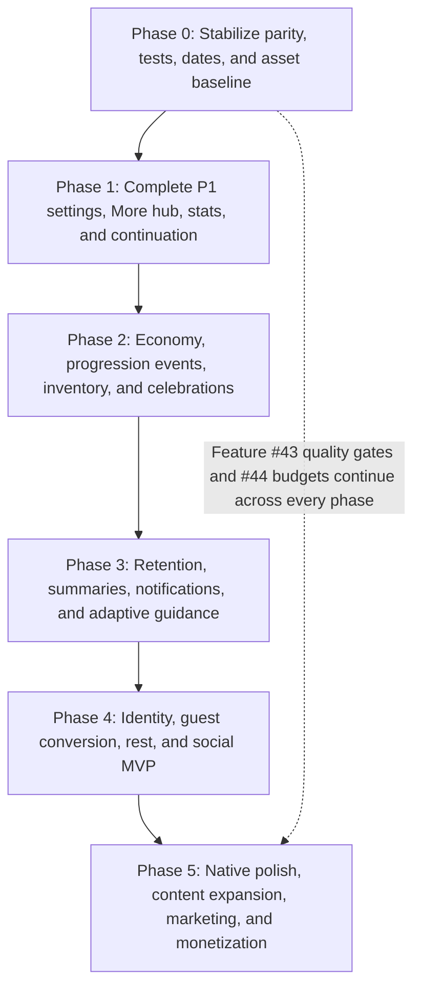

# Implementation Order Recommendation

> Decision record extracted from the roadmap. Read this file only when the task touches this topic.

## Implementation Order Recommendation

The previous order scheduled already completed features and deferred launch controls until the end. The revised order fixes parity and delivery foundations first, then builds vertical slices whose dependencies are ready.

### Phase 0 — Stabilize the Existing Product

1. Finish authenticated Feature #4 parity and add pgTAP coverage.
2. Harden/finish Feature #28 timed target overrides; remove or defer unenforced one-time counts.
3. Consolidate date/timezone utilities and define cross-midnight timer behavior.
4. Establish Feature #43's first quality gates: unit-test harness, generated-type drift, RLS checks, and internal build path.
5. Establish Feature #44's initial asset/bundle baseline.
6. Correct stale Guild copy/targets and any migration snapshot regressions found by the audit.

### Phase 1 — Complete the P1 User Experience

1. Refactor More into a hub and complete the safe portions of Feature #8.
2. Build the shared celebration/toast coordinator, then ship Feature #33.
3. Add paged read-model infrastructure and ship the first useful slice of Feature #7.
4. Add Feature #39 refresh/cached-loading behavior.
5. Finish Feature #42's discovery metadata and basic Catalog view.

### Phase 2 — Economy and Progression

1. Ship Feature #5 Coin Shop only after shield/economy parity and concurrency tests.
2. Add Feature #34 salvage using the same economy/idempotency conventions.
3. Add Feature #11 achievement ledger/events.
4. Add Features #12 and #36 through the celebration coordinator.
5. Add UI-focused Features #37, #38, #40, #41, and #26 in small independent slices.

### Phase 3 — Retention and Guidance

1. Complete Feature #21 rollover behavior and Feature #16's shared risk selector.
2. Ship Feature #10 local reminders first; add remote push only where required.
3. Add deterministic Feature #23 summaries and Feature #24 heatmap on the statistics read models.
4. Finish Feature #35's server-authoritative adaptive signals.
5. Add Feature #14 versioned guided onboarding after the core surfaces are stable enough to teach.

### Phase 4 — Identity and Compassionate Growth

1. ✅ Implement Feature #29 Google sign-in; staging/production redirect verification remains an external deployment prerequisite.
2. Build Feature #25 selected-habit model and bounded guest onboarding import.
3. Add Feature #27 rest days after streak/shield rules are stable.
4. Build Feature #30 only as the privacy-first friend MVP; defer feeds/leaderboards.

### Phase 5 — Native/Visual Polish and Commercial Launch

1. Features #13, #15, #17, #20, and #22 can proceed independently behind shared theme/motion/audio/asset standards.
2. Expand authored paths, then design the schema-backed recurring/prestige path.
3. Add focused loot sets after collection-time telemetry exists.
4. Build Feature #18 widgets only after development-build/release infrastructure is reliable.
5. Ship Feature #31 marketing/waitlist before public beta.
6. Ship Feature #32 payments last, after Feature #43 security, telemetry, webhook, restore, and rollback gates pass.

### Key Dependency Map

| Feature | Must depend on |
|---------|----------------|
| #5 Shop | #4 parity rollout gate, economy RPC conventions, #43 tests |
| #10 Notifications | #8 settings, shared date utility, #16/#21 rules |
| #11/#12/#36/#40/#41 | Shared celebration/toast coordinator from #33 foundation |
| #14 Guided tour | Stable Home/Guild/Stash/More surfaces and versioned settings |
| #16 Streak risk | Shared date utility and final #27 precedence rules |
| #18 Widget | Development builds, shared-storage design, #43 release pipeline |
| #23/#24 | #7 read models and timezone aggregation |
| #25 IKEA onboarding | Selected-habit model, secure bounded import, auth flow |
| #26 Tab badges | Owning seen/claim states from #11/#38/#40 |
| #27 Rest days | #4 streak rules and shared date/week utilities |
| #30 Social | #29 identity, privacy model, #43 security/observability |
| #32 Payments | #43 production controls and verified webhook infrastructure |
| #34 Salvage | Economy ledger/idempotency established by #5 |
| #35 Adaptive Lory | Server-authoritative compact context and shared selectors |
| #42 Catalog | Discovery ledger metadata; #34 must preserve discoveries |

### Recommended Next Implementation Batch

The safest high-value next batch is:

1. Finish Feature #28 as timed-duration customization with strict RPC validation and save semantics.
2. Add the shared date/timezone utility plus foundational unit tests.
3. Refactor More into a hub and finish Feature #8 reminder-time/timezone/account-safe settings.
4. Build the celebration/toast coordinator and ship Feature #33.
5. Start Feature #43's component/integration test, observability, and delivery gates.

---
