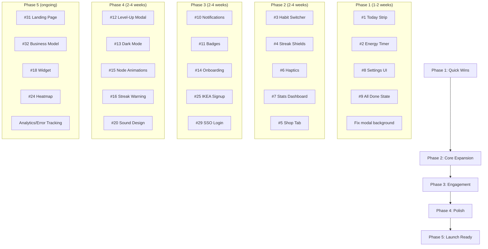

# Loro — Development Plans & Feature Roadmap

> **Last updated:** 2026-07-26
> **Version:** 0.1.1
> **Conversation:** Feature audit & roadmap planning + Batch #3 review

---

## Summary Priority Matrix

| Priority | # | Feature | Effort | Impact | Status |
|----------|---|---------|--------|--------|--------|
| 🔴 P0 | [1](#feature-1) | Today-at-a-glance habit strip | Low | High | ☑ |
| 🔴 P0 | [2](#feature-2) | Energy regeneration countdown timer | Low | High | ☑ |
| 🔴 P0 | [3](#feature-3) | Habit quick-switcher (horizontal pill row) | Medium | High | ☐ |
| 🟡 P1 | [4](#feature-4) | Streak shield earn & consume mechanics | Medium | High | ☐ |
| 🟡 P1 | [5](#feature-5) | Shop tab (shields, potions, charms, cosmetics) | High | High | ☐ |
| 🟡 P1 | [6](#feature-6) | Haptic feedback (quest start/complete, level-up) | Low | Medium | ☑ |
| 🟡 P1 | [7](#feature-7) | Statistics & insights dashboard (More tab) | Medium | Medium | ☐ |
| 🟡 P1 | [8](#feature-8) | Settings UI in More tab (sound, haptics, reminders) | Low | Medium | ☐ |
| 🟡 P1 | [9](#feature-9) | "All habits done" congratulatory state | Low | Medium | ☐ |
| 🟢 P2 | [10](#feature-10) | Push notifications (reminders, streak at risk, energy) | Medium | High | ☐ |
| 🟢 P2 | [11](#feature-11) | Achievement/badge system | Medium | Medium | ☐ |
| 🟢 P2 | [12](#feature-12) | Level-up celebration modal | Low | Medium | ☐ |
| 🟢 P2 | [13](#feature-13) | Dark mode | High | Medium | ☐ |
| 🟢 P2 | [14](#feature-14) | Onboarding guided tour / tutorial | High | High | ☐ |
| 🟢 P2 | [15](#feature-15) | Path node animation polish (pulse, unlock, chapter burst) | Medium | Medium | ☐ |
| 🟢 P2 | [16](#feature-16) | Streak "at risk" visual warning (amber tint at evening) | Low | Medium | ☐ |
| 🟢 P2 | [17](#feature-17) | Chapter preview / "Coming Soon" teasers | Low | Low | ☐ |
| 🔵 P3 | [18](#feature-18) | Home screen widget (iOS/Android) | High | Medium | ☐ |
| 🔵 P3 | [19](#feature-19) | Habit completion notes (optional one-liner) | Low | Low | ☐ |
| 🔵 P3 | [20](#feature-20) | Expanded sound design (rarity fanfares, ambient music) | Medium | Low | ☐ |
| 🔵 P3 | [21](#feature-21) | Midnight date-roll transition polish | Low | Medium | ☐ |
| 🔵 P3 | [22](#feature-22) | Empty state illustrations (Lory variants) | Medium | Low | ☐ |
| 🔵 P3 | [23](#feature-23) | Daily/weekly summary at check-in | Medium | Medium | ☐ |
| 🔵 P3 | [24](#feature-24) | Calendar heatmap (GitHub-style contribution grid) | Medium | Medium | ☐ |
| 🔵 P3 | [25](#feature-25) | IKEA-effect onboarding (habits first, auth later) | Medium | High | ☐ |
| 🔵 P3 | [26](#feature-26) | Badge indicators on tab bar | Low | Medium | ☐ |
| 🔵 P3 | [27](#feature-27) | Campfire rest days (streak freeze alternative) | Medium | Medium | ☐ |
| 🟡 P1 | [28](#feature-28) | Customize habit settings (duration/count per habit) | Medium | Medium | ☐ |
| 🔵 P3 | [29](#feature-29) | SSO login (Google) | Medium | Medium | ☐ |
| 🔵 P3 | [30](#feature-30) | Friend/social features | High | Medium | ☐ |
| 🔵 P3 | [31](#feature-31) | Landing page / marketing site | High | Medium | ☐ |
| 🔵 P3 | [32](#feature-32) | Business model implementation (payments) | High | High | ☐ |
| 🟡 P1 | [33](#feature-33) | Post-completion flow ("Continue to next trail") | Low | Medium | ☐ |
| 🔵 P3 | [34](#feature-34) | Duplicate gear salvage for coins | Low | Low | ☐ |
| 🟢 P2 | [35](#feature-35) | Adaptive Lory messages (context-aware briefings) | Medium | Medium | ☐ |
| 🟢 P2 | [36](#feature-36) | Chapter completion celebration (distinct from quest/loot) | Medium | High | ☐ |
| 🟢 P2 | [37](#feature-37) | Equipment comparison on equip (stat diff) | Medium | Medium | ☐ |
| 🟢 P2 | [38](#feature-38) | "New" badge on recently acquired items | Low | Medium | ☐ |
| 🟢 P2 | [39](#feature-39) | Pull-to-refresh + skeleton loading states | Medium | Medium | ☐ |
| 🟢 P2 | [40](#feature-40) | Guild quest progress toasts + quest history | Medium | Medium | ☐ |
| 🟢 P2 | [41](#feature-41) | Tap loot preview in celebration modal for item details | Low | Medium | ☐ |
| 🟢 P2 | [42](#feature-42) | Item catalog (all collected items, even sold/lost) | Medium | Medium | ☐ |

### Quick Links

- [Feature Details (1–42)](#feature-details)
- [After Adventure Paths](#after-adventure-paths)
- [Loot Pool Management](#loot-pool-management)
- [Review of Existing Planned Features](#review-of-planned)
- [Conflict Analysis](#conflict-analysis)
- [Maintenance Notes](#maintenance-notes)
- [Implementation Order](#implementation-order)
- [Conversation Log](#conversation-log)

---

## Feature Details

### 1. Today-at-a-Glance Habit Strip (P0)

**What:** A compact horizontal strip below the resource bar on Home showing all 6 habits with a check/dot indicator for today's completion status. Tapping a habit switches to it.

**Why:** Currently players must navigate into individual habits to see daily status. This reduces friction and encourages multi-habit days (synergy with guild quests like "Double Step" and "Four Corners").

**Implementation notes (as built):**
- ✅ Implemented directly in the existing `ActiveHabitCard` 2×3 habit grid (no standalone strip component)
- All habit pills share a consistent blue background (`bg-primary-soft`, `border-primary`) for visual clarity
- Active pill uses a slightly stronger border (`border-primary-strong`)
- Status is communicated through the icon only:
  - **Completed today:** green checkmark-circle icon + green label
  - **In progress (timed quest running):** gold play-circle-outline icon + gold label
  - **Active/selected (unstarted):** blueDark habit icon + blue label
  - **Default/unstarted:** muted habit icon + muted label
- Uses `useGameHabits().habitList`, `useGameSync().todayDateKey`, and `useGameActions().setActiveHabit`
- Future enhancement: add a `3/6 trails cleared` counter summary above the grid with individual habit completion dots
- Future enhancement: show a "Possible loot" rarity teaser (e.g., `?` silhouette matching the node's loot tier) on the `DailyQuestCard` to build anticipation before quest completion

---

### 2. Energy Regeneration Countdown Timer (P0)

**What:** Display "⚡ +1 in 23m" next to the energy pill in `ResourceBar` when energy is below max. Also add a gentle zero-energy fallback so players are never blocked from habits.

**Why:** Classic mobile retention mechanic. The state already tracks `lastRefillAt` — just needs a visible countdown. Energy should feel like a pacing mechanic, not a paywall — especially important for a wellness app.

**Implementation notes (as built):**
- ✅ Client: Added a 30-second interval in `ResourceBar` that calculates remaining time until next energy refill and the effective energy including passive regeneration
- ✅ Client: When `lastRefillAt` is available and energy is below max, displays "+1 in Nm" suffix and updates the displayed value to include passively regenerated points
- ✅ Local repo: `lastRefillAt` now set to `now` on energy deduction in `startLocalDailyQuest` and `completeLocalDailyQuest` (was only set during daily check-in)
- ✅ Server: New migration `20260726000100_energy_passive_refill.sql` that:
  - Updates `start_daily_quest` RPC to set `last_energy_refill_at = action_time` when energy is consumed
  - Updates `complete_daily_quest` RPC to set `last_energy_refill_at = action_time` when energy is consumed for one-time quests
  - Updates `build_game_snapshot` to compute passive refill: `energy_current + floor(elapsed_seconds / 1800)` capped at `energy_max`
- ✅ Cross-device: After logout/login or device switch, the server snapshot includes passively regenerated energy based on real elapsed time
- Refill rate: 1 energy per 30 minutes (configurable in `ENERGY_REFILL_INTERVAL_MS` constant)
- **Future: Zero-energy fallback** — when energy is 0 and user tries a timed quest, offer "Start with reduced rewards" (50% coins, 50% XP, no loot drop) instead of blocking
- **Future: Low-energy warning** — when energy ≤ 1, show a warning before starting a timed quest
- One-time habits (Water, Sleep) remain unaffected and always work at zero energy

---

### 3. Habit Quick-Switcher (P0)

**What:** A horizontal scrollable row of habit icon pills that lets players jump between habits without navigating back to a list.

**Why:** Currently switching habits requires going through `HabitPathScreen` back button. A persistent switcher makes exploration frictionless.

**Implementation notes:**
- New component `HabitSwitcher` — horizontal `ScrollView` of `TouchableOpacity` pills
- Each pill: habit icon, habit label, mini check if completed today, timer icon if quest in progress
- Active pill gets `bg-primary` highlight
- Calls `setActiveHabit(habitId)` on press
- Shows in both `HomeScreen` dashboard and `HabitPathScreen`
- **"Resume quest" visibility:** If a timed quest is running for a non-active habit, show a play/timer icon on that habit's pill so the user knows a quest is in progress elsewhere

---

### 4. Streak Shield Mechanics (P1)

**What:** Earn streak shields from chapter completions. Auto-consume one when a day is missed to preserve the streak. Visual indicator when a shield is protecting you.

**Why:** Inventory already has `streakShields: 0` and `ActiveBuff` types defined. This is the natural next step to make shields meaningful.

**Implementation notes:**
- Add `"streak-shield"` to `ActiveBuff["id"]` union
- On chapter reward claim, increment `streakShields` by 1
- In the streak calculation (`getNextStreak` / `getEffectiveStreak`), check if `streakShields > 0` — if so, decrement and preserve streak instead of resetting
- Show a shield icon 🛡️ next to the streak flame when active
- Optional: "Streak Protected!" toast on day-after-miss

---

### 5. Shop Tab (P1)

**What:** A dedicated shop where players spend coins on items that enhance gameplay.

**Why:** Coins currently have no spend outlet beyond psychological satisfaction. A shop closes the economy loop.

**Shop inventory:**
| Item | Cost | Effect |
|------|------|--------|
| Streak Shield | 50 🪙 | Protects streak for one missed day |
| Energy Elixir | 30 🪙 | Restores 3 energy instantly |
| XP Charm | 40 🪙 | 2× XP for next 3 completions (stacks as `ActiveBuff`) |
| Lory Scarf (Green) | 100 🪙 | Cosmetic — Lory wears a green scarf on Home |
| Lory Hat (Explorer) | 150 🪙 | Cosmetic — Lory wears an explorer hat |

**Implementation notes:**
- New tab: add `"shop"` to `TabId` union, create `ShopScreen`
- Add tab bar item between Stash and Profile
- Shop catalog constant in `src/constants/shop.ts`
- New reducer actions: `PURCHASE_ITEM`, validation for sufficient coins
- Cosmetic items stored in a new `cosmetics` array on `PlayerProfile`

---

### 6. Haptic Feedback (P1)

**What:** Use `expo-haptics` to provide tactile feedback for key interactions.

**Why:** Settings already has `hapticsEnabled`. Wiring it up makes the app feel native and premium with minimal effort.

**Haptic map:**
- `light` — habit switch, tab press, node tap
- `medium` — quest start, quest complete, item equip
- `heavy` — chapter complete, level up, legendary loot drop
- `selection` — scrolling through habit switcher

**Implementation notes:**
- Install `expo-haptics` (compatible with SDK 54)
- Create `src/hooks/useHaptics.ts` that respects `settings.hapticsEnabled`
- Call from `QuestActionButton`, habit switcher, celebration modal, etc.

---

### 7. Statistics & Insights Dashboard (P1)

**What:** Transform the More tab from a bare sign-out button into a stats hub.

**Why:** `activityLog` and all completion records already exist in state. Players crave visibility into their progress.

**Sections:**
- **Weekly Overview:** 7-day bar chart of completions per day
- **Habit Distribution:** Which habits get the most completions (horizontal bar or donut)
- **Per-Habit Breakdown:** For each habit — total quests, total tracked time (timed), best streak, last completed date, chapter progress
- **Personal Records:** Best streak, longest timed quest, most coins in a day
- **Collection Progress:** "You've found 12 of 16 Verdant Wayfinder pieces"
- **All-Time Stats:** Total quests, total coins earned, total XP
- **Activity Log:** Scrollable timeline of recent completions with timestamps, rewards, and loot (accessible from Profile)

**Implementation notes:**
- Use `react-native-svg` (already installed) for simple charts
- New component `StatsDashboard` in `src/components/`
- Read from `state.activityLog`, `state.habits[].completions`, `state.inventory`
- Pure computation in `src/utility/statistics.ts`

---

### 8. Settings UI (P1)

**What:** Expose the existing settings state (sound, haptics, reminders, timezone) in the More tab.

**Why:** `AppSettings` type, `updateSettings` action, and reducer handling all exist — but no UI calls them. This is a quick confidence win.

**Toggles and sections:**
- 🔔 Daily Reminder (on/off + time picker)
- 🔊 Sound Effects (on/off)
- 📳 Haptics (on/off)
- 🌍 Timezone (display-only for now, auto-detected)
- 🌓 Theme toggle (when dark mode is added)
- 🔒 Privacy: link to privacy policy, data usage summary
- 💬 Support & Feedback: email/message link
- 📤 Export Data: download game data as JSON
- 🗑️ Delete Account / Reset Progress: with confirmation flow

---

### 9. "All Habits Done" State (P1)

**What:** When all 6 habits are completed for the day, Home shows a congratulatory message with Lory celebrating.

**Why:** Currently there's no acknowledgment for a perfect day. This rewards effort and closes the daily loop.

**Implementation notes:**
- Check `habitList.every(h => h.lastCompletedDateKey === todayDateKey)` in `HomeScreen`
- Show a special card: "🎉 Perfect Day! Lory is proud of you."
- `PixelParrot` with a celebration pose (bounce animation)
- Small bonus: +5 coins for a perfect day (optional, to avoid inflation)
- **Post-completion prompt:** After completing any single habit, if other habits remain unfinished, show a subtle "Continue to next trail? →" prompt that switches to the next unfinished habit. This ties into the [post-completion flow](#feature-33).

---

### 10. Push Notifications (P2)

**What:** Local push notifications for habit reminders, streak warnings, and energy refills.

**Why:** Settings already scaffolds `dailyReminderEnabled` and `dailyReminderTime`. Notifications are the #1 retention tool for habit apps.

**Notification types:**
- Daily reminder at user's chosen time: "Lory's waiting! Time for your daily quest. 🦜"
- Streak-at-risk at 8 PM: "Your 7-day 🔥 is at risk! Complete a quest before midnight."
- Energy full: "Your energy is fully restored. Ready for adventure?"
- Guild quest expiring: "A guild quest expires tomorrow — claim your reward!"

**Implementation notes:**
- Use `expo-notifications` (need to verify SDK 54 compatibility)
- Schedule/update notifications in `AppStateProvider` when settings change
- Respect `dailyReminderEnabled` toggle
- Permission request on first app launch (part of onboarding)

---

### 11. Achievement / Badge System (P2)

**What:** Define milestone-based achievements that unlock badges on the Profile screen. Each badge grants a small coin reward when first earned.

**Why:** `profileBadges` is already defined and imported in Profile. This gives players long-term goals beyond daily streaks.

**Badge definitions (expand on existing 4):**
| Badge | Unlock Condition | Tone |
|-------|-----------------|------|
| 🧭 New Adventurer | Account created | primary |
| ✅ First Quest | Complete 1 quest | success |
| 🔥 Seven Day Spark | 7-day streak | danger |
| 🏆 Chapter Hero | Complete a full chapter | reward |
| 🦜 Lory's Friend | 30 daily check-ins | primary |
| ⚡ Energizer | Complete all habits in one day | reward |
| 💎 Collector | Own 20+ items | reward |
| 🗺️ Trail Master | Complete 3 chapters | reward |
| 🛡️ Iron Will | Use a streak shield | primary |
| ⭐ Legendary Find | Acquire a legendary item | reward |

**Implementation notes:**
- Expand `ProfileBadgeId` union in `constants/profile.ts`
- Add `unlockedBadgeIds: ProfileBadgeId[]` to `PlayerProfile`
- Compute unlock eligibility in reducer after every mutation
- Badge unlock shown as a mini celebration (non-blocking toast)
- Profile screen shows greyed-out locked badges

---

### 12. Level-Up Celebration Modal (P2)

**What:** A distinct, simpler modal when the player gains a level, separate from the quest-complete loot drop modal.

**Why:** Currently XP is tracked and levels exist, but the only celebration is quest-complete. Leveling up should feel like an event too.

**Implementation notes:**
- Detect level-up during quest completion or chapter reward in the reducer
- Emit a `levelUp` flag in the completion outcome
- `QuestCelebrationModal` gets a new `"level-up"` variant
- Shows: new level number, stat increase (if applicable), Lory cheering
- Can be a simpler overlay than the full loot drop sequence
- Note: distinct from the [chapter completion celebration](#feature-36) — level-ups can happen mid-chapter; chapter completions are 7-day milestones

---

### 13. Dark Mode (P2)

**What:** A dark variant of the pastel color palette, toggleable in Settings.

**Why:** Major QoL for evening habit logging. NativeWind supports `dark:` variants.

**Implementation notes:**
- Add `darkMode: "class"` to `tailwind.config.js`
- Define dark color tokens in `themeTokens.js`: `dark-canvas`, `dark-surface`, etc.
- Add `theme: "light" | "dark"` to `AppSettings`
- Toggle in More → Settings
- Persist to AsyncStorage so it loads before first render
- System theme detection: `useColorScheme()` from React Native

---

### 14. Onboarding Guided Tour (P2)

**What:** First-time user walkthrough introducing Lory, the game loop, streaks, energy, and quest types.

**Why:** New users may not understand timed vs one-time quests, energy costs, or how adventure paths work. A guided tour reduces drop-off.

**Flow:**
1. Lory greets: "Welcome, adventurer! I'm Lory, your trail captain. 🦜"
2. "These are your daily quests — complete them to advance on the adventure path."
3. "Timed quests use energy. Hold the button to start!" (demo on Exercise)
4. "One-time quests like Water don't need energy. Just tap!"
5. "Build streaks to earn more rewards. Don't break the chain!"
6. "Check in daily for bonus coins and energy."

**Implementation notes:**
- New component `OnboardingTour` with step-by-step overlays
- Tooltip-style highlights pointing at UI elements
- Stored `hasCompletedOnboarding: boolean` in settings or profile
- Skip button always visible
- Can be re-triggered from More → "Replay tutorial"

---

### 15. Path Node Animation Polish (P2)

**What:** Add subtle animations to adventure path nodes beyond static styling.

**Why:** The adventure path is the core visual metaphor. Animations make it feel alive.

**Animations:**
- **Active node:** Soft pulse/glow ring (Reanimated `withRepeat` scale 1→1.05)
- **Node unlock:** Scale-up + fade-in when midnight rolls over
- **Node complete:** Brief burst + checkmark pop (already partially in place via celebration)
- **Chapter complete:** Full-row particle burst (distinct from single-node)
- **Locked nodes:** Subtle "shimmer" on the lock icon to indicate they're not broken, just waiting

**Implementation notes:**
- Animated wrapper around node items in `HabitPathScreen`
- Use `useReducedMotion()` to skip when accessibility setting is on
- Performance: only animate visible nodes (FlatList vs ScrollView consideration)
- **Stretch goal — Visual path map:** Transform the vertically stacked chapter list into a winding trail/board-game aesthetic with connected nodes, Lory standing at the active node, and themed terrain backgrounds per chapter (forest, ridge, springs). This is high-effort but would dramatically reinforce the gamification identity.

---

### 16. Streak "At Risk" Visual Warning (P2)

**What:** If it's past 8 PM in the user's timezone and a habit isn't completed, tint the habit icon amber/orange and show a subtle warning.

**Why:** Proven nudge pattern from Duolingo, Streaks, etc. Creates urgency without being annoying.

**Implementation notes:**
- In `DailyQuestCard` or `HabitSwitcher`, check timezone-aware hour
- If hour >= 20 and `!completedToday`, apply amber border/icon tint
- Optional text: "🔥 Streak at risk — complete before midnight!"
- The `timeZone` field in settings is already available via context

---

### 17. Chapter Preview / Teasers (P2)

**What:** Show the next chapter's name, theme, and description when the current chapter is complete but the next isn't unlocked yet.

**Why:** Builds anticipation. Currently the path just shows locked nodes with no context.

**Implementation notes:**
- After chapter N is complete, show a locked card for chapter N+1
- Card shows: chapter title, description, node count, reward preview
- "Complete Chapter N first to unlock" label
- Data already exists in `habits.ts` chapter blueprints

---

### 18. Home Screen Widget (P3)

**What:** iOS/Android home screen widget showing Lory, today's streak, and completion rings for habits.

**Why:** High engagement value — players see their progress without opening the app.

**Implementation notes:**
- Requires native module: `expo-config-plugin-widget` or similar
- Widget shows: Lory icon, streak count, N/6 habits done today
- Updates via shared app group or periodic background fetch
- Significant effort for cross-platform widget development

---

### 19. Habit Completion Notes (P3)

**What:** Optional single-line text note when completing a habit (e.g., "Read Chapter 4 of Dune").

**Why:** Adds personal context without complicating the interaction model. The "one-tap complete" philosophy is preserved by making notes optional.

**Implementation notes:**
- After tapping "Complete Quest" on a one-time quest (or after the timer on timed), show a small text input: "Add a note (optional)"
- Store as `note?: string` on `NodeCompletionRecord`
- Display in activity log and path node detail
- Skip-able — tapping "Done" without typing saves no note

---

### 20. Expanded Sound Design (P3)

**What:** Distinct sounds for different loot rarities, streak milestones, and chapter completions.

**Why:** `expo-audio` is already wired for button presses. Expanding the soundscape increases the game-feel dramatically.

**Sound map:**
- Common loot: soft wooden chime
- Uncommon: brighter chime
- Rare: harp arpeggio
- Epic: orchestral sting
- Legendary: full fanfare
- Streak milestone (7, 30, 100): ascending jingle
- Chapter complete: orchestral chord
- Level up: upbeat flourish

**Implementation notes:**
- Add audio files to `src/assets/audio/`
- Register in `src/constants/audio.ts`
- Play via `useAudioPlayer` in `QuestCelebrationModal` and level-up modal
- Respect `settings.soundEnabled`

---

### 21. Midnight Date-Roll Transition (P2)

**What:** When the date changes, auto-refresh the UI: lock yesterday's completed nodes, unlock today's, reset quest status.

**Why:** Currently likely requires a pull-to-refresh or app restart to see new day state.

**Implementation notes:**
- `useEffect` in `AppStateProvider` watching `todayDateKey`
- When it changes, dispatch a `DAY_ROLLOVER` action that:
  - Recalculates all habit active nodes
  - Resets energy to max
  - Refreshes guild quest board
  - Shows a subtle "New day, new quests! 🌅" toast

---

### 22. Empty State Illustrations (P3)

**What:** Show Lory in different poses for empty states instead of blank space.

**Why:** `PixelParrot` already exists. Empty states are a prime opportunity for personality.

**Lory variants needed:**
- "Thinking" — inventory empty: "No gear yet! Complete quests to find loot."
- "Sleeping" — no active guild quests: "The quest board is quiet. Check back soon!"
- "Celebrating" — all habits done: "Perfect day!"
- "Waving" — welcome back after absence

**Implementation notes:**
- Create alternate parrot PNG assets or use `PixelParrot` with animation variants
- Reusable `EmptyState` component with `PixelParrot`, message, optional CTA

---

### 23. Daily/Weekly Summary at Check-In (P3)

**What:** When the player does their daily check-in, show a quick summary of yesterday's accomplishments.

**Why:** Ties the check-in ritual to recent accomplishments, making it more rewarding.

**Implementation notes:**
- Extend `TrailStampDetails` to include previous-day summary
- "Yesterday you completed 3 quests, earned 85 coins, and found a Rare Cape!"
- Pull data from `activityLog` filtered to yesterday's date key

---

### 24. Calendar Heatmap (P3)

**What:** GitHub-style contribution grid showing completion density over time.

**Why:** Requested by the user. Visually satisfying way to see long-term consistency.

**Implementation notes:**
- New component `CompletionHeatmap` using `react-native-svg`
- Data from `activityLog` — count completions per day
- Show last 3-6 months in a grid (columns = weeks, rows = days)
- Color intensity: 0 = grey, 1-2 = light green, 3-4 = medium, 5+ = dark green
- Place in More → Stats or Profile

---

### 25. IKEA-Effect Onboarding (P3)

**What:** Let users select habits and complete their first quest BEFORE signing up. Auth comes after they've invested effort.

**Why:** User-requested. The IKEA effect (valuing something more when you help build it) increases signup conversion.

**Flow:**
1. Splash → "Pick up to 5 habits to start your adventure"
2. Habit selection grid (checkboxes, max 5)
3. Immediately start first quest (timed or one-time demo)
4. After completion: "Great job! Create your account to save your progress."
5. Signup → "Lory: Your account is ready! Your progress is safe." 🦜
6. Existing users: "I already have an account" → login

**Implementation notes:**
- This requires significant auth flow restructuring
- Guest session state must persist through the trial → signup transition
- The current `AuthScreen` would need a pre-auth onboarding phase
- **Guest progress migration (batch #3):** On sign-up, read the guest game cache (keyed under `"local-guest"`) and seed the new authenticated player's state on Supabase via an RPC or direct insert. This requires mapping local SQLite guest data → Supabase state shape. Current guest cache key: `loro.game.cache.local-guest` in `gameCache.native.ts`. This is explicitly coupled to #25 — do not implement as a standalone feature.
- See also: user's existing "IKEA effect on signup" task below

---

### 26. Badge Indicators on Tab Bar (P3)

**What:** Red badge dots on tab bar icons for pending actions.

**Why:** User-requested. Standard mobile pattern for drawing attention.

**Badge rules:**
- **Home:** Unfinished habits count (e.g., "3" if 3 of 6 not done)
- **Profile:** New unlocked badges or completed sets
- **Shop:** New items available (if rotating stock is added)
- **Guild:** Claimable rewards

**Implementation notes:**
- Add `badgeCount` or `hasBadge` to each tab in `PersistentTabHost`
- Red dot (not number) for Profile/Shop, number for Home
- Derived from state in `AppNavigator` or tab host

---

### 27. Campfire Rest Days (P3)

**What:** A "rest day" mechanic — once per week, declare a rest day that preserves your streak without completing a quest.

**Why:** User-requested. Alternative to streak shields. More compassionate: acknowledges that rest is part of a healthy routine, not a failure.

**Implementation notes:**
- Add `restDaysUsedThisWeek: number` and `maxRestDaysPerWeek: 3` to state
- "Campfire" button on Home: "Take a rest day — your streak is safe."
- Visual: Lory sitting by a campfire
- Resets weekly (Sunday or Monday depending on locale)
- Could cost coins instead of being free: 20 coins per rest day
- **"Path progress is safe" messaging:** When the user returns after a missed day, show a reassuring message: "You missed a day, but your path progress is safe. Streaks can be rebuilt!" This reinforces that only streaks reset — never adventure path progress.

---

### 28. Customize Habit Settings (P1)

**What:** Let users adjust the target duration (timed habits) or target count (one-time habits) per habit, without changing quest types. Stock values serve as minimums.

**Why:** User-requested. Six fixed targets won't fit everyone's routine (e.g., "I exercise for 30 minutes, not 15"). This replaces the original #28 (Custom Habit Creation) which was P3 — customizing existing habits is lower effort and higher immediate value. Full custom habit creation may return in a future P3 iteration.

**Constraints:**
- **Type lock:** `timed` habits stay timed; `one-time` habits stay one-time. No converting Water into a timed quest — this would break energy cost assumptions and path structure.
- **Minimum floor:** Timed = 5 minutes, one-time = 1 unit. Stock values are the floor.
- **Per-habit override** stored in `HabitState.settings` (new field), falling back to default chapter blueprints.

**Examples:**
| Habit | Default | User Sets |
|-------|---------|-----------|
| Exercise | 15 min | 30 min |
| Reading | 10 min | 20 min |
| Water | 8 glasses | 6 glasses |

**Implementation notes:**
- Add `habitSettings: Record<HabitId, { targetOverride?: number }>` to `AppState`
- Add a settings row per habit in the Settings UI (More tab, #8)
- Display: habit icon + label + stepper/slider for the override value
- `getDailyQuestDetails()` reads the override, clamped to the minimum
- No path migration needed — overrides only affect quest completion requirements, not adventure path structure
- This is distinct from the original #28 (custom habit creation) which would create entirely new habits with generated paths

---

### 29. SSO Login (Google) (P3)

**What:** Google Sign-In as an alternative to email magic link.

**Why:** User-requested as MUST. Reduces signup friction significantly.

**Implementation notes:**
- Supabase supports Google OAuth out of the box
- Use `@supabase/supabase-js` `signInWithOAuth` with `provider: 'google'`
- Requires Google Cloud Console OAuth client configuration
- Redirect handling via `expo-linking` (already installed)
- Add "Continue with Google" button to auth screen
- Keep existing magic link as fallback

---

### 30. Friend / Social Features (P3)

**What:** Compare streaks, send encouragement, or see friends' adventure progress.

**Why:** User-requested. Social accountability is a powerful habit motivator.

**Considerations:**
- This is a major feature requiring backend work (Supabase friendships table, activity feeds)
- Start minimal: friend codes, see each other's streaks and current chapter
- Avoid competitive leaderboards initially — keep it supportive
- Requires careful privacy design (opt-in sharing)

---

### 31. Landing Page / Marketing Site (P3)

**What:** External web page with app details, screenshots, and a waitlist/signup.

**Why:** User-requested. Needed before public launch.

**Implementation notes:**
- Separate project (not part of the Expo app)
- Could be a simple Next.js or Astro site
- Sections: hero, features, screenshots, "Join the waitlist" form
- Waitlist could feed into a Supabase table or third-party service

---

### 32. Business Model Implementation (P3)

**What:** Monetization strategy — subscription, one-time purchase, or free with IAP.

**Why:** User-requested. Critical for sustainability but needs careful design to not harm the core experience.

**Recommendation:** Free with optional cosmetic IAP + generous free tier.
- Free: 10 energy max, 50 inventory slots, all habits, all quests, streaks
- Loro Supporter ($2.99/mo or $19.99 lifetime): +5 energy max, 200 inventory slots, exclusive Lory cosmetics, supporter badge, priority feature requests
- Never sell: streak protection, energy refills, loot odds — these should stay earnable through gameplay
- Payment via RevenueCat or directly through App Store / Google Play IAP

**Implementation notes:**
- RevenueCat SDK for cross-platform IAP management
- Entitlement checks in state/context
- This is a late-stage feature — implement after core loop is solid

---

### 33. Post-Completion Flow in Celebration Modal (P1)

**What:** After the loot drop celebration, offer clear next-action choices instead of just closing the modal.

**Why:** Currently the modal shows rewards then dismisses. Adding "Continue to next trail", "View adventure path", and "Done for today" turns completion into a satisfying transition. Reduces friction for multi-habit days.

**CTA buttons after loot reveal:**
- **"Continue to next trail"** — switches to the next unfinished habit and closes the modal
- **"View adventure path"** — navigates to the adventure path for the completed habit
- **"Done for today"** — closes the modal, stays on current habit

**Implementation notes:**
- Extend `LootDropDetails` with a `nextUnfinishedHabitId` field
- Add action buttons below the streak display in `QuestCelebrationModal`
- "Continue to next trail" only appears when there are unfinished habits remaining
- If all habits are done, show "🎉 All trails cleared!" instead (ties into #9)

---

### 34. Duplicate Gear Salvage (P3)

**What:** Allow players to convert duplicate inventory items into coins.

**Why:** Inventory already shows item counts and quantities. Duplicates currently have no purpose. A simple salvage action gives them meaning without needing a full shop or crafting system.

**Salvage values by rarity:**
| Rarity | Coins |
|--------|-------|
| Common | 5 |
| Uncommon | 10 |
| Rare | 20 |
| Epic | 40 |
| Legendary | 80 |

**Implementation notes:**
- Add "Salvage" button in `InventoryStackDetailsModal`
- New reducer action: `SALVAGE_ITEM` — removes one instance, adds coins
- Prevent salvaging equipped items
- Confirmation dialog: "Salvage this [Item Name] for [X] coins?"
- Keep at least one copy of each unique item (anti-frustration)

---

### 35. Adaptive Lory Messages (P2)

**What:** Lory's briefing adapts its tone and content based on player context — completion status, missed days, low energy, or returning after a break.

**Why:** The LoryBriefing system already exists with daily prompts. Making messages context-aware deepens the companion feeling and differentiates Loro from sterile habit trackers.

**Context triggers:**
| Trigger | Lory's tone | Example |
|---------|------------|---------|
| First quest of the day | Encouraging | "A fresh trail awaits! Let's start strong. 🦜" |
| All habits done | Celebratory | "You cleared every trail today! Rest well, adventurer." |
| Returning after 2+ missed days | Welcoming, no guilt | "The trail missed you! No rush — take it one step at a time." |
| Low energy (< 2) | Gentle nudge | "Running low on trail supplies. Water and Sleep don't need energy!" |
| Streak at risk (past 8 PM) | Urgent but kind | "Your flame is flickering! A quick quest will keep it burning. 🔥" |
| Midday (all habits unstarted) | Playful | "Lory's packed lunch and is ready when you are!" |

**Implementation notes:**
- Extend `LoryBriefingContext` in `src/types/loryBriefing.ts` with context trigger fields
- Update `buildLoryBriefingContext()` in `src/utility/loryBriefing.ts`
- Modify the Supabase Edge Function `generate-lory-briefing` to accept context and adjust prompt
- Fallback: local template strings when offline, server-generated when online
- Respect the existing daily refresh limit (2 per day)

---

### 36. Chapter Completion Celebration (P2)

**What:** A dedicated celebration variant for completing all 7 nodes in a chapter — distinct from individual quest completion and level-up celebrations.

**Why:** Currently only individual quests trigger the loot modal. Finishing an entire chapter is a much larger milestone (7 days of consistency) and deserves its own moment. The chapter reward claim flow already exists but has no fanfare.

**Celebration content:**
- "Chapter Complete!" banner with the chapter name and description
- Total chapter rewards breakdown (coins + XP bonus)
- Confetti/particle burst distinct from quest loot drops
- Smooth transition into the "Claim chapter reward" button
- Lory appears with a celebratory pose

**Implementation notes:**
- Add a `"chapter-complete"` variant to `QuestCelebrationModal`
- Trigger when the reducer detects all 7 nodes in a chapter are now complete
- Different color palette: gold/purple vs the blue/green of quest loot
- Use existing `isSectionComplete()` utility to detect eligibility

---

### 37. Equipment Comparison on Equip (P2)

**What:** When viewing an item in the inventory modal, show a side-by-side stat comparison against the currently equipped item in the same slot.

**Why:** Currently `InventoryStackDetailsModal` shows an item's stats in isolation. Players can't tell if equipping it is an upgrade or sidegrade without memorizing their current gear. A stat diff (green ↑, red ↓) makes equip decisions feel meaningful and RPG-like.

**Implementation notes:**
- Extend `InventoryStackDetailsModal` to accept the currently equipped item for the same slot
- Render two columns: "Equipped" vs "Selected"
- Diff indicators: `+2 Strength` in green, `−1 Luck` in red
- Show total attribute change summary at the bottom
- Respect the existing equip action flow — comparison is read-only guidance

---

### 38. "New" Badge on Recently Acquired Items (P2)

**What:** Show a pulsing dot or "NEW" badge on inventory items acquired since the player last visited the Stash tab.

**Why:** Items have `acquiredAt` timestamps but no discovery indicator. A new-item badge drives excitement and ensures players don't miss loot they earned.

**Implementation notes:**
- Track `lastStashVisitAt: string | null` in state (set when Stash tab is opened)
- In `InventoryStashGrid`, compare each item's `acquiredAt` against `lastStashVisitAt`
- Show a small pulsing dot or "NEW" ribbon on matching items
- Badge clears on next Stash visit (timestamp updates)
- Use Reanimated for a subtle pulse animation on the dot

---

### 39. Pull-to-Refresh + Skeleton Loading States (P2)

**What:** Add `RefreshControl` to Home and other scrollable screens. Replace text-only loading messages with animated skeleton placeholder cards.

**Why:** Pull-to-refresh is a standard mobile pattern users expect. Skeleton screens reduce perceived loading time and feel more polished than "Loading profile details…" text.

**Implementation notes:**
- Add `RefreshControl` to `HomeScreen`, `GuildScreen`, `StashScreen`, `ProfileScreen` ScrollViews
- On refresh, call `refreshGameState()` from context
- Create a reusable `SkeletonCard` component: animated pulsing placeholder matching real card shapes
- Use Reanimated `withRepeat` opacity loop (0.3 → 0.7) for the pulse effect
- Replace inline loading text with skeleton cards in Profile, Stash, and Guild screens
- Respect `useReducedMotion()` — show static placeholders when reduce motion is enabled

---

### 40. Guild Quest Progress Toasts + Quest History (P2)

**What:** Show a small toast when daily habit completions advance a guild quest's progress. Add a "Past Quests" archive showing completed guild quests from previous periods.

**Why:** There's currently no visible feedback connecting daily actions to guild quest progress. The connection between "I completed Exercise today" and "Steady Trail is now 3/5" should be explicit. A history view adds long-term accomplishment tracking.

**Progress toast implementation notes:**
- After quest completion in the reducer, check if any accepted guild quest metrics advanced
- Show a non-blocking toast: "🛡️ Steady Trail: 3/5 days" with the guild quest icon
- Toast auto-dismisses after 3 seconds, stacks if multiple quests advance
- Use a lightweight animated banner at the top of the screen (below status bar)

**Quest history implementation notes:**
- Add a "Past Quests" collapsible section at the bottom of `GuildScreen`
- Store completed (claimed) guild quests in state with their period key
- Show: quest title, completion date/period, rewards earned
- Only persists the last 4 periods to bound storage
- Ties into the [activity log idea](#feature-7) for cross-referencing

---

### 41. Tap Loot Preview in Celebration Modal for Item Details (P2)

**What:** The inline loot item preview inside `QuestCelebrationModal` becomes tappable. Tapping opens `InventoryStackDetailsModal` showing the full item with an equip action, without adding any new buttons to the celebration flow.

**Why:** The inline preview card already shows the item image, rarity, name, and stats — but doesn't let the player inspect details or equip it. Adding a tap target on the existing preview avoids UI clutter while giving immediate agency over new loot.

**Implementation notes:**
- Wrap the inline loot card in `LootDropCelebration` (lines 272–327 of `QuestCelebrationModal.tsx`) with a `TouchableOpacity` or `Pressable`
- On press, open `InventoryStackDetailsModal` with the `lootItem` passed as the stack (not preview mode — full equip support)
- `onEquip` callback: calls `equipItem` from `useGameActions()`, closes the details modal on success
- After equipping, the player returns to the celebration modal (still open behind) to continue to the streak page
- `InventoryStackDetailsModal` already accepts `onEquip` and handles equip/unequip — no changes needed to that component
- Do NOT add a separate "View item details" button — the tap target is the existing preview card itself

---

### 42. Item Catalog — All Collected Items (P2)

**What:** A read-only gallery in the More tab showing every item definition the player has ever discovered, including items no longer in their inventory (sold, salvaged, or otherwise lost). Separate from the Stash (which shows currently owned gear for equipping).

**Why:** Players want to track their collection history, not just their current inventory. The data already exists in `discoveredItemDefinitionIds` — this is purely a display feature. It turns More from a bare sign-out page into a meaningful collection hub.

**Data source:**
- `state.inventory.discoveredItemDefinitionIds: string[]` — all item definitions ever seen
- `equipmentItemsById` from constants — item metadata (name, image, set, slot, rarity)
- `state.inventory.items` — used only to show how many are currently owned vs. total discovered
- Acquisition dates can be pulled from the earliest `acquiredAt` across all `InventoryItem` records for each definition

**Display:**
- Grouped by equipment set (Verdant Wayfinder, Emberforge Vanguard, Tidesong Arcanist)
- Each item card shows: image, name, rarity badge, slot label, first-acquired date
- Set header shows: set name, X/8 collected progress bar, set theme colors
- Sort options: by set, by rarity, by acquisition date
- Show "Not yet discovered" greyed-out slots for items in known sets that the player hasn't found
- Lory illustration: "Sleeping" variant in the empty space when no items are discovered yet (ties into #22)

**Implementation notes:**
- New component `ItemCatalogScreen` or integrate into the More screen as a section
- Pure read-only — no equip, unequip, salvage, or trade actions
- Uses existing `equipmentItemsById`, `equipmentSetThemes`, and `discoveredItemDefinitionIds`
- Requires no new state fields or backend changes

---

## Feature-Specific: What Happens After Completing All Adventure Paths?

**Problem:** Each habit currently has 2 chapters (14 days of content). What happens after both are done?

**Options evaluated:**

| Option | Pros | Cons |
|--------|------|------|
| A. Loop chapters (repeat with scaled rewards) | Simple, infinite content | Repetitive, loses novelty |
| B. Procedural "endless path" with RNG nodes | Fresh, game-like | Hard to theme narratively |
| C. Prestige system: restart at higher difficulty with bonus rewards | Rewarding, extendable | Could feel like "losing progress" |
| D. More handcrafted chapters (content expansion) | Best experience | Requires ongoing content work |
| **E. Hybrid: More chapters + prestige option** | **Best of both** | **Higher dev cost** |

**Recommendation:** Start with **Option A + D hybrid**. Add 2-3 more chapters per habit (bringing total to 4-5 chapters = 28-35 days). After final chapter, loop back to Chapter 1 with +50% rewards and a "New Game+" badge. This gives 2-3 months of unique content per habit with infinite replayability.

---

## Feature-Specific: Loot Pool Management

**Problem:** As more equipment sets are added, the loot pool dilutes, making it harder to complete a specific set.

**User's idea:** "Focus set selector — pick 3 target sets"

**Evaluation:** ✅ **Good idea.** This is how many gacha games handle expanding pools without frustrating collectors.

**Implementation:**
- In Profile or Stash, let players "favorite" up to 3 sets
- When loot is rolled, favorited sets get 2× drop weight
- Non-favorited sets still drop but at normal rate
- New players default to Verdant Wayfinder as favorited
- Can be changed anytime (cooldown: once per week to prevent gaming)

---

## Review of User's Existing Planned Features

Below is a review of each item from the user's original list, assessed for conflicts, quality, and alignment with the current codebase.

### ☑ Already Completed

| Item | Assessment |
|------|------------|
| ☑ Implement functionality for buttons / update animations | ✅ Done. `QuestActionButton` supports tap + hold, Reanimated progress ring, completion state. |
| ☑ Design daily check-in modal | ✅ Done. `QuestCelebrationModal` with `"trail-stamp"` variant. |
| ☑ Backend (Supabase) | ✅ Done. `gameRepository.ts`, `supabaseClient.ts`, migrations, seed data. |
| ☑ Database | ✅ Done. Full schema in `supabase/migrations/`. |
| ☑ Authentication / Login pages | ✅ Done. `AuthScreen` with email magic link + guest sessions. |
| ☑ Loot drop after quest completion | ✅ Done. `QuestCelebrationModal` with `"loot-drop"` variant. |
| ☑ Gears on profile page | ✅ Done. `EquipmentLoadoutGrid` + `SetShowcaseFrame` on Profile. |
| ☑ Generate placeholder assets for loadout | ✅ Done. Equipment images registered in `constants/images.tsx`. |

---

### ☐ Not Yet Started — with Assessment

| Item | Verdict | Reasoning |
|------|---------|-----------|
| ☐ Fix modal background popping with the modal | ✅ **Good.** Known RN issue. The `QuestCelebrationModal` uses React Native `Modal` — background "jumps" on open. Fix: use `statusBarTranslucent` + `transparent` status bar, or use Reanimated enter/exit instead of native Modal. Low effort, high polish. |
| ☐ Landing page with app details / screenshots / waitlist | ✅ **Good.** See [feature #31](#feature-31). Separate project, needed pre-launch. |
| ☐ Let user pick up to 5 max habits | ✅ **Good.** Currently 6 habits are hardcoded. Reducing to 5 selectable from 6+ options gives agency. Related to [custom habits](#feature-28) and [IKEA onboarding](#feature-25). The `habitOrder` constant and `createInitialHabits()` would need a `selectedHabitIds` parameter. |
| ☐ IKEA effect on signup | ✅ **Excellent.** Detailed in [feature #25](#feature-25). The multi-step flow (habits → first quest → signup → Lory confirmation) is well thought out. High conversion impact. |
| ☐ Badges on navigation bar | ✅ **Good.** Detailed in [feature #26](#feature-26). Red dot indicators. Low effort, high polish. |
| ☐ What to do after completing Habit's adventure path? | ✅ **Critical.** Discussed in the [dedicated section](#after-adventure-paths). Recommendation: more chapters + prestige loop. |
| ☐ Custom habit / timer? | ✅ **Good.** Detailed in [feature #28](#feature-28). Significant effort but high value for user agency. |
| ☐ Home Screen Widgets | ✅ **Good.** See [feature #18](#feature-18). High effort, high engagement. Android + iOS. |
| ☐ Lory's Push Notifications | ✅ **Good.** See [feature #10](#feature-10). Essential for retention. Use Lory's voice: "Lory's waiting! 🦜" |
| ☐ "Campfire" Rest Days | ✅ **Good.** Detailed in [feature #27](#feature-27). Compassionate alternative to streak shields. Differentiates from punitive habit apps. |
| ☐ A way for user to display already collected sets | ✅ **Good.** The Profile screen already has `SetShowcaseFrame` and `getEquipmentSetProgressList()`. This is partially done — the showcase exists but could be made more prominent with a "Collection Gallery" view showing all sets and their completion percentage. |
| ☐ Business model? | ✅ **Important.** Discussed in [feature #32](#feature-32). Recommendation: free + cosmetic IAP subscription. Don't paywall core mechanics. |
| ☐ How to flood loot pool if more sets are released | ✅ **Good concern.** Discussed in [Loot Pool Management](#loot-pool-management). "Focus set selector" with weighted drops. |
| ☐ Before deployment: Have a different LLM check security / QA / Code review | ✅ **Good practice.** Independent code review catches blind spots. Also: Supabase RLS policies, input validation audit, dependency vulnerability scan (`npm audit`), and penetration testing on the API. |
| ☐ Shop / Trade | ✅ **Good.** Shop = [feature #5](#feature-5). "Trade" requires more thought — player-to-player trading adds significant complexity (duping, economy balance). Recommend shop first, trade much later or never. |
| ☐ Friend / Social aspect | ✅ **Good.** See [feature #30](#feature-30). Start minimal: friend codes + streak visibility. |
| ☐ Calendar view / GitHub-style contribution heatmap | ✅ **Good.** See [feature #24](#feature-24). Fits naturally in the Stats dashboard. |
| ☐ Refine and revisit paths | ✅ **Ongoing.** Adventure paths should be reviewed after playtesting. Are 7-day chapters the right length? Are node titles engaging? Is the 2-chapter limit enough? Tied to the ["what happens after"](#after-adventure-paths) question. |
| ☐ Profile: analytics / charts / diagrams | ✅ **Good.** See [feature #7](#feature-7) (Stats dashboard). User marks this as MUST. |
| ☐ Guided tour / tutorial | ✅ **Good.** See [feature #14](#feature-14). User marks this as MUST. |
| ☐ Analytics / error tracking | ✅ **Good.** User marks as MUST. Add before deployment. Options: Sentry (React Native SDK), PostHog (product analytics), or Firebase Crashlytics. Also: `expo-error-recovery` or a global error boundary wrapping `AppNavigator`. |
| ☐ Design badges | ✅ **Good.** See [feature #11](#feature-11). The 4 existing badge definitions are a start. Expand to 10+ with the ones listed above. |
| ☐ Potions / buffs | ✅ **Good.** Already scaffolded: `ActiveBuff` type and `activeBuffs` array exist in inventory. Tied to the [Shop](#feature-5). "Energy Elixir" and "XP Charm" are natural first buffs. |
| ☐ Replace quests with something that users can utilize gear attributes? | ⚠️ **Needs clarification.** Currently gear attributes (strength, agility, etc.) are purely cosmetic/collectible — they show on Profile but don't affect gameplay. Using them in quests (e.g., "Strength +3 = 10% faster timed quests") could add depth, but risks complicating the simple habit loop. **Recommendation:** Add small passive bonuses (e.g., total Vitality reduces energy cost by 1 per 10 points). Keep it subtle and never gate quest completion behind stats. |
| ☐ Audio feedback to make the actions and buttons more satisfying | ✅ **Good.** Already partially done (`expo-audio` for button presses, `AppAudioProvider`). See [feature #20](#feature-20) for expansion. |
| ☐ Optimize assets and images | ✅ **Good.** Image optimization: use WebP for pixel art, ensure proper dimensions, lazy-load non-critical assets. Run images through `pngquant` or `sharp` before bundling. |
| ☐ Animations / Idle Animations on the Adventure Path | ✅ **Good.** Related to [feature #15](#feature-15). Idle animations on Lory (gentle bob, occasional wing flap) would make the Home screen feel alive. Use `withRepeat` + `withSequence` on Reanimated values. |
| ☐ Custom illustrations (for empty spaces, modals) | ✅ **Good.** Related to [feature #22](#feature-22). A consistent illustration style for empty states, error states, and celebrations. |
| ☐ Haptic feedback (when starting/completing quests) | ✅ **Good.** User marks as MUST. See [feature #6](#feature-6). |
| ☐ SSO login (Google) | ✅ **Good.** User marks as MUST. See [feature #29](#feature-29). |

---

## Conflict Analysis

### No Major Conflicts Found

The user's planned features and my suggested features are largely complementary, with a few overlaps that are noted above. Here are the alignments:

| User's Item | Maps To Suggested Feature |
|-------------|--------------------------|
| IKEA effect on signup | #25 IKEA-Effect Onboarding |
| Badges on navigation bar | #26 Badge Indicators on Tab Bar |
| Campfire Rest Days | #27 Campfire Rest Days |
| Custom habit / timer | #28 Custom Habit Creation |
| Home Screen Widgets | #18 Home Screen Widget |
| Push Notifications | #10 Push Notifications |
| Shop / Trade | #5 Shop Tab |
| Calendar heatmap | #24 Calendar Heatmap |
| Profile analytics/charts | #7 Statistics Dashboard |
| Guided tour / tutorial | #14 Onboarding Guided Tour |
| Potions / buffs | #5 Shop Tab (items) |
| Haptic feedback | #6 Haptic Feedback |
| SSO login (Google) | #29 SSO Login |

### One Item Needs Discussion

> ☐ Replace quests with something that users can utilize gear attributes?

This is the only item that could be problematic. Gear stats are currently collectible/cosmetic. Making them affect quest mechanics adds game depth but risks:
- Making habits feel like "grinding for stats" rather than self-improvement
- Players optimizing for stat gains over actual habit consistency
- Complexity creep in what's currently an elegant simple loop

**Recommendation:** Add small passive bonuses (e.g., +1 energy max per 10 total Vitality) rather than replacing the quest system. Keep the core "do the habit → advance on path" loop pristine.

---

## Maintenance Notes

### Guild Quest Descriptions Are Stale

The guild quest catalog in `src/constants/guildQuests.ts` contains descriptions referencing "four habits" (e.g., "Four Corners: Complete each of the four habits at least once"). The app now has **six** habits. Update:

- `"four-corners"` — change target from 4 to 6, update description to "six habits"
- Any other quests referencing a specific habit count
- Guild quest period logic in `src/utility/guildQuests.ts` — verify it handles 6 habits correctly
- The guild quest board UI should clarify the difference between: Available → Accepted → In progress → Completed → Reward claimed

**Effort:** Low | **Impact:** Medium (prevents player confusion)

---

## Implementation Order Recommendation

Based on the priority matrix and dependencies, here's the suggested build order:

---

## Conversation Log

### 2026-07-26 — Feature Batch #3 Review

- Reviewed 6 user-proposed features against the codebase and PLANS.md. All 6 were not implemented.
- **Added as new features:**
  - **#41 Tap loot preview in celebration modal for item details (P2):** Make the existing inline loot card tappable to open `InventoryStackDetailsModal` with equip support. No new buttons — tap target is the preview itself.
  - **#42 Item catalog — all collected items (P2):** Read-only gallery in More tab showing every item definition from `discoveredItemDefinitionIds`, including lost/sold items. Grouped by set with completion progress. Distinct from Stash (equip-focused) and Stats Dashboard (#7).
- **Replaced existing feature:**
  - **#28 Custom Habit Creation → Customize Habit Settings:** Downgraded from P3 full custom habit creation to P1 habit setting overrides (type-locked, duration/count only, minimum floor). Original #28 content preserved in conversation log. Custom creation may return later as a P3 feature.
- **Updated existing feature:**
  - **#25 IKEA-Effect Onboarding:** Added explicit implementation note about guest progress migration — reading local guest cache (`"local-guest"`) and seeding Supabase state during sign-up. Explicitly coupled to #25, not a standalone feature.
- **Deferred / not added:**
  - **Community habit marketplace:** Combines #5 (Shop), #28 (Custom Habits), and #30 (Social). All three are unbuilt. Shelved until prerequisites exist.
  - **"Keep guest progress after sign-up":** Already covered by #25 — not a separate feature.

### 2026-07-26 — Feature #6 Implementation (Haptic Feedback)

- Installed `expo-haptics` (SDK 54 compatible) via `npx expo install`.
- Created `src/hooks/useHaptics.ts` — exposes `light()`, `medium()`, `heavy()` functions that read `settings.hapticsEnabled` from the new `useGameSettings()` context hook and call `Haptics.impactAsync()`.
- Added `useGameSettings()` hook to `src/contexts/appContext/index.tsx` — exposes `AppSettings` as a dedicated context slice following the existing 8-slice pattern.
- Wired haptics into 4 components:
  - `BottomTabs.tsx` — `light` on tab press
  - `DailyQuestCard.tsx` — `medium` on quest start and quest complete
  - `QuestCelebrationModal.tsx` — `medium` on loot drop collect (common–epic), `heavy` on legendary drops
  - `InventoryStackDetailsModal.tsx` — `medium` on equip/unequip
- Design decisions: ref-based `hapticsEnabled` check inside memoized callbacks avoids stale closures. Fires haptics synchronously before async actions for immediate tactile feedback.
- Future: `selection` haptic for habit switcher (#3), `heavy` for chapter complete (#36) and level-up (#12) — wired when those celebration variants exist.
- `useGameSettings()` hook also lays the foundation for Feature #8 (Settings UI).

### 2026-07-26 — Feature #2 Implementation

- Implemented energy regeneration countdown timer in `ResourceBar`.
- Added a 30-second tick interval that calculates remaining time until the next energy point (1 energy per 30 minutes).
- Displays "+1 in Nm" suffix on the energy pill when energy is below max and `lastRefillAt` is available.
- Uses `ResourcePill`'s existing `suffix` prop — no component API changes needed.
- Zero-energy fallback and low-energy warning remain as future enhancements to the feature.

### 2026-07-25 — External Recommendations Review (Batch #2)

- Reviewed a second batch of feature/QoL recommendations focused on home screen daily experience, adventure path, profile, stash, guild quests, settings, and global UX polish.
- **Already covered:** Habit completion indicators (#1 — done), daily progress banner (#1 — future enhancement), streak shield UI (#4), level-up celebration (#12), settings screen (#8), haptic feedback (#6), empty states (#22), onboarding (#14), duplicate salvage (#34).
- **Added as new features:** Chapter completion celebration (#36), equipment comparison on equip (#37), "New" badge on items (#38), pull-to-refresh + skeleton loading (#39), guild quest progress toasts + history (#40).
- **Updated existing features:** #1 (N/6 counter + loot rarity teaser), #7 (per-habit breakdown + activity log), #12 (cross-reference to chapter celebration), #15 (visual path map stretch goal).
- **Noteworthy:** The "visual path map" (board game trail aesthetic) is a high-effort/high-impact idea added as a stretch goal to #15. The animated transition between dashboard and HabitPathScreen (1c) and node detail expansion (2a) are valid polish items but too granular for standalone features — they'd be natural byproducts of #15 and #3 respectively.

### 2026-07-25 — External Recommendations Review (Batch #1)

- Reviewed a set of external feature/QoL recommendations against the existing PLANS.md.
- **Already covered:** Energy rework (#2), More tab (#7/#8), quest recovery (#3), calendar (#24), weekly recap (#23), rest days (#27), badges (#11), unused systems (Conflict Analysis), postpone list (aligns with P3 tiering).
- **Added as new features:** Post-completion flow in celebration modal (#33), duplicate gear salvage (#34), adaptive Lory messages (#35).
- **Updated existing features:** #1 (reflected actual implementation), #2 (zero-energy fallback, low-energy warning), #3 (resume quest visibility), #8 (privacy/support/export), #9 (continue to next trail prompt), #27 (path progress is safe messaging).
- **Added maintenance note:** Guild quest descriptions reference "four habits" but the app now has six — needs updating.

### 2026-07-25 — Feature #1 Implementation

- Implemented today-at-a-glance habit status coloring in the existing `ActiveHabitCard` habit grid (rather than a standalone strip component).
- Each habit pill in the 2×3 grid now shows: blue (active/selected), green (completed today), gold/yellow (timed quest in progress), or muted (unstarted).
- Active/selected state takes visual priority so the user always knows which habit they're viewing.
- Removed the intermediate `DailyHabitStrip` component per user feedback.

### 2026-07-25 — Feature Audit & Roadmap Session

- Conducted comprehensive codebase review across all screens, components, contexts, utilities, constants, and types.
- Identified 24 suggested features/QoL improvements with priority tiers (P0–P3).
- Reviewed user's existing 33 planned items; assessed each for quality, conflict, and alignment.
- Identified one item needing clarification: "Replace quests with gear-attribute mechanics."
- Recommended hybrid approach for post-path-completion content and loot pool management.
- Created this living `PLANS.md` document.

---

> **How to use this file:** After each work session, update the status of completed items (☐ → ☑), add new ideas, and append to the conversation log. This is the single source of truth for Loro's development roadmap.
